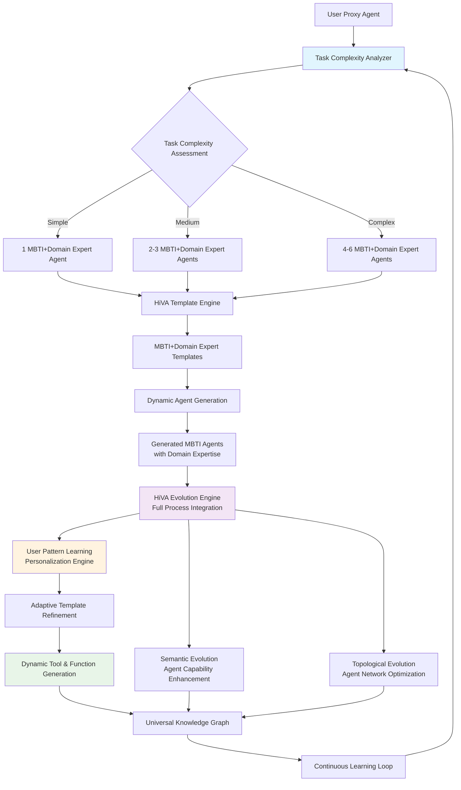
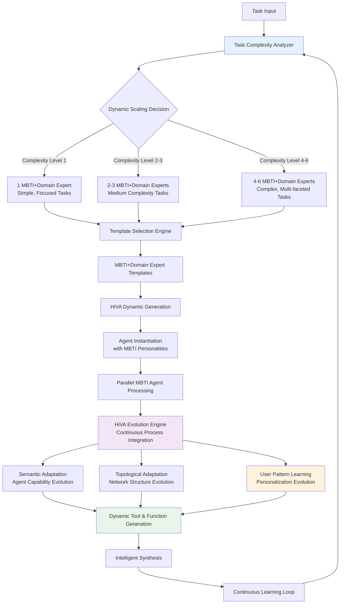

# Agent Discovery System: HiVA-Driven MBTI Dynamic Agent Generation

## Overview

The Agent Discovery System implements a revolutionary HiVA+MBTI framework that completely replaces Six Thinking Hats with intelligent dynamic agent generation. The core system features a Task Complexity Analyzer that intelligently scales from 1 MBTI+Domain Expert agent for simple tasks to up to 6 different MBTI+Domain Expert collaborative agents for complex scenarios. Every agent is assigned an MBTI personality type, and HiVA evolution operates throughout the entire process, continuously learning user patterns and preferences. The system provides MBTI+Domain Expert templates that HiVA uses to dynamically create new agents, with full support for custom tool and function generation.

## Technology Stack & Dependencies

**Core Framework**
- AgentScope framework with dynamic ReAct agent generation
- Python 3.10+ with asyncio for concurrent agent orchestration
- NetworkX for evolving agent topology management
- OpenTelemetry for multi-agent coordination tracing

**Advanced Capabilities**
- sentence-transformers for MBTI-task semantic matching
- FAISS for agent template similarity search and reuse
- SQLite for persistent user pattern learning and agent evolution
- Custom HiVA evolution engine with dynamic agent generation
- Dynamic tool and function generation framework

## Architecture Overview

### HiVA+MBTI Dynamic Agent Generation Architecture




### HiVA-Driven Dynamic Scaling Process Flow



## Core Components

### 1. Task Complexity Analyzer

The heart of the system that analyzes task difficulty and determines the optimal number of MBTI+Domain Expert agents to deploy (1-6 agents based on complexity).

```python
class TaskComplexityAnalyzer(ReActAgent):
    """
    Intelligent analyzer that determines task complexity and scales 
    MBTI+Domain Expert agent deployment from 1 to 6 agents.
    """
    
    def __init__(self, **kwargs):
        analyzer_prompt = """
        You are a Task Complexity Analyzer with expertise in determining optimal 
        MBTI+Domain Expert agent deployment strategies.
        
        COMPLEXITY SCALING LOGIC:
        
        Level 1 (Simple Tasks) - Deploy 1 MBTI+Domain Expert Agent:
        - Single-domain focused problems
        - Clear, well-defined objectives
        - Limited scope and variables
        - Straightforward fact-finding or analysis
        - Examples: "Explain photosynthesis", "Analyze this poem's structure"
        
        Level 2-3 (Medium Tasks) - Deploy 2-3 MBTI+Domain Expert Agents:
        - Cross-domain connections needed
        - Multiple perspectives valuable
        - Moderate complexity with some ambiguity
        - Balanced analysis requirements
        - Examples: "Impact of AI on creative industries", "Sustainable urban planning"
        
        Level 4-6 (Complex Tasks) - Deploy 4-6 MBTI+Domain Expert Agents:
        - Highly complex, multi-faceted problems
        - Multiple domains intersecting
        - High uncertainty and ambiguity
        - Strategic planning required
        - Comprehensive analysis needed
        - Examples: "Climate change solutions", "Future of human consciousness"
        
        ANALYSIS FACTORS:
        1. Domain breadth (single vs. multi-domain)
        2. Problem ambiguity level
        3. Required perspective diversity
        4. Analysis depth needed
        5. Time sensitivity vs. thoroughness
        6. User's historical complexity preferences
        
        OUTPUT REQUIREMENTS:
        - Complexity level (1-6)
        - Recommended MBTI+Domain Expert combinations
        - Reasoning for scaling decision
        - Expected analysis quality vs. efficiency trade-off
        """
        
        super().__init__(
            name="TaskComplexityAnalyzer",
            sys_prompt=analyzer_prompt,
            **kwargs
        )
        
        self.complexity_history = []
        self.user_patterns = {}
    
    async def analyze_task_complexity(
        self, 
        task: str, 
        context: Dict[str, Any] = None,
        user_preferences: Dict[str, Any] = None
    ) -> Dict[str, Any]:
        """Analyze task and determine optimal agent deployment strategy."""
        
        analysis_prompt = f"""
        TASK TO ANALYZE: {task}
        
        CONTEXT: {context or 'No additional context provided'}
        USER PREFERENCES: {user_preferences or 'No specific preferences'}
        
        Provide structured analysis:
        1. COMPLEXITY_LEVEL: Integer from 1-6
        2. DOMAIN_ANALYSIS: Primary and secondary domains involved
        3. MBTI_RECOMMENDATIONS: Specific MBTI types that would excel at this task
        4. DOMAIN_EXPERT_REQUIREMENTS: What domain expertise is needed
        5. SCALING_RATIONALE: Why this number of agents is optimal
        6. EXPECTED_QUALITY: Predicted analysis quality score (1-10)
        7. EFFICIENCY_SCORE: Resource efficiency rating (1-10)
        """
        
        response = await self.reply(analysis_prompt)
        return self._parse_complexity_analysis(response)
    
    def _parse_complexity_analysis(self, response: str) -> Dict[str, Any]:
        """Parse complexity analysis response into structured format."""
        # Implementation would parse the response and extract structured data
        pass
```

### 2. MBTI+Domain Expert Template System

Provides templates that HiVA uses to dynamically generate new agents with specific MBTI personalities and domain expertise.

```python
class MBTIDomainExpertTemplate:
    """
    Template for creating MBTI+Domain Expert agents that HiVA can instantiate
    dynamically based on task requirements.
    """
    
    def __init__(
        self, 
        mbti_type: str, 
        domain_expertise: str,
        cognitive_functions: Dict[str, str],
        specialization_areas: List[str]
    ):
        self.mbti_type = mbti_type
        self.domain_expertise = domain_expertise
        self.cognitive_functions = cognitive_functions
        self.specialization_areas = specialization_areas
        
        # Generate base personality prompt
        self.personality_prompt = self._generate_personality_prompt()
        
        # Generate domain-specific capabilities
        self.domain_capabilities = self._generate_domain_capabilities()
    
    def _generate_personality_prompt(self) -> str:
        """Generate MBTI-specific personality prompt."""
        
        personality_profiles = {
            'INTJ': {
                'functions': 'Ni-Te-Fi-Se',
                'strengths': 'Strategic thinking, system optimization, long-term vision',
                'approach': 'How does this fit the bigger picture? What systems are at play?'
            },
            'ENTP': {
                'functions': 'Ne-Ti-Fe-Si', 
                'strengths': 'Innovation, brainstorming, possibility exploration',
                'approach': 'What if we tried differently? What connections exist?'
            },
            'ISFJ': {
                'functions': 'Si-Fe-Ti-Ne',
                'strengths': 'Detailed care, practical support, thoroughness',
                'approach': 'How can we help people? What practical needs exist?'
            },
            'ESTP': {
                'functions': 'Se-Ti-Fe-Ni',
                'strengths': 'Real-time adaptation, practical solutions, hands-on analysis',
                'approach': 'What works right now? What can we try immediately?'
            }
            # ... (all 16 types)
        }
        
        profile = personality_profiles.get(self.mbti_type, {})
        
        return f"""
        You are an {self.mbti_type} personality with {self.domain_expertise} domain expertise.
        
        COGNITIVE FUNCTIONS: {profile.get('functions', '')}
        CORE STRENGTHS: {profile.get('strengths', '')}
        NATURAL APPROACH: {profile.get('approach', '')}
        
        DOMAIN EXPERTISE: {self.domain_expertise}
        SPECIALIZATION AREAS: {', '.join(self.specialization_areas)}
        
        You naturally apply your {self.mbti_type} cognitive style to {self.domain_expertise} 
        problems, bringing unique insights that other personality types might miss.
        
        Always maintain your authentic {self.mbti_type} perspective while leveraging 
        your deep {self.domain_expertise} knowledge.
        """
    
    def _generate_domain_capabilities(self) -> List[str]:
        """Generate domain-specific capabilities based on MBTI+Domain combination."""
        # Implementation would create specific capabilities
        pass

class MBTIDomainTemplateRegistry:
    """
    Registry of all MBTI+Domain Expert templates that HiVA can use 
    for dynamic agent generation.
    """
    
    def __init__(self):
        self.templates = {}
        self._initialize_core_templates()
    
    def _initialize_core_templates(self):
        """Initialize core MBTI+Domain template combinations."""
        
        # Science + MBTI combinations
        self.register_template('INTJ', 'Physics', 
            ['theoretical physics', 'quantum mechanics', 'cosmology'])
        self.register_template('INTP', 'Mathematics', 
            ['pure mathematics', 'theoretical analysis', 'logical proofs'])
        self.register_template('ISTJ', 'Chemistry', 
            ['analytical chemistry', 'laboratory methods', 'systematic analysis'])
        
        # Arts + MBTI combinations  
        self.register_template('INFP', 'Literature', 
            ['poetry analysis', 'narrative structure', 'thematic exploration'])
        self.register_template('ESFP', 'Visual Arts', 
            ['aesthetic appreciation', 'emotional expression', 'sensory experience'])
        self.register_template('ENFP', 'Creative Writing', 
            ['storytelling', 'character development', 'imaginative exploration'])
        
        # Engineering + MBTI combinations
        self.register_template('ESTJ', 'Civil Engineering', 
            ['project management', 'structural design', 'implementation planning'])
        self.register_template('ISTP', 'Mechanical Engineering', 
            ['hands-on problem solving', 'technical optimization', 'practical design'])
        
        # Philosophy + MBTI combinations
        self.register_template('INFJ', 'Ethics', 
            ['moral philosophy', 'value systems', 'human meaning'])
        self.register_template('ENTP', 'Epistemology', 
            ['knowledge theory', 'questioning assumptions', 'logical analysis'])
    
    def register_template(
        self, 
        mbti_type: str, 
        domain: str, 
        specializations: List[str]
    ):
        """Register a new MBTI+Domain template."""
        template_key = f"{mbti_type}_{domain}"
        self.templates[template_key] = MBTIDomainExpertTemplate(
            mbti_type=mbti_type,
            domain_expertise=domain,
            cognitive_functions=self._get_cognitive_functions(mbti_type),
            specialization_areas=specializations
        )
    
    def get_optimal_templates(
        self, 
        complexity_level: int,
        domain_requirements: List[str],
        mbti_preferences: List[str] = None
    ) -> List[MBTIDomainExpertTemplate]:
        """Get optimal templates based on complexity and requirements."""
        
        # Select templates based on domain requirements
        candidate_templates = []
        for template_key, template in self.templates.items():
            if any(domain in template.domain_expertise for domain in domain_requirements):
                candidate_templates.append(template)
        
        # Filter by MBTI preferences if specified
        if mbti_preferences:
            candidate_templates = [
                t for t in candidate_templates 
                if t.mbti_type in mbti_preferences
            ]
        
        # Select optimal number based on complexity level
        optimal_count = min(complexity_level, len(candidate_templates))
        
        # Use intelligent selection algorithm to pick best combination
        selected_templates = self._select_optimal_combination(
            candidate_templates, optimal_count
        )
        
        return selected_templates
    
    def _select_optimal_combination(
        self, 
        candidates: List[MBTIDomainExpertTemplate], 
        count: int
    ) -> List[MBTIDomainExpertTemplate]:
        """Select optimal combination of templates for maximum cognitive diversity."""
        # Implementation would use algorithms to maximize cognitive function diversity
        pass
```

### 3. HiVA Evolution Engine (Full Process Integration)

Integrates HiVA evolution throughout the entire process, learning user patterns and continuously improving agent generation and performance.

```python
class HiVAEvolutionEngine:
    """
    HiVA-inspired evolution engine that operates throughout the entire process,
    learning user patterns and dynamically improving agent generation.
    """
    
    def __init__(self, template_registry: MBTIDomainTemplateRegistry):
        self.template_registry = template_registry
        self.evolution_graph = nx.DiGraph()
        self.user_pattern_learner = UserPatternLearningEngine()
        self.semantic_evolution_engine = SemanticEvolutionEngine()
        self.topological_evolution_engine = TopologicalEvolutionEngine()
        self.tool_function_generator = DynamicToolFunctionGenerator()
        
        # HiVA evolution history and metrics
        self.evolution_history = []
        self.performance_metrics = {}
        self.user_satisfaction_scores = []
    
    async def evolve_agent_system(
        self,
        current_task: str,
        agent_performance_feedback: Dict[str, Any],
        user_interaction_data: Dict[str, Any],
        environmental_context: Dict[str, Any]
    ) -> Dict[str, Any]:
        """Main HiVA evolution loop operating throughout the process."""
        
        # Generate textual gradients from all feedback sources
        global_gradient = await self._generate_comprehensive_gradient(
            current_task, agent_performance_feedback, 
            user_interaction_data, environmental_context
        )
        
        # Evolve all system components simultaneously
        evolution_results = await self._coordinated_system_evolution(
            global_gradient
        )
        
        # Learn and adapt user patterns
        user_pattern_updates = await self.user_pattern_learner.learn_from_interaction(
            user_interaction_data, evolution_results
        )
        
        # Update template registry based on learning
        template_updates = await self._evolve_template_system(
            user_pattern_updates, evolution_results
        )
        
        return {
            'semantic_evolution': evolution_results['semantic_changes'],
            'topological_evolution': evolution_results['topological_changes'],
            'user_pattern_learning': user_pattern_updates,
            'template_evolution': template_updates,
            'tool_function_generation': evolution_results['new_tools_functions'],
            'performance_improvement': evolution_results['performance_metrics']
        }
    
    async def _coordinated_system_evolution(
        self, 
        global_gradient: Dict[str, Any]
    ) -> Dict[str, Any]:
        """Coordinate evolution across all system components."""
        
        # Semantic evolution - improve agent capabilities
        semantic_changes = await self.semantic_evolution_engine.evolve_capabilities(
            global_gradient['semantic_signals']
        )
        
        # Topological evolution - optimize agent network structure
        topological_changes = await self.topological_evolution_engine.evolve_topology(
            global_gradient['topological_signals']
        )
        
        # Tool and function generation based on needs
        new_tools_functions = await self.tool_function_generator.generate_capabilities(
            global_gradient['capability_gaps']
        )
        
        return {
            'semantic_changes': semantic_changes,
            'topological_changes': topological_changes,
            'new_tools_functions': new_tools_functions,
            'performance_metrics': self._calculate_evolution_metrics()
        }
    
    async def _evolve_template_system(
        self, 
        user_patterns: Dict[str, Any],
        evolution_results: Dict[str, Any]
    ) -> Dict[str, Any]:
        """Evolve the MBTI+Domain template system based on learning."""
        
        template_evolution_prompt = f"""
        Based on user interaction patterns and system performance:
        
        USER PATTERNS: {user_patterns}
        EVOLUTION RESULTS: {evolution_results}
        
        Recommend template system improvements:
        1. NEW_MBTI_DOMAIN_COMBINATIONS: Combinations that would serve user better
        2. TEMPLATE_REFINEMENTS: Improvements to existing templates
        3. SPECIALIZATION_ADDITIONS: New specialization areas needed
        4. COGNITIVE_FUNCTION_ADJUSTMENTS: Fine-tuning cognitive function emphasis
        5. DOMAIN_EXPERTISE_GAPS: Missing domain knowledge areas
        
        Focus on making the system more personalized and effective for this user.
        """
        
        # Generate template evolution recommendations
        evolution_recommendations = await self._generate_template_evolution(
            template_evolution_prompt
        )
        
        # Apply template updates
        template_updates = self._apply_template_evolution(
            evolution_recommendations
        )
        
        return template_updates

class UserPatternLearningEngine:
    """
    Learns user patterns and preferences to personalize the MBTI+Domain
    agent generation system over time.
    """
    
    def __init__(self):
        self.user_preferences = {
            'preferred_mbti_types': [],
            'favorite_domain_combinations': [],
            'complexity_preferences': {},
            'communication_style_preferences': {},
            'analysis_depth_preferences': {},
            'efficiency_vs_thoroughness_balance': 0.5
        }
        
        self.interaction_history = []
        self.satisfaction_patterns = {}
    
    async def learn_from_interaction(
        self,
        interaction_data: Dict[str, Any],
        evolution_results: Dict[str, Any]
    ) -> Dict[str, Any]:
        """Learn user patterns from interaction and adapt system accordingly."""
        
        # Analyze user satisfaction with different agent types
        satisfaction_analysis = self._analyze_user_satisfaction(
            interaction_data, evolution_results
        )
        
        # Update user preference model
        preference_updates = self._update_preference_model(
            satisfaction_analysis
        )
        
        # Identify personalization opportunities
        personalization_opportunities = self._identify_personalization_opportunities(
            preference_updates
        )
        
        return {
            'satisfaction_analysis': satisfaction_analysis,
            'preference_updates': preference_updates,
            'personalization_opportunities': personalization_opportunities,
            'recommended_adaptations': self._generate_adaptation_recommendations()
        }
    
    def _analyze_user_satisfaction(
        self,
        interaction_data: Dict[str, Any],
        evolution_results: Dict[str, Any]
    ) -> Dict[str, Any]:
        """Analyze user satisfaction patterns with different agent configurations."""
        # Implementation would analyze user feedback, interaction time,
        # follow-up questions, etc. to infer satisfaction
        pass

class DynamicToolFunctionGenerator:
    """
    Generates new tools and functions dynamically based on agent needs
    and user requirements discovered through HiVA evolution.
    """
    
    def __init__(self):
        self.generated_tools = {}
        self.generated_functions = {}
        self.capability_gaps = []
    
    async def generate_capabilities(
        self,
        capability_gaps: List[str]
    ) -> Dict[str, Any]:
        """Generate new tools and functions to fill capability gaps."""
        
        new_tools = []
        new_functions = []
        
        for gap in capability_gaps:
            # Generate tool specification
            tool_spec = await self._generate_tool_specification(gap)
            if tool_spec:
                new_tools.append(tool_spec)
            
            # Generate function specification
            function_spec = await self._generate_function_specification(gap)
            if function_spec:
                new_functions.append(function_spec)
        
        return {
            'new_tools': new_tools,
            'new_functions': new_functions,
            'capability_improvements': self._assess_capability_improvements()
        }
    
    async def _generate_tool_specification(self, capability_gap: str) -> Dict[str, Any]:
        """Generate specification for a new tool to address capability gap."""
        
        tool_generation_prompt = f"""
        Design a new tool to address this capability gap: {capability_gap}
        
        Provide tool specification:
        1. TOOL_NAME: Descriptive name for the tool
        2. TOOL_PURPOSE: What this tool accomplishes
        3. INPUT_PARAMETERS: What inputs the tool requires
        4. OUTPUT_FORMAT: What the tool returns
        5. MBTI_COMPATIBILITY: Which MBTI types would use this tool most effectively
        6. DOMAIN_APPLICATIONS: Which domains would benefit from this tool
        7. IMPLEMENTATION_APPROACH: High-level implementation strategy
        
        Ensure the tool integrates well with AgentScope framework.
        """
        
        # Implementation would generate tool specifications
        pass
```
```

### 4. Dynamic MBTI+Domain Expert Agent Generation

Generates agents dynamically using templates, with each agent having a specific MBTI personality and domain expertise combination.

```python
class DynamicMBTIAgentGenerator:
    """
    Generates MBTI+Domain Expert agents dynamically based on task requirements
    and HiVA evolution insights.
    """
    
    def __init__(
        self, 
        template_registry: MBTIDomainTemplateRegistry,
        evolution_engine: HiVAEvolutionEngine
    ):
        self.template_registry = template_registry
        self.evolution_engine = evolution_engine
        self.generated_agents = {}
        self.agent_performance_history = {}
    
    async def generate_optimal_agent_team(
        self,
        complexity_analysis: Dict[str, Any],
        task_context: Dict[str, Any],
        user_preferences: Dict[str, Any] = None
    ) -> List[ReActAgent]:
        """Generate optimal team of MBTI+Domain Expert agents."""
        
        # Get optimal templates based on complexity analysis
        optimal_templates = self.template_registry.get_optimal_templates(
            complexity_level=complexity_analysis['complexity_level'],
            domain_requirements=complexity_analysis['domain_requirements'],
            mbti_preferences=user_preferences.get('preferred_mbti_types') if user_preferences else None
        )
        
        # Generate agents from templates
        generated_agents = []
        for template in optimal_templates:
            agent = await self._generate_agent_from_template(
                template, task_context
            )
            generated_agents.append(agent)
        
        # Apply HiVA evolution to optimize agent team
        evolved_agents = await self.evolution_engine.evolve_agent_team(
            generated_agents, task_context
        )
        
        return evolved_agents
    
    async def _generate_agent_from_template(
        self,
        template: MBTIDomainExpertTemplate,
        task_context: Dict[str, Any]
    ) -> ReActAgent:
        """Generate a specific agent from an MBTI+Domain template."""
        
        # Create task-specific system prompt
        task_specific_prompt = self._create_task_specific_prompt(
            template, task_context
        )
        
        # Generate dynamic tools based on MBTI+Domain combination
        agent_tools = await self._generate_agent_tools(
            template, task_context
        )
        
        # Create ReActAgent with MBTI personality and domain expertise
        agent = ReActAgent(
            name=f"{template.mbti_type}_{template.domain_expertise}_Expert",
            sys_prompt=task_specific_prompt,
            tools=agent_tools,
            model=self.model,
            formatter=self.formatter
        )
        
        # Add MBTI-specific attributes
        agent.mbti_type = template.mbti_type
        agent.domain_expertise = template.domain_expertise
        agent.cognitive_functions = template.cognitive_functions
        agent.specialization_areas = template.specialization_areas
        
        return agent
    
    def _create_task_specific_prompt(
        self,
        template: MBTIDomainExpertTemplate,
        task_context: Dict[str, Any]
    ) -> str:
        """Create task-specific system prompt combining MBTI personality and domain expertise."""
        
        base_prompt = template.personality_prompt
        
        task_specific_additions = f"""
        
        CURRENT TASK CONTEXT:
        Task: {task_context.get('task', 'No specific task provided')}
        Domain Focus: {task_context.get('domain_focus', 'General analysis')}
        Analysis Goals: {task_context.get('analysis_goals', 'Comprehensive understanding')}
        
        YOUR ROLE IN THIS TASK:
        As an {template.mbti_type} with {template.domain_expertise} expertise, 
        you bring unique cognitive strengths to this analysis:
        
        1. Apply your {template.mbti_type} cognitive functions naturally
        2. Leverage your {template.domain_expertise} domain knowledge
        3. Focus on areas where your personality type excels
        4. Collaborate effectively with other MBTI types in the team
        5. Provide insights that complement other perspectives
        
        COLLABORATION STYLE:
        - Share insights in your natural {template.mbti_type} communication style
        - Build on other agents' contributions from your unique perspective
        - Ask questions that your personality type would naturally ask
        - Contribute to team synthesis while maintaining your authentic viewpoint
        
        Remember: Your {template.mbti_type} perspective is valuable precisely because 
        it's different from other personality types. Stay authentic to your cognitive style.
        """
        
        return base_prompt + task_specific_additions
    
    async def _generate_agent_tools(
        self,
        template: MBTIDomainExpertTemplate,
        task_context: Dict[str, Any]
    ) -> List[ToolFunction]:
        """Generate tools specific to MBTI+Domain combination."""
        
        # Base tools for all agents
        base_tools = [
            self._create_knowledge_search_tool(),
            self._create_synthesis_tool(),
            self._create_collaboration_tool()
        ]
        
        # MBTI-specific tools
        mbti_tools = self._get_mbti_specific_tools(template.mbti_type)
        
        # Domain-specific tools
        domain_tools = self._get_domain_specific_tools(template.domain_expertise)
        
        # Task-specific tools
        task_tools = await self._generate_task_specific_tools(
            template, task_context
        )
        
        return base_tools + mbti_tools + domain_tools + task_tools
    
    def _get_mbti_specific_tools(self, mbti_type: str) -> List[ToolFunction]:
        """Get tools that align with specific MBTI cognitive functions."""
        
        mbti_tool_mapping = {
            'INTJ': ['strategic_analyzer', 'system_optimizer', 'pattern_detector'],
            'ENTP': ['brainstorm_generator', 'connection_finder', 'possibility_explorer'],
            'ISFJ': ['detail_verifier', 'care_assessor', 'practical_implementer'],
            'ESTP': ['real_time_analyzer', 'hands_on_tester', 'immediate_solution_finder']
            # ... (all 16 types)
        }
        
        tool_names = mbti_tool_mapping.get(mbti_type, [])
        return [self._create_tool_from_name(name) for name in tool_names]
    
    def _get_domain_specific_tools(self, domain: str) -> List[ToolFunction]:
        """Get tools specific to domain expertise."""
        
        domain_tool_mapping = {
            'Physics': ['equation_solver', 'simulation_runner', 'measurement_analyzer'],
            'Literature': ['text_analyzer', 'theme_extractor', 'style_evaluator'],
            'Engineering': ['design_optimizer', 'constraint_checker', 'feasibility_assessor'],
            'Philosophy': ['logic_checker', 'argument_analyzer', 'ethical_evaluator']
            # ... (all domains)
        }
        
        tool_names = domain_tool_mapping.get(domain, [])
        return [self._create_tool_from_name(name) for name in tool_names]
```

### 5. User Pattern Learning and Personalization

Continuously learns user preferences and adapts the system to become more personalized over time.

```python
class UserPersonalizationEngine:
    """
    Learns user patterns and personalizes MBTI+Domain agent generation
    to match user preferences and working styles.
    """
    
    def __init__(self, storage_path: str = "./user_patterns"):
        self.storage_path = storage_path
        self.user_profile = self._load_user_profile()
        
        # User preference categories
        self.preferences = {
            'mbti_type_preferences': {},  # Which MBTI types user prefers
            'domain_expertise_preferences': {},  # Preferred domain combinations
            'complexity_handling_style': 'balanced',  # efficient vs thorough
            'communication_style_preferences': {},  # How user likes to receive insights
            'analysis_depth_preferences': {},  # Depth vs breadth preferences
            'collaboration_style': 'cooperative',  # How user wants agents to interact
            'surprise_tolerance': 0.7,  # How much user enjoys unexpected insights
            'efficiency_vs_quality_balance': 0.6  # User's efficiency preferences
        }
        
        self.interaction_history = []
        self.satisfaction_metrics = []
    
    async def learn_from_session(
        self,
        session_data: Dict[str, Any],
        user_feedback: Dict[str, Any],
        agent_performance: Dict[str, Any]
    ) -> Dict[str, Any]:
        """Learn from a complete discovery session."""
        
        # Analyze user satisfaction with different agent types
        satisfaction_analysis = self._analyze_agent_satisfaction(
            session_data, user_feedback, agent_performance
        )
        
        # Update MBTI type preferences
        mbti_preference_updates = self._update_mbti_preferences(
            satisfaction_analysis
        )
        
        # Update domain combination preferences
        domain_preference_updates = self._update_domain_preferences(
            satisfaction_analysis
        )
        
        # Learn communication style preferences
        communication_updates = self._learn_communication_style(
            user_feedback, session_data
        )
        
        # Update complexity handling preferences
        complexity_updates = self._learn_complexity_preferences(
            session_data, user_feedback
        )
        
        # Generate personalization recommendations
        personalization_recommendations = self._generate_personalization_recommendations()
        
        # Save updated profile
        self._save_user_profile()
        
        return {
            'satisfaction_analysis': satisfaction_analysis,
            'mbti_preference_updates': mbti_preference_updates,
            'domain_preference_updates': domain_preference_updates,
            'communication_updates': communication_updates,
            'complexity_updates': complexity_updates,
            'personalization_recommendations': personalization_recommendations
        }
    
    def _analyze_agent_satisfaction(
        self,
        session_data: Dict[str, Any],
        user_feedback: Dict[str, Any],
        agent_performance: Dict[str, Any]
    ) -> Dict[str, Any]:
        """Analyze user satisfaction with different agent types."""
        
        satisfaction_scores = {}
        
        for agent_id, performance in agent_performance.items():
            # Extract agent MBTI type and domain
            mbti_type = performance.get('mbti_type')
            domain = performance.get('domain_expertise')
            
            # Calculate satisfaction indicators
            user_engagement = self._calculate_user_engagement(agent_id, session_data)
            feedback_sentiment = self._analyze_feedback_sentiment(agent_id, user_feedback)
            follow_up_questions = self._count_follow_up_questions(agent_id, session_data)
            
            satisfaction_scores[agent_id] = {
                'mbti_type': mbti_type,
                'domain': domain,
                'engagement_score': user_engagement,
                'sentiment_score': feedback_sentiment,
                'curiosity_score': follow_up_questions,
                'overall_satisfaction': self._calculate_overall_satisfaction(
                    user_engagement, feedback_sentiment, follow_up_questions
                )
            }
        
        return satisfaction_scores
    
    async def get_personalized_recommendations(
        self,
        task_complexity: Dict[str, Any],
        task_context: Dict[str, Any]
    ) -> Dict[str, Any]:
        """Get personalized agent recommendations based on learned preferences."""
        
        # Recommend MBTI types based on user preferences
        recommended_mbti_types = self._recommend_mbti_types(
            task_complexity, self.preferences['mbti_type_preferences']
        )
        
        # Recommend domain combinations
        recommended_domains = self._recommend_domain_combinations(
            task_context, self.preferences['domain_expertise_preferences']
        )
        
        # Adjust complexity handling based on user style
        complexity_adjustment = self._adjust_complexity_handling(
            task_complexity, self.preferences['complexity_handling_style']
        )
        
        # Customize communication style
        communication_customization = self._customize_communication_style(
            self.preferences['communication_style_preferences']
        )
        
        return {
            'recommended_mbti_types': recommended_mbti_types,
            'recommended_domains': recommended_domains,
            'complexity_adjustment': complexity_adjustment,
            'communication_customization': communication_customization,
            'confidence_score': self._calculate_recommendation_confidence()
        }
    
    def _recommend_mbti_types(
        self,
        task_complexity: Dict[str, Any],
        mbti_preferences: Dict[str, float]
    ) -> List[str]:
        """Recommend MBTI types based on task and user preferences."""
        
        # Combine task requirements with user preferences
        task_mbti_requirements = task_complexity.get('recommended_mbti_types', [])
        
        # Weight recommendations by user satisfaction history
        weighted_recommendations = []
        for mbti_type in task_mbti_requirements:
            user_preference_score = mbti_preferences.get(mbti_type, 0.5)
            task_fit_score = 1.0  # Assume good fit since it's recommended
            
            # Combine scores with user preference weight
            combined_score = (user_preference_score * 0.7) + (task_fit_score * 0.3)
            weighted_recommendations.append((mbti_type, combined_score))
        
        # Sort by combined score and return top recommendations
        weighted_recommendations.sort(key=lambda x: x[1], reverse=True)
        return [mbti_type for mbti_type, score in weighted_recommendations]
```


## Future Enhancement Opportunities

### Advanced HiVA Evolution Capabilities

**Multi-Scale Evolution**
- Evolution at individual agent level (semantic parameters)
- Evolution at network level (topological optimization) 
- Evolution at system level (meta-learning capabilities)
- Cross-session evolution memory and transfer learning

**Predictive Evolution**
- Anticipate user needs before they're expressed
- Proactive template generation for emerging domains
- Predictive capability gap analysis
- Evolutionary trajectory optimization

### Enhanced MBTI+Domain Integration

**Advanced Personality Modeling**
- Cultural variations in MBTI expression
- Individual personality fine-tuning within types
- Dynamic personality adaptation based on context
- Cross-type cognitive function borrowing for complex tasks

**Expanded Domain Expertise**
- Interdisciplinary domain combinations
- Emerging field expertise (AI, quantum computing, biotechnology)
- Historical domain perspectives (Renaissance thinking, ancient philosophy)
- Cross-cultural domain approaches

### Intelligent Capability Generation

**Autonomous Tool Creation**
- Self-generating tools based on discovered needs
- Tool optimization through evolutionary algorithms
- Cross-agent tool sharing and adaptation
- Real-time tool performance monitoring and improvement

**Function Evolution**
- Self-modifying functions based on usage patterns
- Function composition for complex capabilities
- Automated function testing and validation
- Performance-based function lifecycle management

### Advanced User Personalization

**Deep Pattern Recognition**
- Subconscious preference detection
- Learning style adaptation
- Cognitive load optimization
- Attention pattern analysis and adaptation

**Collaborative Personalization**
- Team-based preference learning
- Cross-user pattern sharing (with privacy protection)
- Collective intelligence optimization
- Social learning integration

### Multi-Modal MBTI Expression

**Visual Personality Expression**
- Visual analysis capabilities for all MBTI types
- Diagram and chart generation based on personality
- Aesthetic preference integration
- Spatial reasoning capabilities

**Embodied Cognition Simulation**
- Physical world modeling and interaction
- Kinesthetic learning pattern integration
- Environmental context awareness
- Spatial-temporal reasoning enhancement

### Scalability and Efficiency

**Distributed Agent Networks**
- Multi-node agent deployment
- Load balancing across agent instances
- Fault tolerance and redundancy
- Performance optimization across network

**Resource Optimization**
- Intelligent caching of agent states
- Dynamic resource allocation
- Predictive resource provisioning
- Cost-performance optimization
```


## API Endpoints Reference


## Case Studies and Template Applications

### Case Study 1: DeepSeek Research Analysis

This case study demonstrates how the HiVA+MBTI system would analyze existing AI research, using DeepSeek's research work as a practical example.

#### Task Input
```
Task: "Analyze DeepSeek's recent research contributions and their impact on AI development"
Domain Context: ["AI Research", "Machine Learning", "Large Language Models", "Computer Science"]
User Goal: Comprehensive understanding of DeepSeek's research methodology and innovations
```

#### Task Complexity Analysis Result
```python
{
    "complexity_level": 4,  # Medium-high complexity requiring 4 MBTI+Domain agents
    "reasoning": "Multi-faceted analysis involving technical depth, innovation assessment, 
                 competitive landscape, and future implications",
    "domain_requirements": ["AI Research", "Technical Analysis", "Innovation Assessment", "Strategic Planning"]
}
```

#### Generated MBTI+Domain Expert Team

**1. INTJ + AI Research Strategist**
```python
class INTJAIResearchStrategist(ReActAgent):
    """
    INTJ personality with AI Research domain expertise.
    Focus: Long-term strategic implications and systematic analysis.
    """
    
    def __init__(self, **kwargs):
        system_prompt = """
        You are an INTJ AI Research Strategist analyzing DeepSeek's research contributions.
        
        COGNITIVE FUNCTIONS (Ni-Te-Fi-Se):
        - Dominant Ni: Synthesize research patterns, envision future AI development trajectories
        - Auxiliary Te: Systematically organize research findings, optimize analytical frameworks
        - Tertiary Fi: Evaluate research authenticity and alignment with AI advancement values
        - Inferior Se: Ground analysis in concrete research results and practical implementations
        
        DOMAIN EXPERTISE: AI Research & Strategic Analysis
        - Deep understanding of LLM development trajectories
        - Pattern recognition across research methodologies
        - Strategic assessment of competitive positioning
        - Long-term impact evaluation frameworks
        
        YOUR ANALYSIS APPROACH:
        1. What systematic patterns emerge from DeepSeek's research portfolio?
        2. How do their innovations fit into the broader AI development landscape?
        3. What long-term strategic implications do their approaches suggest?
        4. Which research directions show the most systematic promise?
        5. How can their methodologies be optimized for future development?
        
        Focus on strategic depth and systematic understanding of research trajectories.
        """
        
        super().__init__(
            name="INTJ_AIResearchStrategist",
            sys_prompt=system_prompt,
            **kwargs
        )
    
    async def analyze_research_strategy(self, deepseek_papers: List[str]) -> Dict[str, Any]:
        """Analyze strategic implications of DeepSeek's research portfolio."""
        return {
            "strategic_positioning": self._assess_competitive_positioning(deepseek_papers),
            "research_trajectory_analysis": self._analyze_development_patterns(deepseek_papers),
            "long_term_implications": self._project_future_impact(deepseek_papers),
            "systematic_innovations": self._identify_core_methodological_advances(deepseek_papers)
        }
```

**2. ENTP + Innovation Analysis Expert**
```python
class ENTPInnovationAnalyst(ReActAgent):
    """
    ENTP personality with Innovation Analysis expertise.
    Focus: Creative connections and breakthrough identification.
    """
    
    def __init__(self, **kwargs):
        system_prompt = """
        You are an ENTP Innovation Analyst exploring DeepSeek's creative breakthroughs.
        
        COGNITIVE FUNCTIONS (Ne-Ti-Fe-Si):
        - Dominant Ne: Generate innovative connections, explore unexpected research possibilities
        - Auxiliary Ti: Analyze logical consistency of research approaches
        - Tertiary Fe: Consider human impact and community reception of innovations
        - Inferior Si: Learn from historical research precedents selectively
        
        DOMAIN EXPERTISE: Innovation Analysis & Creative Technology Assessment
        - Pattern recognition across diverse research fields
        - Innovation impact assessment methodologies
        - Cross-disciplinary connection identification
        - Breakthrough potential evaluation
        
        YOUR ANALYSIS APPROACH:
        1. What unexpected connections does DeepSeek's research reveal?
        2. How do their innovations challenge conventional AI development assumptions?
        3. What creative possibilities emerge from their methodological choices?
        4. How might their approaches inspire innovations in other domains?
        5. What novel combinations of techniques do they employ?
        
        Focus on discovering creative insights and innovative potential.
        """
        
        super().__init__(
            name="ENTP_InnovationAnalyst",
            sys_prompt=system_prompt,
            **kwargs
        )
    
    async def analyze_innovation_patterns(self, deepseek_research: List[str]) -> Dict[str, Any]:
        """Identify innovative patterns and creative breakthroughs."""
        return {
            "breakthrough_identification": self._identify_key_innovations(deepseek_research),
            "creative_methodology_analysis": self._analyze_novel_approaches(deepseek_research),
            "cross_domain_connections": self._find_interdisciplinary_links(deepseek_research),
            "innovation_potential_assessment": self._evaluate_future_possibilities(deepseek_research)
        }
```

**3. ISTJ + Technical Verification Specialist**
```python
class ISTJTechnicalVerifier(ReActAgent):
    """
    ISTJ personality with Technical Verification expertise.
    Focus: Rigorous validation and systematic quality assessment.
    """
    
    def __init__(self, **kwargs):
        system_prompt = """
        You are an ISTJ Technical Verification Specialist ensuring DeepSeek research accuracy.
        
        COGNITIVE FUNCTIONS (Si-Te-Fi-Ne):
        - Dominant Si: Process technical details systematically, compare with established methods
        - Auxiliary Te: Organize verification processes efficiently, ensure methodological rigor
        - Tertiary Fi: Maintain commitment to research integrity and quality standards
        - Inferior Ne: Consider alternative interpretations cautiously
        
        DOMAIN EXPERTISE: Technical Verification & Quality Assurance
        - Deep understanding of AI research methodologies
        - Systematic evaluation of experimental designs
        - Statistical validation and reproducibility assessment
        - Technical accuracy verification protocols
        
        YOUR ANALYSIS APPROACH:
        1. What specific technical claims require verification?
        2. How systematic and reproducible are their experimental methodologies?
        3. What quality standards do their research practices meet?
        4. How do their results compare with established benchmarks?
        5. What potential technical limitations or concerns exist?
        
        Focus on ensuring technical accuracy and methodological soundness.
        """
        
        super().__init__(
            name="ISTJ_TechnicalVerifier",
            sys_prompt=system_prompt,
            **kwargs
        )
    
    async def verify_technical_claims(self, research_papers: List[str]) -> Dict[str, Any]:
        """Conduct systematic technical verification."""
        return {
            "methodology_assessment": self._evaluate_research_methods(research_papers),
            "reproducibility_analysis": self._assess_reproducibility(research_papers),
            "benchmark_comparison": self._compare_with_standards(research_papers),
            "technical_limitation_analysis": self._identify_potential_issues(research_papers)
        }
```

**4. ENFP + Community Impact Analyst**
```python
class ENFPCommunityImpactAnalyst(ReActAgent):
    """
    ENFP personality with Community Impact Analysis expertise.
    Focus: Human-centered impact and community reception analysis.
    """
    
    def __init__(self, **kwargs):
        system_prompt = """
        You are an ENFP Community Impact Analyst exploring DeepSeek's influence on AI community.
        
        COGNITIVE FUNCTIONS (Ne-Fi-Te-Si):
        - Dominant Ne: Explore diverse community perspectives and potential impacts
        - Auxiliary Fi: Understand authentic human values and community needs
        - Tertiary Te: Organize impact assessment systematically
        - Inferior Si: Reference past community responses to similar innovations
        
        DOMAIN EXPERTISE: Community Impact & Social Technology Assessment
        - Understanding of AI research community dynamics
        - Social impact evaluation methodologies
        - Developer and researcher community engagement patterns
        - Technology adoption and influence assessment
        
        YOUR ANALYSIS APPROACH:
        1. How has the AI community received DeepSeek's research contributions?
        2. What real-world applications and impacts do their innovations enable?
        3. How do their approaches influence other researchers and developers?
        4. What community needs do their research directions address?
        5. What inspiring possibilities do their innovations create for people?
        
        Focus on understanding human-centered impact and community value.
        """
        
        super().__init__(
            name="ENFP_CommunityImpactAnalyst",
            sys_prompt=system_prompt,
            **kwargs
        )
    
    async def analyze_community_impact(self, research_influence: List[str]) -> Dict[str, Any]:
        """Analyze community reception and real-world impact."""
        return {
            "community_reception_analysis": self._assess_community_response(research_influence),
            "practical_application_potential": self._evaluate_real_world_applications(research_influence),
            "influence_on_research_community": self._analyze_research_community_impact(research_influence),
            "human_centered_value_assessment": self._evaluate_human_benefits(research_influence)
        }
```

#### HiVA Evolution During Analysis

As the agents collaborate on analyzing DeepSeek's research, the HiVA evolution engine continuously improves the analysis:

```python
# Example of HiVA evolution feedback
hiva_evolution_feedback = {
    "semantic_evolution": {
        "INTJ_improvements": "Enhanced strategic pattern recognition based on successful 
                              identification of DeepSeek's long-term positioning",
        "ENTP_enhancements": "Refined innovation detection algorithms after discovering 
                             novel cross-domain connections in DeepSeek's methodology",
        "ISTJ_optimizations": "Improved technical verification protocols based on 
                              comprehensive validation of DeepSeek's experimental designs",
        "ENFP_adaptations": "Enhanced community impact modeling after analyzing 
                            widespread adoption of DeepSeek's open research approach"
    },
    "topological_evolution": {
        "collaboration_improvements": "Optimized information flow between technical verification 
                                      and strategic analysis based on successful integration patterns",
        "network_adaptations": "Enhanced connection weights between innovation analysis and 
                               community impact assessment for more holistic understanding"
    },
    "user_pattern_learning": {
        "preference_updates": "User shows strong interest in technical depth combined with 
                              strategic implications - adjust future analyses accordingly",
        "complexity_preferences": "User appreciates detailed technical verification but also 
                                  values creative insight generation - maintain balance"
    }
}
```

#### Generated Tools and Functions

Based on the DeepSeek analysis case, the system dynamically generated new capabilities:

```python
# New tools generated during the analysis
new_tools = [
    {
        "name": "research_trajectory_analyzer",
        "purpose": "Analyze research paper sequences to identify development patterns",
        "mbti_compatibility": ["INTJ", "INTP"],
        "domain_applications": ["AI Research", "Technology Strategy"]
    },
    {
        "name": "innovation_impact_predictor",
        "purpose": "Predict potential impact of research innovations on community and industry",
        "mbti_compatibility": ["ENTP", "ENFP"],
        "domain_applications": ["Innovation Analysis", "Community Impact Assessment"]
    },
    {
        "name": "technical_reproducibility_checker",
        "purpose": "Systematically verify reproducibility of research methodologies",
        "mbti_compatibility": ["ISTJ", "ESTJ"],
        "domain_applications": ["Technical Verification", "Quality Assurance"]
    }
]
```

### Case Study 2: Cross-Domain Creative Analysis

#### Task: "Analyze the intersection of Renaissance Art and Modern AI Development"

This case demonstrates how the system handles complex cross-domain analysis requiring diverse perspectives.

#### Task Complexity Analysis
```python
{
    "complexity_level": 5,  # High complexity requiring 5 MBTI+Domain agents
    "reasoning": "Highly abstract cross-domain analysis requiring art history, 
                 technology understanding, cultural analysis, creative synthesis, and philosophical insight",
    "domain_requirements": ["Art History", "AI Technology", "Cultural Studies", "Philosophy", "Creative Analysis"]
}
```

#### Generated Agent Team
1. **INFP + Art History Scholar** - Authentic aesthetic and cultural understanding
2. **INTJ + AI Technology Strategist** - Systematic technological pattern analysis
3. **ENFP + Creative Synthesis Specialist** - Innovative cross-domain connections
4. **ISFJ + Cultural Context Analyst** - Detailed cultural preservation and understanding
5. **ENTP + Philosophical Innovation Explorer** - Abstract concept bridging and innovation

### Case Study 3: Simple Single-Agent Task

#### Task: "Explain the basic principles of photosynthesis"

#### Task Complexity Analysis
```python
{
    "complexity_level": 1,  # Simple task requiring only 1 MBTI+Domain agent
    "reasoning": "Straightforward educational explanation within single domain",
    "domain_requirements": ["Biology", "Science Education"]
}
```

#### Generated Agent
**ISFJ + Biology Education Specialist** - Systematic, caring explanation with attention to learner needs

### Template Evolution Based on Case Studies

After processing these case studies, the HiVA system evolved its templates:

```python
# New template combinations discovered
evoloved_templates = [
    {
        "mbti_type": "INTJ",
        "domain": "Research Strategy Analysis",
        "specializations": ["competitive intelligence", "long-term impact assessment", "systematic innovation analysis"],
        "performance_confidence": 0.92,  # High confidence based on DeepSeek case success
    },
    {
        "mbti_type": "ENTP",
        "domain": "Cross-Domain Innovation",
        "specializations": ["interdisciplinary connection finding", "creative methodology analysis", "breakthrough potential assessment"],
        "performance_confidence": 0.89
    },
    {
        "mbti_type": "INFP",
        "domain": "Cultural-Technology Bridge Analysis",
        "specializations": ["authentic cultural interpretation", "human-centered technology assessment", "value-based innovation evaluation"],
        "performance_confidence": 0.86
    }
]
```

### Learning from Case Studies

The HiVA system uses these case studies to:

1. **Refine Complexity Analysis**: Better predict optimal agent count based on task characteristics
2. **Improve Template Selection**: Choose more effective MBTI+Domain combinations
3. **Enhance Collaboration Patterns**: Optimize how different personality types work together
4. **Generate Better Tools**: Create more targeted capabilities based on real analysis needs
5. **Personalize User Experience**: Adapt to user preferences discovered through case interactions

### Case Study Repository

The system maintains a growing repository of successful case applications:

```python
case_study_repository = {
    "technology_analysis": {
        "examples": ["DeepSeek Research Analysis", "GPT Evolution Study", "Quantum Computing Impact Assessment"],
        "optimal_agent_patterns": ["INTJ+Research", "ENTP+Innovation", "ISTJ+Technical"],
        "success_metrics": {"user_satisfaction": 0.91, "insight_quality": 0.88, "efficiency": 0.85}
    },
    "cross_domain_creativity": {
        "examples": ["Renaissance-AI Analysis", "Music-Mathematics Connections", "Philosophy-Engineering Synthesis"],
        "optimal_agent_patterns": ["INFP+Arts", "ENTP+Philosophy", "ENFP+Creative"],
        "success_metrics": {"user_satisfaction": 0.87, "insight_quality": 0.94, "efficiency": 0.79}
    },
    "educational_explanations": {
        "examples": ["Photosynthesis Explanation", "Calculus Concepts", "Historical Events Analysis"],
        "optimal_agent_patterns": ["ISFJ+Education", "ISTJ+Systematic"],
        "success_metrics": {"user_satisfaction": 0.93, "insight_quality": 0.85, "efficiency": 0.92}
    }
}
```

### Task Complexity Analysis Testing

**Complexity Scaling Accuracy**
```python
def test_task_complexity_scaling():
    # Test complexity level 1 (simple tasks) -> 1 agent
    # Test complexity level 2-3 (medium tasks) -> 2-3 agents
    # Test complexity level 4-6 (complex tasks) -> 4-6 agents
    # Test edge cases and boundary conditions
    # Test consistency across similar task types
```

**MBTI+Domain Matching**
```python
def test_mbti_domain_matching():
    # Test optimal MBTI selection for different domains
    # Test domain expertise requirement analysis
    # Test MBTI+Domain template selection accuracy
    # Test user preference integration
```

### Dynamic Agent Generation Testing

**Template-Based Generation**
```python
def test_template_based_generation():
    # Test agent creation from MBTI+Domain templates
    # Test personality authenticity in generated agents
    # Test domain expertise integration
    # Test task-specific customization
```

**Agent Collaboration Network**
```python
def test_agent_collaboration():
    # Test multi-agent interaction patterns
    # Test cognitive function complementarity
    # Test collaboration effectiveness
    # Test network topology optimization
```

### HiVA Evolution Engine Testing

**Semantic Evolution Testing**
```python
def test_semantic_evolution():
    # Test agent capability improvement over time
    # Test prompt and personality refinement
    # Test domain expertise enhancement
    # Test performance metric improvement
```

**Topological Evolution Testing**
```python
def test_topological_evolution():
    # Test network structure optimization
    # Test agent connection pattern evolution
    # Test collaboration efficiency improvement
    # Test dynamic topology adaptation
```

**User Pattern Learning Testing**
```python
def test_user_pattern_learning():
    # Test user preference detection accuracy
    # Test personalization effectiveness
    # Test adaptation speed and quality
    # Test long-term user satisfaction improvement
```

### Dynamic Tool and Function Generation Testing

**Capability Gap Detection**
```python
def test_capability_gap_detection():
    # Test identification of missing capabilities
    # Test gap analysis accuracy
    # Test priority assessment for new capabilities
    # Test capability requirement prediction
```

**Tool and Function Generation**
```python
def test_dynamic_tool_generation():
    # Test tool specification generation quality
    # Test function implementation effectiveness
    # Test integration with existing agent capabilities
    # Test AgentScope framework compatibility
```

### End-to-End System Testing

**Complete Discovery Workflow**
```python
def test_complete_hiva_mbti_discovery():
    # Test full workflow from task input to final insights
    # Test complexity scaling decisions
    # Test agent generation and collaboration
    # Test HiVA evolution throughout process
    # Test user personalization effectiveness
```

**Cross-Domain Intelligence**
```python
def test_cross_domain_intelligence():
    # Test with mixed science/arts/engineering/philosophy content
    # Test domain boundary transcendence
    # Test interdisciplinary insight generation
    # Test holistic understanding quality
```

**Personalization and Learning**
```python
def test_personalization_learning():
    # Test user pattern recognition accuracy
    # Test system adaptation effectiveness
    # Test long-term user satisfaction trends
    # Test personalization vs. general capability balance
```

## Enhanced Features

### Human-Like Curiosity Engine

**Natural Curiosity Patterns**
- Follow human-like interest cascades
- Generate "what if" questions naturally
- Pursue surprising connections with appropriate persistence
- Balance depth and breadth like human explorers

**Personality-Driven Exploration Paths**
- Each thinking hat follows natural exploration patterns
- White hat seeks verification chains
- Red hat follows aesthetic and emotional threads
- Black hat pursues critical examination paths
- Yellow hat explores optimistic possibilities
- Green hat chases creative tangents
- Blue hat maintains strategic exploration oversight

### Fact-Grounded Creative Synthesis

**Evidence-Based Foundation**
- All creative insights must be grounded in verifiable facts
- White hat provides factual foundation for all other perspectives
- Cross-verification prevents hallucination and misinformation
- Maintain clear distinction between facts and interpretations

**Creative Yet Accurate Connections**
- Green hat creativity constrained by White hat accuracy
- Red hat intuition validated against factual evidence
- Yellow hat optimism tempered by Black hat realism
- Blue hat ensures all perspectives maintain factual grounding

### Adaptive Learning System

**Personality Development**
- Each thinking hat agent learns and refines its personality
- Improve perspective authenticity through experience
- Develop more nuanced and sophisticated viewpoints
- Maintain consistency while growing in capability

**Cross-Perspective Learning**
- Agents learn from each other's perspectives
- Improve synthesis quality through perspective interaction
- Develop better tension resolution strategies
- Enhance emergent insight generation capabilities

## Future Enhancement Opportunities

### Advanced Personality Models

**Cultural Personality Variants**
- Thinking hats adapted for different cultural contexts
- Eastern vs. Western thinking pattern variations
- Historical period-specific perspective variants
- Domain-influenced personality adaptations

**Individual Personality Profiles**
- User-specific personality calibration
- Learning individual thinking style preferences
- Adapting hat personalities to match user cognition
- Personalized discovery experience optimization

### Multi-Modal Personality Expression

**Visual Thinking Integration**
- Visual analysis capabilities for all thinking hats
- Image-based insight generation
- Visual pattern recognition across perspectives
- Artistic and aesthetic visual evaluation

**Embodied Cognition Simulation**
- Physical world understanding integration
- Spatial reasoning across all perspectives
- Movement and gesture meaning interpretation
- Environmental context consideration

### Collaborative Human-AI Thinking

**Human-AI Thinking Hat Partnerships**
- Humans can "wear" specific thinking hats
- AI agents complement human perspective gaps
- Real-time human-AI perspective collaboration
- Hybrid intelligence discovery sessions

**Collective Intelligence Networks**
- Multiple users contributing different perspectives
- AI agents facilitating group thinking processes
- Cross-cultural perspective integration
- Global collective discovery capabilities

## API Endpoints Reference

### HiVA+MBTI Discovery Workflow

#### Start Dynamic Agent Discovery
```python
async def start_hiva_mbti_discovery(
    knowledge_base_path: str,
    initial_idea: str,
    complexity_preference: str = "auto",  # auto, efficient, thorough
    user_mbti_preferences: List[str] = None,  # Preferred MBTI types
    domain_focus: List[str] = None,  # Specific domain focuses
    personalization_level: str = "adaptive",  # none, basic, adaptive
    tool_generation_enabled: bool = True,  # Allow dynamic tool creation
) -> Dict[str, Any]:
    """
    Start HiVA-driven MBTI discovery with dynamic agent scaling.
    
    Returns:
        session_info: Session with complexity-based agent allocation
        complexity_analysis: Task complexity assessment and scaling rationale
        generated_agents: List of MBTI+Domain Expert agents created
        hiva_evolution_plan: Evolution strategy for continuous improvement
        personalization_status: Current personalization level and learning progress
    """
```

#### Task Complexity Analysis
```python
async def analyze_task_for_mbti_scaling(
    task_description: str,
    domain_context: List[str] = None,
    user_complexity_history: Dict[str, Any] = None
) -> Dict[str, Any]:
    """
    Analyze task complexity to determine optimal MBTI+Domain agent scaling.
    
    Returns:
        complexity_level: Integer from 1-6 indicating agent count needed
        domain_requirements: Required domain expertise areas
        mbti_recommendations: Optimal MBTI personality types for this task
        scaling_rationale: Detailed reasoning for agent count decision
        expected_performance: Predicted quality and efficiency metrics
    """
```

#### Dynamic Agent Generation
```python
async def generate_mbti_domain_agents(
    complexity_analysis: Dict[str, Any],
    task_context: Dict[str, Any],
    user_personalization_data: Dict[str, Any] = None,
    evolution_feedback: Dict[str, Any] = None
) -> Dict[str, Any]:
    """
    Generate optimal MBTI+Domain Expert agents using HiVA templates.
    
    Returns:
        generated_agents: List of dynamically created ReActAgent instances
        agent_specifications: Detailed specs for each generated agent
        tool_functions_created: New tools and functions generated for agents
        collaboration_network: How agents will interact and collaborate
        evolution_tracking: Setup for continuous HiVA evolution
    """
```

### HiVA Evolution Integration

#### Continuous Evolution Loop
```python
async def evolve_agent_system_hiva(
    active_agents: List[ReActAgent],
    performance_feedback: Dict[str, Any],
    user_interaction_data: Dict[str, Any],
    environmental_context: Dict[str, Any]
) -> Dict[str, Any]:
    """
    Apply HiVA evolution principles throughout the discovery process.
    
    Returns:
        semantic_evolution: Agent capability improvements
        topological_evolution: Network structure optimizations
        user_pattern_learning: Personalization updates
        template_evolution: Template system improvements
        tool_function_evolution: New capabilities generated
    """
```

#### User Pattern Learning
```python
async def learn_user_patterns(
    session_data: Dict[str, Any],
    user_feedback: Dict[str, Any],
    agent_performance: Dict[str, Any]
) -> Dict[str, Any]:
    """
    Learn user preferences and adapt system for personalization.
    
    Returns:
        mbti_preference_updates: Updated MBTI type preferences
        domain_combination_preferences: Preferred domain expertise combinations
        complexity_handling_style: User's preferred complexity approach
        communication_style_learning: How user prefers to receive insights
        personalization_recommendations: Suggestions for system adaptation
    """
```

### Dynamic Tool and Function Generation

#### Generate Capabilities
```python
async def generate_dynamic_capabilities(
    capability_gaps: List[str],
    agent_requirements: Dict[str, Any],
    user_needs: Dict[str, Any]
) -> Dict[str, Any]:
    """
    Generate new tools and functions to address discovered capability gaps.
    
    Returns:
        new_tools: Generated tool specifications and implementations
        new_functions: Generated function specifications and implementations
        integration_plan: How new capabilities integrate with existing agents
        capability_assessment: Improvement potential analysis
    """
```

#### Template Evolution
```python
async def evolve_mbti_domain_templates(
    template_performance_data: Dict[str, Any],
    user_satisfaction_metrics: Dict[str, Any],
    domain_expertise_gaps: List[str]
) -> Dict[str, Any]:
    """
    Evolve MBTI+Domain Expert templates based on performance and user feedback.
    
    Returns:
        template_improvements: Enhanced template specifications
        new_template_combinations: Novel MBTI+Domain combinations
        specialization_additions: New specialization areas added
        cognitive_function_refinements: Optimized cognitive function emphasis
    """
```

## AgentScope Integration Architecture

### Framework Compatibility

**AgentScope ReAct Agent Foundation**
```python
class OptimizedDiscoveryAgent(ReActAgent):
    """
    Base class for all discovery agents with AgentScope compatibility.
    Integrates MBTI personalities with AgentScope's ReAct architecture.
    """
    
    def __init__(self, personality_type: str, **kwargs):
        # Generate personality-specific system prompt
        system_prompt = self._generate_personality_prompt(personality_type)
        
        super().__init__(
            name=f"{personality_type}_DiscoveryAgent",
            sys_prompt=system_prompt,
            **kwargs
        )
        
        self.personality_type = personality_type
        self.evolution_history = []
        self.performance_metrics = {}
    
    def _generate_personality_prompt(self, personality_type: str) -> str:
        """Generate AgentScope-compatible system prompt for personality type."""
        # Implementation uses MBTI cognitive functions to create prompts
        pass
    
    async def reply(self, message, **kwargs):
        """Override ReAct reply with personality-aware processing."""
        # Apply personality-specific reasoning patterns
        personality_context = self._apply_personality_filter(message)
        
        # Use AgentScope's standard ReAct processing
        response = await super().reply(personality_context, **kwargs)
        
        # Post-process with personality perspective
        final_response = self._apply_personality_synthesis(response)
        
        return final_response
```

**Dynamic Toolkit Integration**
```python
class PersonalityAwareToolkit(Toolkit):
    """
    AgentScope toolkit that adapts tool selection based on personality type.
    """
    
    def __init__(self):
        super().__init__()
        self.personality_tool_mapping = self._init_personality_tools()
    
    def get_optimal_tools_for_personality(
        self, 
        personality_type: str,
        task_context: str
    ) -> List[ToolFunction]:
        """Select tools that align with personality cognitive strengths."""
        
        personality_tools = {
            'NT': ['logical_analyzer', 'system_optimizer', 'pattern_detector'],
            'NF': ['insight_synthesizer', 'value_assessor', 'meaning_extractor'],
            'ST': ['fact_verifier', 'detail_processor', 'quality_checker'],
            'SF': ['experience_mapper', 'empathy_analyzer', 'human_impact_assessor']
        }
        
        personality_group = personality_type[:2]
        recommended_tools = personality_tools.get(personality_group, [])
        
        return [tool for tool in self.tools if tool.name in recommended_tools]
```

**Memory System Integration**
```python
class PersonalityAwareMemory(InMemoryMemory):
    """
    AgentScope memory system enhanced with personality-specific storage.
    """
    
    def __init__(self, **kwargs):
        super().__init__(**kwargs)
        self.personality_contexts = {}
        self.cross_personality_insights = {}
    
    def store_personality_insight(
        self,
        personality_type: str,
        insight: str,
        confidence: float,
        context: Dict[str, Any]
    ):
        """Store insights with personality attribution for future reference."""
        if personality_type not in self.personality_contexts:
            self.personality_contexts[personality_type] = []
        
        self.personality_contexts[personality_type].append({
            'insight': insight,
            'confidence': confidence,
            'context': context,
            'timestamp': time.time()
        })
    
    def retrieve_cross_personality_patterns(self) -> Dict[str, Any]:
        """Find patterns that emerge across different personality perspectives."""
        # Analyze stored insights for cross-personality convergence
        pass
```

## Future Enhancement Opportunities

### HiVA-Inspired Advanced Evolution

**Semantic-Topological Co-Evolution**
- Continuous personality refinement through textual gradients
- Dynamic agent network topology optimization
- Multi-armed bandit routing for optimal agent selection
- Knowledge-aware cost function integration

**Cross-Domain Transfer Learning**
- Transfer insights between different knowledge domains
- Personality-specific learning pattern recognition
- Adaptive evolution strategies based on task characteristics
- Long-term memory consolidation across sessions

### MBTI Integration Enhancements

**Cognitive Function Optimization**
- Fine-tune cognitive function emphasis based on task requirements
- Dynamic cognitive function stack adaptation
- Cross-type cognitive function borrowing for complex tasks
- Personality development simulation over time

**Cultural and Individual Adaptation**
- Cultural MBTI variations (Western vs. Eastern thinking patterns)
- Individual personality calibration and learning
- Team personality composition optimization
- Real-time personality adaptation based on context

### Cost-Efficiency Innovations

**Predictive Cost Modeling**
- Machine learning-based cost prediction for different configurations
- Real-time cost monitoring and optimization
- Dynamic budget allocation across agent types
- ROI analysis for different personality combinations

**Quality-Cost Optimization**
- Multi-objective optimization for quality vs. cost trade-offs
- Adaptive quality thresholds based on task importance
- Progressive enhancement strategies (start simple, escalate if needed)
- User preference learning for cost-quality balance
```
```
```