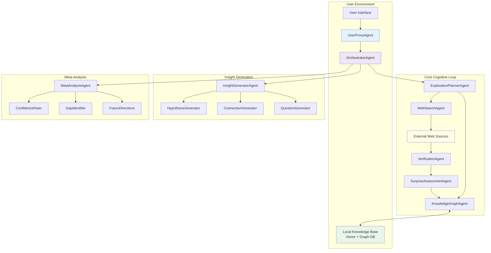
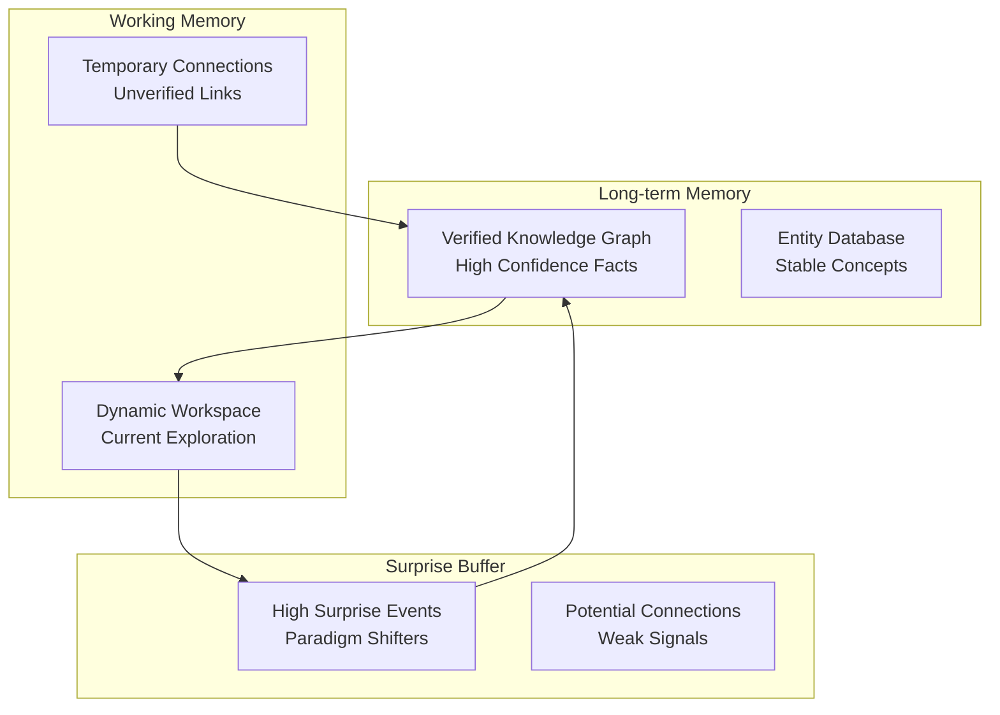
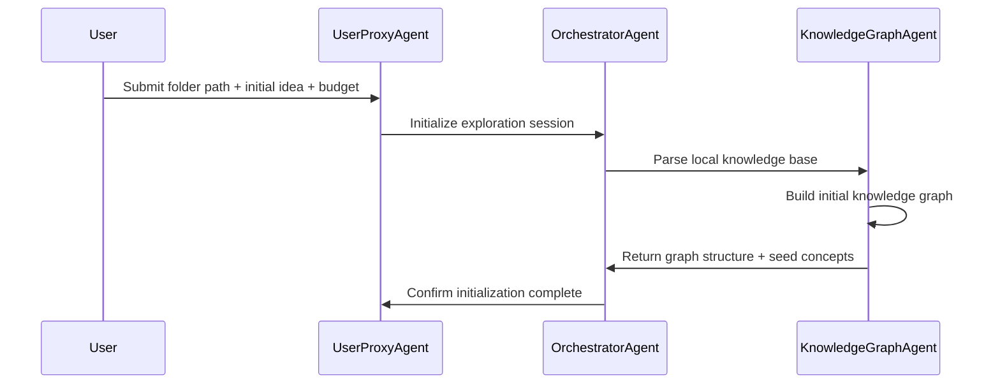
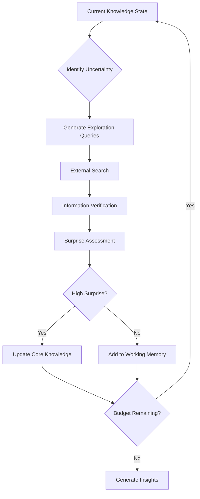
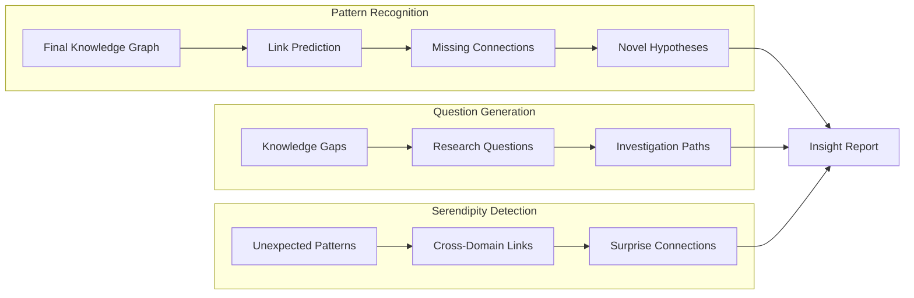
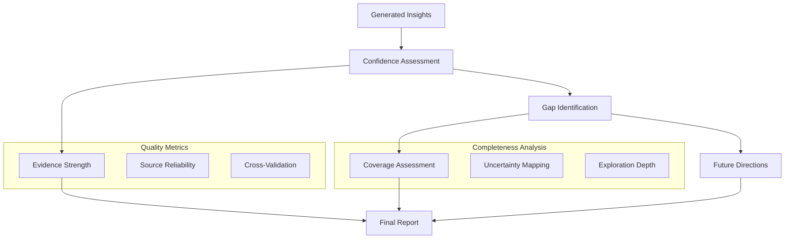
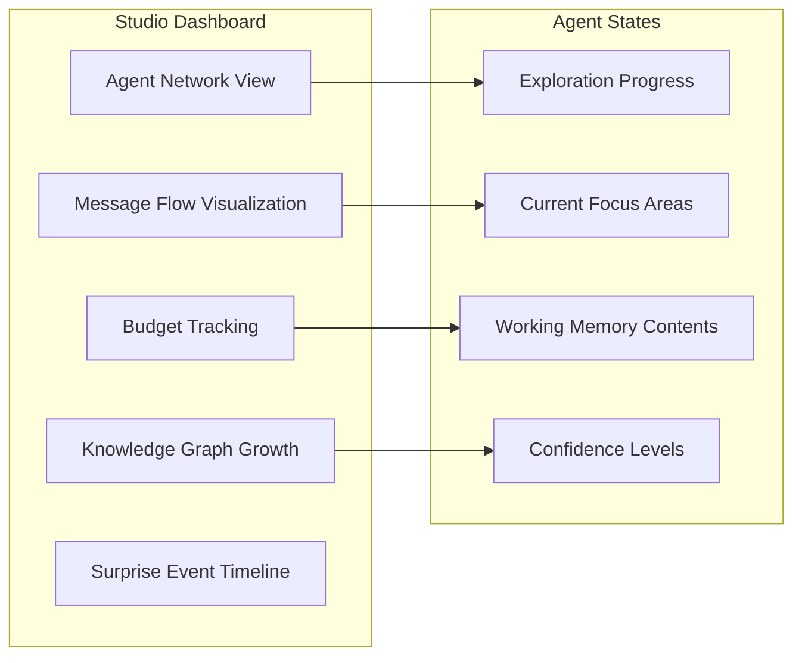

# Agent Discovery System: A Cognitive Framework for Eureka and Serendipity

## Overview

The Agent Discovery System is an advanced AI framework built on AgentScope that enables active discovery of eureka moments and serendipitous insights from personal knowledge bases. Unlike traditional question-answering systems, this framework operates as a cognitive partner that autonomously explores, connects, and generates novel insights by combining the user's local knowledge with external information sources.

## Core Philosophy

### Eureka Moments vs. Information Retrieval

Traditional systems operate on a **query-response paradigm**: users ask specific questions and receive targeted answers. Our system implements a **discovery paradigm**: starting from a user's idea or knowledge base, it actively explores to find unexpected connections and generate novel insights.

### Computational Definitions

#### Eureka Moments
Formalized as **Bayesian Surprise** - the Kullback-Leibler divergence between prior and posterior beliefs:

```
S(D, M) = KL(P(M|D) || P(M)) = ∫ P(M|D) log(P(M|D)/P(M)) dM
```

Where:
- `D` = new data/evidence
- `M` = agent's knowledge model
- High KL divergence indicates paradigm-shifting discoveries

#### Serendipity
Defined by three components:
1. **Unexpectedness**: Discovery deviates from planned exploration path
2. **Value**: Discovery provides meaningful insights for user's context
3. **Cognitive Preparedness**: User's knowledge enables recognition of value

## Technology Architecture

### Multi-Agent Framework



### Agent Responsibilities

#### UserProxyAgent
- **Interface Management**: Receives user queries and knowledge base paths
- **Budget Control**: Accepts exploration parameters (max loops, depth, cost limits)
- **Result Presentation**: Delivers structured insights with confidence assessments

#### OrchestratorAgent (Central Coordinator)
- **State Management**: Maintains exploration state and budget tracking
- **Flow Control**: Coordinates between exploration, analysis, and generation phases
- **Termination Logic**: Stops exploration when budget exhausted or high-value insights found

#### ExplorationPlannerAgent
- **Curiosity Engine**: Implements active learning strategies to identify exploration targets
- **Query Generation**: Creates probing questions based on knowledge gaps
- **Path Planning**: Balances exploitation of known areas vs. exploration of unknown territories

#### KnowledgeGraphAgent
- **Local Knowledge Management**: Maintains personal knowledge graph
- **Entity Relationship Mapping**: Tracks connections between concepts
- **Belief State Tracking**: Updates confidence levels for knowledge claims

#### WebSearchAgent
- **External Exploration**: Searches for information based on planner queries
- **Source Diversification**: Ensures coverage across multiple information types
- **Context Preservation**: Maintains connection to original user knowledge

#### VerificationAgent
- **Quality Assessment**: Validates information using multi-source verification
- **Reliability Scoring**: Assigns confidence scores to new information
- **Conflict Detection**: Identifies contradictions with existing knowledge

#### SurpriseAssessmentAgent
- **Bayesian Surprise Calculation**: Quantifies impact of new information on knowledge model
- **Threshold Management**: Identifies high-surprise discoveries worth pursuing
- **Priority Ranking**: Orders discoveries by potential insight value

#### InsightGeneratorAgent
- **Pattern Recognition**: Identifies novel connections in expanded knowledge graph
- **Hypothesis Formation**: Generates testable hypotheses from discovered patterns
- **Link Prediction**: Uses graph algorithms to predict missing connections

#### MetaAnalysisAgent
- **Confidence Assessment**: Evaluates reliability of generated insights
- **Gap Analysis**: Identifies areas where exploration was insufficient
- **Future Recommendations**: Suggests directions for continued exploration

## Cognitive Architecture Components

### Stateful Knowledge Core

#### Memory Hierarchy


#### Belief Update Mechanism
1. **Prior State**: Current knowledge graph represents P(M)
2. **Evidence Integration**: New information provides P(D|M)
3. **Posterior Calculation**: Bayesian update yields P(M|D)
4. **Surprise Quantification**: KL divergence measures belief change
5. **Selective Integration**: High-surprise information updates core knowledge

### Active Learning Framework

#### Exploration Strategies

**Uncertainty Sampling**
- Identifies knowledge areas with highest uncertainty
- Prioritizes exploration of ambiguous regions
- Balances breadth vs. depth of investigation

**Query-by-Committee**
- Maintains multiple hypotheses about user's domain
- Explores areas where hypotheses disagree
- Resolves conflicts through targeted information gathering

**Information Density Mapping**
- Identifies sparse regions in concept space
- Ensures comprehensive coverage of domain
- Prevents overemphasis on popular topics

#### Curiosity-Driven Mechanisms

**Prediction Error Minimization**
- Generates predictions about unexplored knowledge areas
- Seeks information that violates predictions
- Uses prediction errors as intrinsic motivation signal

**Novel Connection Detection**
- Searches for bridges between disparate knowledge clusters
- Identifies cross-domain transfer opportunities
- Prioritizes investigation of weak ties

## Discovery Workflows

### Phase 1: Initialization and Seeding



**Knowledge Base Processing**
- Document parsing and entity extraction
- Relationship identification and graph construction
- Confidence scoring for initial knowledge claims
- Identification of natural exploration starting points

### Phase 2: Curiosity-Driven Exploration Loop



**Active Learning Cycle**
1. **Gap Analysis**: ExplorationPlannerAgent identifies knowledge boundaries
2. **Query Formulation**: Generate specific questions to resolve uncertainties
3. **Information Gathering**: WebSearchAgent collects relevant external data
4. **Quality Filtering**: VerificationAgent validates and scores information
5. **Surprise Calculation**: SurpriseAssessmentAgent quantifies paradigm shift potential
6. **Knowledge Integration**: High-value information updates core knowledge graph

### Phase 3: Insight Generation and Synthesis



**Discovery Mechanisms**

**Automated Hypothesis Generation**
- Link prediction algorithms identify missing graph connections
- Each predicted link represents a testable hypothesis
- Hypotheses ranked by novelty and potential impact

**Cross-Domain Bridge Discovery**
- Identifies connections between previously unlinked domains
- Maps concepts from user's knowledge to external discoveries
- Highlights unexpected applications and analogies

**Question Generation**
- Active learning queries become research questions
- Gap analysis reveals investigation opportunities
- Generates actionable next steps for user exploration

### Phase 4: Meta-Analysis and Reporting



## Budget Control and User Agency

### Exploration Parameters

**Budget Dimensions**
- **Loop Count**: Maximum exploration iterations
- **Depth Per Loop**: Information gathering intensity per cycle
- **Time Limits**: Wall-clock constraints for real-time control
- **API Costs**: Token usage and external service limits

**Dynamic Adaptation**
- System adjusts exploration strategy based on remaining budget
- Prioritizes high-impact discoveries when resources are limited
- Provides progress feedback throughout exploration process

### Graceful Termination

**Budget Exhaustion Protocol**
1. **Early Warning**: Alert user when 80% of budget consumed
2. **Priority Shifting**: Focus on highest-confidence insights
3. **Rapid Synthesis**: Generate report from available evidence
4. **Continuation Planning**: Identify optimal restart points

**Quality Assurance**
- Every termination includes confidence assessment
- Explicit identification of knowledge gaps and limitations
- Recommendations for continued exploration with additional budget

## Output Structure and Formatting

### Structured Insight Report

``json
{
  "executive_summary": {
    "key_insights": ["Primary discoveries ranked by impact"],
    "surprise_level": 0.85,
    "exploration_coverage": "comprehensive|partial|limited"
  },
  "discoveries": [
    {
      "insight": "Core discovery description",
      "evidence": ["Supporting information sources"],
      "confidence": 0.78,
      "novelty_score": 0.92,
      "connections": ["Related concepts from user's knowledge"]
    }
  ],
  "hypotheses": [
    {
      "hypothesis": "Testable prediction",
      "evidence_strength": "strong|moderate|weak",
      "suggested_validation": "How to test this hypothesis"
    }
  ],
  "questions_generated": [
    {
      "question": "Research question for further investigation",
      "priority": "high|medium|low",
      "estimated_effort": "Time/resource requirements"
    }
  ],
  "meta_analysis": {
    "confidence_assessment": {
      "overall_score": 0.73,
      "reasoning": "Basis for confidence evaluation"
    },
    "knowledge_gaps": [
      "Areas requiring additional exploration"
    ],
    "exploration_limitations": [
      "Constraints that affected discovery quality"
    ],
    "future_directions": [
      {
        "direction": "Suggested next exploration area",
        "rationale": "Why this direction is promising",
        "required_resources": "Budget estimation"
      }
    ]
  },
  "budget_utilization": {
    "loops_completed": 3,
    "max_loops": 5,
    "tokens_used": 15000,
    "token_budget": 20000,
    "termination_reason": "budget_exhausted|high_confidence_achieved|user_interrupt"
  }
}
```

## Technical Implementation

### AgentScope Integration

#### Agent Class Hierarchy
```python
from agentscope.agent import ReActAgent, AgentBase
from agentscope.memory import InMemoryMemory
from agentscope.toolkit import Toolkit

class UserProxyAgent(AgentBase):
    """Interface between user and discovery system"""
    
class OrchestratorAgent(ReActAgent):
    """Central coordinator with budget management"""
    
class ExplorationPlannerAgent(ReActAgent):
    """Active learning and curiosity implementation"""
    
class KnowledgeGraphAgent(ReActAgent):
    """Local knowledge management with graph operations"""
    
class InsightGeneratorAgent(ReActAgent):
    """Pattern recognition and hypothesis generation"""
    
class MetaAnalysisAgent(ReActAgent):
    """Confidence assessment and gap analysis"""
```

#### Message Flow Design
```python
class DiscoveryMessage:
    """Standardized message format for inter-agent communication"""
    message_type: str  # query.explore, evidence.verify, insight.generate
    task_id: str       # Unique identifier for tracking
    payload: dict      # JSON-formatted content
    budget_info: dict  # Remaining resources
    priority: float    # Processing priority
```

#### State Management
```python
class ExplorationState:
    """Persistent state for discovery session"""
    knowledge_graph: nx.Graph
    current_loop: int
    budget_remaining: dict
    surprise_buffer: List[SurpriseEvent]
    working_memory: List[TemporaryInsight]
    confidence_scores: dict
```

### Local Knowledge Infrastructure

#### Vector Database Integration
- **Embedding Generation**: Local sentence transformers for document vectorization
- **Similarity Search**: Efficient retrieval of related concepts
- **Incremental Updates**: Dynamic addition of discovered information

#### Graph Database Operations
- **Entity Extraction**: NLP pipelines for concept identification
- **Relationship Mapping**: Automatic edge creation and weighting
- **Path Analysis**: Graph algorithms for connection discovery
- **Centrality Measures**: Importance scoring for concepts

### Hybrid Local-Cloud Architecture

#### Local-First Design
- **Core Processing**: All agent logic runs locally
- **Knowledge Storage**: Personal data remains on user's machine
- **Model Inference**: Support for local LLMs (Ollama integration)
- **Offline Capability**: Basic discovery without external dependencies

#### Optional Cloud Services
- **Enhanced Models**: Access to more powerful LLMs for complex reasoning
- **External Knowledge**: Web search and academic database access
- **Synchronization**: Cross-device knowledge base sharing
- **Backup Services**: Secure cloud storage for knowledge graphs

## AgentScope Studio Integration

### Observability Features

#### Real-time Monitoring


#### Visual Analytics
- **Exploration Path Mapping**: Shows how agents navigate knowledge space
- **Surprise Spike Detection**: Highlights moments of significant discovery
- **Budget Burn Rate**: Real-time tracking of resource consumption
- **Knowledge Graph Evolution**: Animated view of graph growth and changes

### Debug and Control Interface

#### Interactive Controls
- **Pause/Resume**: Stop exploration to examine current state
- **Budget Adjustment**: Modify exploration parameters mid-session
- **Focus Redirection**: Guide agents toward specific areas
- **Manual Override**: Inject user insights or constraints

#### State Inspection
- **Agent Memory Browsing**: Examine working memory and knowledge states
- **Message History**: Full communication log between agents
- **Decision Rationale**: Understand why agents made specific choices
- **Confidence Breakdown**: Detailed analysis of certainty assessments

## Extensibility and Modularity

### Plugin Architecture

#### Custom Discovery Strategies
```python
class DiscoveryStrategy(ABC):
    """Interface for pluggable discovery algorithms"""
    
    @abstractmethod
    def identify_exploration_targets(self, knowledge_graph: nx.Graph) -> List[Query]:
        pass
    
    @abstractmethod
    def assess_discovery_value(self, discovery: Discovery) -> float:
        pass
```

#### Domain-Specific Modules
- **Scientific Discovery**: Citation network analysis, hypothesis testing
- **Creative Writing**: Narrative structure analysis, character development
- **Business Intelligence**: Market analysis, competitor research
- **Personal Learning**: Study path optimization, knowledge gap identification

### Knowledge Source Integration

#### Configurable Backends
```python
class KnowledgeSource(ABC):
    """Interface for different knowledge providers"""
    
    @abstractmethod
    def search(self, query: str) -> List[Document]:
        pass
    
    @abstractmethod
    def verify_information(self, claim: str) -> VerificationResult:
        pass

# Implementations
class WebSearchSource(KnowledgeSource): ...
class AcademicDatabaseSource(KnowledgeSource): ...
class PersonalNotesSource(KnowledgeSource): ...
class WikipediaSource(KnowledgeSource): ...
```

## Quality Assurance and Validation

### Evaluation Metrics

#### Discovery Quality
- **Novelty Score**: Quantifies unexpectedness of insights
- **Relevance Assessment**: Measures connection to user's interests
- **Actionability Rating**: Evaluates practical value of discoveries
- **Surprise Validation**: Confirms genuinely paradigm-shifting findings

#### System Performance
- **Coverage Completeness**: Percentage of knowledge space explored
- **Efficiency Metrics**: Insights generated per resource unit consumed
- **Coherence Measures**: Logical consistency of discovery narrative
- **User Satisfaction**: Subjective value assessment

### Robustness Features

#### Error Handling
- **Graceful Degradation**: Continues operation despite component failures
- **Quality Fallbacks**: Uses cached results when new information unavailable
- **Uncertainty Propagation**: Tracks and reports confidence throughout system
- **Recovery Mechanisms**: Restarts exploration from last stable state

#### Bias Mitigation
- **Source Diversification**: Prevents echo chamber effects
- **Perspective Balancing**: Seeks contradictory viewpoints
- **Cultural Sensitivity**: Respects diverse knowledge traditions
- **Fairness Auditing**: Regular assessment of discovery equity

## Deployment and Scaling

### Lightweight Desktop Application

#### Installation Requirements
- **Python Runtime**: 3.10+ with AgentScope framework
- **Local Dependencies**: Vector database, graph processing libraries
- **Optional Components**: Local LLM support, extended NLP tools
- **Resource Needs**: 8GB RAM minimum, 16GB recommended

#### Configuration Management
```yaml
# discovery_config.yml
exploration:
  max_loops: 5
  depth_per_loop: 3
  surprise_threshold: 0.7
  
budget:
  token_limit: 50000
  time_limit_minutes: 30
  cost_limit_usd: 5.0

knowledge_sources:
  local_only: false
  web_search: true
  academic_databases: false

models:
  local_llm: "ollama://llama2"
  cloud_llm: "openai://gpt-4"
  embedding_model: "sentence-transformers/all-MiniLM-L6-v2"
```

### Cloud Enhancement Services

#### Subscription Tiers
- **Free Tier**: Local-only operation with basic features
- **Explorer Tier**: Web search access, cloud model integration
- **Researcher Tier**: Academic database access, advanced analytics
- **Enterprise Tier**: Custom models, API access, team collaboration

#### Revenue Model
- **Freemium Core**: Full local functionality at no cost
- **Usage-Based Pricing**: Pay per external API call or cloud computation
- **Subscription Services**: Monthly/yearly plans for enhanced features
- **Enterprise Licensing**: Custom deployments for organizations

## Future Evolution

### Advanced Capabilities

#### Multi-Modal Discovery
- **Image Analysis**: Visual pattern recognition in user's documents
- **Audio Processing**: Podcast and lecture content integration
- **Video Understanding**: Educational content analysis and connection

#### Collaborative Intelligence
- **Multi-User Sessions**: Shared exploration with colleagues
- **Expertise Matching**: Connect users with complementary knowledge
- **Collective Insights**: Aggregate discoveries across user community

#### Autonomous Research
- **Self-Directed Investigation**: Agents pursue discoveries independently
- **Long-Term Projects**: Multi-session exploration of complex topics
- **Hypothesis Testing**: Automated validation of generated theories

### Emerging Technologies

#### Advanced AI Integration
- **Multimodal LLMs**: Vision and language understanding
- **Reasoning Models**: Enhanced logical inference capabilities
- **Causal Discovery**: Identification of cause-effect relationships

#### Knowledge Technologies
- **Semantic Web**: Integration with formal ontologies
- **Knowledge Graphs**: Advanced reasoning over structured data
- **Neuromorphic Computing**: Brain-inspired processing architectures

## Ethical Considerations

### Privacy Protection
- **Local-First Design**: Personal data never leaves user's control
- **Encryption Standards**: All cloud communications secured
- **Consent Management**: Clear control over data sharing
- **Right to Deletion**: Complete removal of user information

### Responsible Discovery
- **Bias Awareness**: Recognition of discovery system limitations
- **Misinformation Resistance**: Robust verification mechanisms
- **Cultural Sensitivity**: Respect for diverse knowledge traditions
- **Harmful Content Filtering**: Prevention of dangerous discovery paths

### Intellectual Property
- **Attribution Tracking**: Clear sourcing for all discoveries
- **Fair Use Compliance**: Respect for copyright and licensing
- **Original Contribution**: Distinction between discovery and creation
- **Publication Ethics**: Guidelines for sharing system-generated insights
