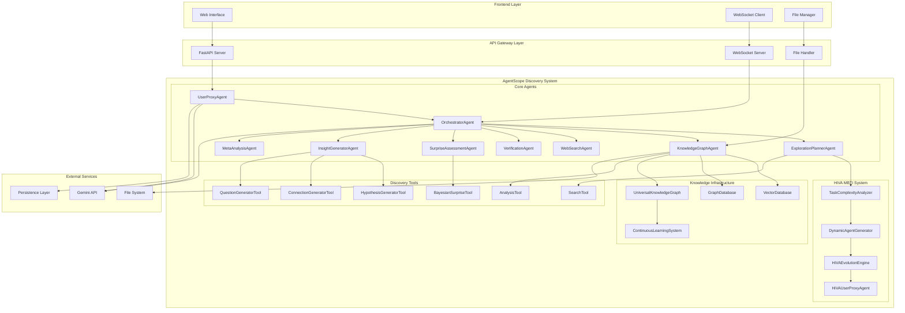
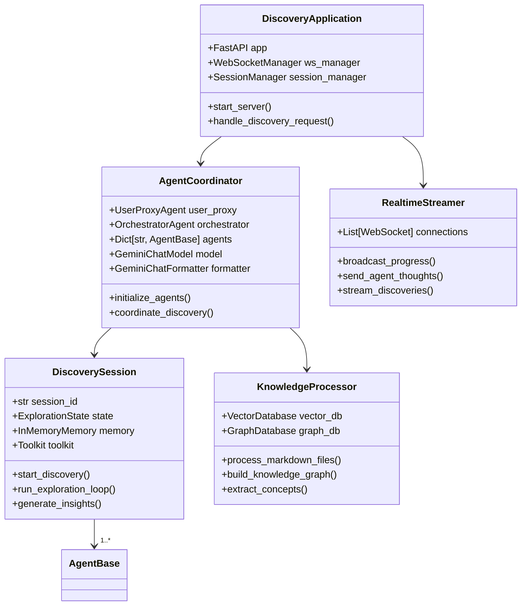
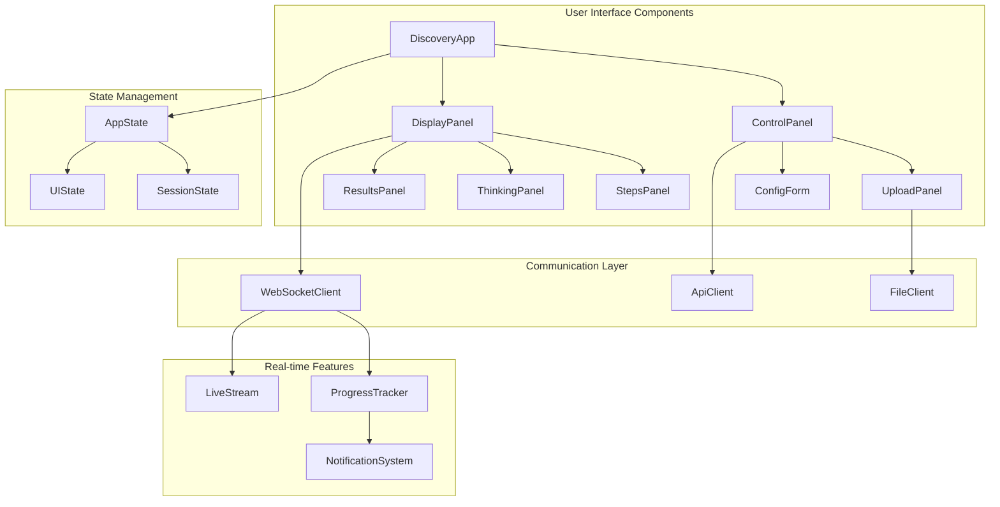
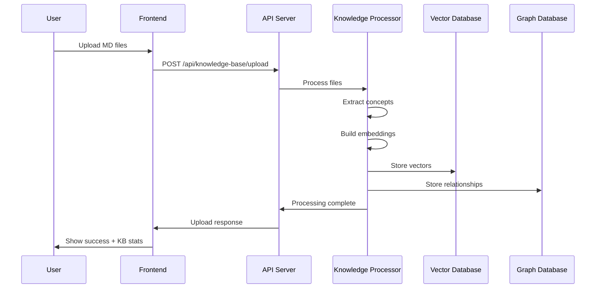
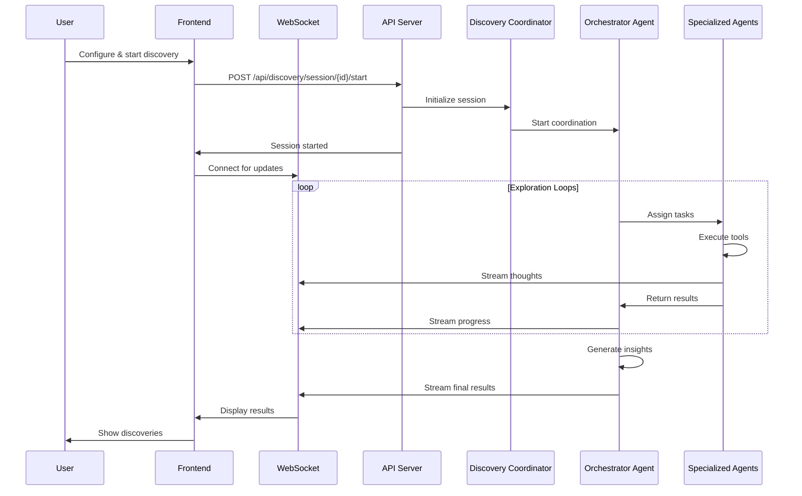

# Discovery Agent Frontend-Backend Implementation Design

## Overview

This document outlines the complete implementation design for a robust frontend-backend integration of the AgentScope Discovery Agent System. The current implementation is a simplified demo that doesn't fully leverage AgentScope's powerful architecture. This design aims to create a production-ready system that strictly follows AgentScope's development principles and patterns.

## Technology Stack & Dependencies

### Backend Framework
- **AgentScope Framework**: Core agent system with ReActAgent patterns
- **FastAPI**: Modern async web framework for API endpoints
- **WebSocket**: Real-time communication for agent streaming
- **Pydantic**: Data validation and structured output
- **Gemini API**: Primary LLM integration via AgentScope

### Frontend Technology
- **Modern HTML5/CSS3/JavaScript**: Native web technologies
- **Tailwind CSS**: Utility-first styling framework
- **WebSocket API**: Real-time bidirectional communication
- **Progressive Enhancement**: Works without JavaScript for basic functionality

### AgentScope Integration
- **Model Layer**: GeminiChatModel with GeminiChatFormatter
- **Agent Layer**: ReActAgent inheritance for discovery agents
- **Memory Layer**: InMemoryMemory and session persistence
- **Tool Layer**: Discovery-specific tool implementations
- **State Management**: StateModule pattern for persistence

## Architecture

### System Architecture Overview



### Component Hierarchy



## Frontend Architecture

### Component Structure



### State Management Pattern

```javascript
class DiscoveryState {
    constructor() {
        this.session = {
            id: null,
            status: 'idle',
            progress: 0,
            currentStep: '',
            knowledgeBase: null
        };
        
        this.agents = {
            activeAgents: [],
            agentThoughts: new Map(),
            discoveries: [],
            insights: []
        };
        
        this.ui = {
            connected: false,
            uploading: false,
            exploring: false,
            error: null
        };
    }
}
```

### WebSocket Event Handling

```javascript
class WebSocketManager {
    constructor(url) {
        this.url = url;
        this.socket = null;
        this.reconnectAttempts = 0;
        this.maxReconnectAttempts = 5;
        this.eventHandlers = new Map();
    }
    
    registerHandler(eventType, handler) {
        if (!this.eventHandlers.has(eventType)) {
            this.eventHandlers.set(eventType, []);
        }
        this.eventHandlers.get(eventType).push(handler);
    }
    
    handleMessage(event) {
        const data = JSON.parse(event.data);
        const handlers = this.eventHandlers.get(data.type) || [];
        handlers.forEach(handler => handler(data));
    }
}
```

## Backend Architecture

### AgentScope Integration Pattern

#### Agent Initialization Following AgentScope Standards

```python
class DiscoveryAgentCoordinator:
    """Coordinates all discovery agents following AgentScope patterns."""
    
    def __init__(self, config: DiscoveryConfig):
        self.config = config
        self.model = self._initialize_model()
        self.formatter = self._initialize_formatter()
        self.memory = self._initialize_memory()
        self.toolkit = self._initialize_toolkit()
        self.agents = self._initialize_agents()
    
    def _initialize_model(self) -> GeminiChatModel:
        """Initialize Gemini model following AgentScope patterns."""
        return GeminiChatModel(
            model_name="gemini-1.5-pro",
            api_key=self.config.gemini_api_key,
            stream=True,
            generate_kwargs={
                "temperature": 0.7,
                "max_output_tokens": 2048,
                "top_p": 0.8,
                "top_k": 40
            }
        )
    
    def _initialize_formatter(self) -> GeminiChatFormatter:
        """Initialize formatter for multi-agent conversations."""
        return GeminiChatFormatter()
    
    def _initialize_memory(self) -> InMemoryMemory:
        """Initialize memory system for session persistence."""
        return InMemoryMemory(
            max_pool_size=1000,
            embedding_model=self.config.embedding_model
        )
    
    def _initialize_toolkit(self) -> Toolkit:
        """Initialize discovery-specific toolkit."""
        toolkit = Toolkit()
        
        # Register core discovery tools
        toolkit.register_tool_function(SearchTool())
        toolkit.register_tool_function(AnalysisTool())
        toolkit.register_tool_function(HypothesisGeneratorTool())
        toolkit.register_tool_function(ConnectionGeneratorTool())
        toolkit.register_tool_function(QuestionGeneratorTool())
        toolkit.register_tool_function(BayesianSurpriseTool())
        
        return toolkit
    
    def _initialize_agents(self) -> Dict[str, AgentBase]:
        """Initialize all discovery agents as ReActAgents."""
        agents = {}
        
        # UserProxyAgent - inherits from ReActAgent
        agents['user_proxy'] = UserProxyAgent(
            name="DiscoveryUserProxy",
            model=self.model,
            formatter=self.formatter,
            memory=self.memory,
            toolkit=self.toolkit,
            max_loops=self.config.max_loops,
            token_budget=self.config.token_budget,
            time_budget=self.config.time_budget,
            cost_budget=self.config.cost_budget
        )
        
        # OrchestratorAgent - central coordinator
        agents['orchestrator'] = OrchestratorAgent(
            name="DiscoveryOrchestrator",
            model=self.model,
            formatter=self.formatter,
            memory=self.memory,
            toolkit=self.toolkit,
            sys_prompt=self._load_orchestrator_prompt()
        )
        
        # Specialized discovery agents
        agents['exploration_planner'] = ExplorationPlannerAgent(
            name="ExplorationPlanner",
            model=self.model,
            formatter=self.formatter,
            memory=self.memory,
            toolkit=self.toolkit,
            sys_prompt=self._load_planner_prompt()
        )
        
        agents['knowledge_graph'] = KnowledgeGraphAgent(
            name="KnowledgeGraphAgent",
            model=self.model,
            formatter=self.formatter,
            memory=self.memory,
            toolkit=self.toolkit,
            storage_base_path=self.config.storage_path
        )
        
        # Additional agents following same pattern...
        
        return agents
```

#### System Prompt Engineering

```python
class PromptManager:
    """Manages structured system prompts for discovery agents."""
    
    @staticmethod
    def load_orchestrator_prompt() -> str:
        return """
# Discovery Orchestrator Agent

## Identity
You are the Discovery Orchestrator, the central coordinator of the Agent Discovery System.

## Core Mission
Coordinate multi-agent exploration to discover novel insights from knowledge bases through:
- Strategic exploration planning
- Agent task allocation
- Progress monitoring
- Insight synthesis

## Operation Paradigm
1. **Plan**: Analyze initial ideas and create exploration strategies
2. **Coordinate**: Assign tasks to specialized agents
3. **Monitor**: Track progress and adjust strategies
4. **Synthesize**: Combine agent outputs into coherent insights

## Important Constraints
- Maintain budget awareness (tokens, time, cost)
- Ensure agent coordination without conflicts
- Focus on novel discoveries over obvious connections
- Prioritize high-surprise insights

## Available Agents
{agent_descriptions}

## Output Format
Always provide structured responses with clear agent assignments and expected outcomes.
"""
    
    @staticmethod
    def load_exploration_planner_prompt() -> str:
        return """
# Exploration Planner Agent

## Identity
You are the Exploration Planner, responsible for strategic knowledge exploration.

## Core Mission
Design and execute exploration strategies that maximize discovery potential:
- Identify knowledge boundaries
- Plan exploration paths
- Generate targeted queries
- Assess exploration effectiveness

## Cognitive Framework
Use curiosity-driven exploration algorithms:
1. **Boundary Detection**: Find edges of current knowledge
2. **Novelty Assessment**: Identify unexplored areas
3. **Strategic Planning**: Design exploration sequences
4. **Adaptive Adjustment**: Modify plans based on discoveries

## Tools Available
{available_tools}

## Output Requirements
- Specific exploration queries
- Rationale for each query
- Expected discovery types
- Success metrics
"""
```

### Real-time Streaming Architecture

#### WebSocket Event Broadcasting

```python
class DiscoveryStreamer:
    """Handles real-time streaming of discovery progress."""
    
    def __init__(self):
        self.connections: List[WebSocket] = []
        self.event_queue = asyncio.Queue()
        self.streaming_task = None
    
    async def add_connection(self, websocket: WebSocket):
        """Add new WebSocket connection."""
        await websocket.accept()
        self.connections.append(websocket)
        
        # Send current session status
        if hasattr(self, 'current_session'):
            await self.send_to_client(websocket, {
                "type": "session_status",
                "session": self.current_session
            })
    
    async def remove_connection(self, websocket: WebSocket):
        """Remove WebSocket connection."""
        if websocket in self.connections:
            self.connections.remove(websocket)
    
    async def broadcast_event(self, event: Dict[str, Any]):
        """Broadcast event to all connected clients."""
        if not self.connections:
            return
        
        disconnected = []
        for connection in self.connections:
            try:
                await self.send_to_client(connection, event)
            except Exception:
                disconnected.append(connection)
        
        # Clean up disconnected clients
        for connection in disconnected:
            await self.remove_connection(connection)
    
    async def send_to_client(self, websocket: WebSocket, data: Dict[str, Any]):
        """Send data to specific client."""
        await websocket.send_text(json.dumps(data, default=str))
    
    async def stream_agent_thought(self, agent_name: str, thought_step: str, content: str):
        """Stream agent thinking process."""
        await self.broadcast_event({
            "type": "agent_thinking",
            "agent_name": agent_name,
            "thought_step": thought_step,
            "content": content,
            "timestamp": datetime.now().isoformat()
        })
    
    async def stream_discovery(self, discovery: Dict[str, Any]):
        """Stream new discovery."""
        await self.broadcast_event({
            "type": "discovery_found",
            "discovery": discovery,
            "timestamp": datetime.now().isoformat()
        })
```

#### Agent Hook Integration

```python
class DiscoveryAgentHooks:
    """Agent hooks for real-time streaming integration."""
    
    def __init__(self, streamer: DiscoveryStreamer):
        self.streamer = streamer
    
    async def pre_reasoning_hook(self, agent: AgentBase, msg: Msg) -> None:
        """Hook before agent reasoning phase."""
        await self.streamer.stream_agent_thought(
            agent_name=agent.name,
            thought_step="reasoning_start",
            content=f"Starting to analyze: {msg.content[:100]}..."
        )
    
    async def post_reasoning_hook(self, agent: AgentBase, reasoning_result: Msg) -> None:
        """Hook after agent reasoning phase."""
        await self.streamer.stream_agent_thought(
            agent_name=agent.name,
            thought_step="reasoning_complete",
            content=reasoning_result.content
        )
    
    async def pre_acting_hook(self, agent: AgentBase, action: Dict[str, Any]) -> None:
        """Hook before agent action phase."""
        await self.streamer.stream_agent_thought(
            agent_name=agent.name,
            thought_step="action_planning",
            content=f"Planning to execute: {action.get('tool_name', 'unknown')}"
        )
    
    async def post_acting_hook(self, agent: AgentBase, action_result: ToolResponse) -> None:
        """Hook after agent action phase."""
        await self.streamer.stream_agent_thought(
            agent_name=agent.name,
            thought_step="action_complete",
            content=f"Action completed with {len(action_result.content)} results"
        )
    
    def register_hooks(self, agent: ReActAgent):
        """Register all hooks with an agent."""
        agent.register_instance_hook("pre_reasoning", "streaming", self.pre_reasoning_hook)
        agent.register_instance_hook("post_reasoning", "streaming", self.post_reasoning_hook)
        agent.register_instance_hook("pre_acting", "streaming", self.pre_acting_hook)
        agent.register_instance_hook("post_acting", "streaming", self.post_acting_hook)
```

## API Design

### RESTful Endpoints

#### Core Discovery Endpoints

```python
@app.post("/api/discovery/session", response_model=SessionResponse)
async def create_discovery_session(request: CreateSessionRequest):
    """Create new discovery session with uploaded knowledge base."""
    
@app.post("/api/discovery/session/{session_id}/start", response_model=StartResponse)
async def start_discovery(session_id: str, request: StartDiscoveryRequest):
    """Start discovery process for existing session."""
    
@app.get("/api/discovery/session/{session_id}/status", response_model=SessionStatus)
async def get_session_status(session_id: str):
    """Get current session status and progress."""
    
@app.get("/api/discovery/session/{session_id}/results", response_model=DiscoveryResults)
async def get_discovery_results(session_id: str):
    """Get final discovery results."""
    
@app.post("/api/discovery/session/{session_id}/stop")
async def stop_discovery(session_id: str):
    """Stop current discovery session."""
    
@app.delete("/api/discovery/session/{session_id}")
async def delete_session(session_id: str):
    """Delete discovery session and cleanup resources."""
```

#### Knowledge Base Management

```python
@app.post("/api/knowledge-base/upload", response_model=UploadResponse)
async def upload_knowledge_base(files: List[UploadFile] = File(...)):
    """Upload markdown files to create knowledge base."""
    
@app.get("/api/knowledge-base/{kb_id}/info", response_model=KnowledgeBaseInfo)
async def get_knowledge_base_info(kb_id: str):
    """Get knowledge base information and statistics."""
    
@app.get("/api/knowledge-base/{kb_id}/graph", response_model=KnowledgeGraph)
async def get_knowledge_graph(kb_id: str):
    """Get knowledge graph structure for visualization."""
```

#### Agent Management

```python
@app.get("/api/agents/status", response_model=List[AgentStatus])
async def get_agents_status():
    """Get status of all discovery agents."""
    
@app.get("/api/agents/{agent_name}/thoughts", response_model=List[AgentThought])
async def get_agent_thoughts(agent_name: str, session_id: str):
    """Get agent thinking history for session."""
```

### WebSocket Events

#### Event Types and Schemas

```python
class WebSocketEvent(BaseModel):
    type: str
    timestamp: datetime
    session_id: Optional[str] = None

class SessionStartedEvent(WebSocketEvent):
    type: Literal["session_started"] = "session_started"
    session_info: Dict[str, Any]

class AgentThinkingEvent(WebSocketEvent):
    type: Literal["agent_thinking"] = "agent_thinking"
    agent_name: str
    thought_step: str
    content: str
    loop_number: Optional[int] = None

class DiscoveryFoundEvent(WebSocketEvent):
    type: Literal["discovery_found"] = "discovery_found"
    discovery: Dict[str, Any]
    agent_name: str
    confidence: float

class ProgressUpdateEvent(WebSocketEvent):
    type: Literal["progress_update"] = "progress_update"
    current_step: str
    progress_percentage: float
    estimated_time_remaining: Optional[float] = None

class SessionCompleteEvent(WebSocketEvent):
    type: Literal["session_complete"] = "session_complete"
    final_results: Dict[str, Any]
    summary_stats: Dict[str, Any]

class ErrorEvent(WebSocketEvent):
    type: Literal["error"] = "error"
    error_code: str
    error_message: str
    recoverable: bool
```

## Data Flow Architecture

### Knowledge Processing Pipeline



### Discovery Session Flow



## State Management

### Session State Model

```python
@dataclass
class DiscoverySessionState:
    """Complete state model for discovery sessions."""
    
    # Session identification
    session_id: str
    created_at: datetime
    updated_at: datetime
    status: SessionStatus
    
    # Configuration
    initial_idea: str
    focus_areas: List[str]
    exploration_depth: ExplorationDepth
    max_loops: int
    budgets: BudgetConstraints
    
    # Knowledge base
    knowledge_base_id: str
    knowledge_base_path: str
    processed_documents: List[DocumentInfo]
    knowledge_graph: KnowledgeGraphStructure
    
    # Execution state
    current_loop: int
    completed_loops: List[LoopResult]
    active_agents: List[str]
    agent_states: Dict[str, AgentState]
    
    # Results
    discoveries: List[Discovery]
    insights: List[Insight]
    hypotheses: List[Hypothesis]
    research_questions: List[ResearchQuestion]
    
    # Budget tracking
    tokens_used: int
    time_elapsed: float
    cost_incurred: float
    
    # Error handling
    errors: List[ErrorEvent]
    warnings: List[WarningEvent]
```

### State Persistence

```python
class SessionStateManager:
    """Manages session state persistence and recovery."""
    
    def __init__(self, storage_path: str):
        self.storage_path = Path(storage_path)
        self.storage_path.mkdir(exist_ok=True)
    
    async def save_session_state(self, state: DiscoverySessionState) -> None:
        """Save session state to disk."""
        session_file = self.storage_path / f"{state.session_id}.json"
        
        # Convert state to serializable format
        state_dict = asdict(state)
        
        # Handle special serialization for complex objects
        state_dict = self._serialize_complex_objects(state_dict)
        
        async with aiofiles.open(session_file, 'w') as f:
            await f.write(json.dumps(state_dict, indent=2, default=str))
    
    async def load_session_state(self, session_id: str) -> Optional[DiscoverySessionState]:
        """Load session state from disk."""
        session_file = self.storage_path / f"{session_id}.json"
        
        if not session_file.exists():
            return None
        
        async with aiofiles.open(session_file, 'r') as f:
            state_dict = json.loads(await f.read())
        
        # Deserialize complex objects
        state_dict = self._deserialize_complex_objects(state_dict)
        
        return DiscoverySessionState(**state_dict)
    
    async def list_sessions(self) -> List[SessionInfo]:
        """List all stored sessions."""
        sessions = []
        for session_file in self.storage_path.glob("*.json"):
            try:
                state = await self.load_session_state(session_file.stem)
                if state:
                    sessions.append(SessionInfo(
                        session_id=state.session_id,
                        created_at=state.created_at,
                        status=state.status,
                        initial_idea=state.initial_idea[:100] + "..." if len(state.initial_idea) > 100 else state.initial_idea
                    ))
            except Exception as e:
                logger.warning(f"Failed to load session {session_file.stem}: {e}")
        
        return sorted(sessions, key=lambda x: x.created_at, reverse=True)
```

## Error Handling & Recovery

### Error Classification

```python
class DiscoveryError(Exception):
    """Base class for discovery system errors."""
    
    def __init__(self, message: str, error_code: str, recoverable: bool = False):
        super().__init__(message)
        self.error_code = error_code
        self.recoverable = recoverable
        self.timestamp = datetime.now()

class AgentError(DiscoveryError):
    """Agent-specific errors."""
    
    def __init__(self, agent_name: str, message: str, error_code: str, recoverable: bool = True):
        super().__init__(f"Agent {agent_name}: {message}", error_code, recoverable)
        self.agent_name = agent_name

class ModelError(DiscoveryError):
    """Model/API-related errors."""
    
    def __init__(self, model_name: str, message: str, error_code: str, recoverable: bool = True):
        super().__init__(f"Model {model_name}: {message}", error_code, recoverable)
        self.model_name = model_name

class KnowledgeBaseError(DiscoveryError):
    """Knowledge base processing errors."""
    
    def __init__(self, message: str, error_code: str, recoverable: bool = False):
        super().__init__(f"Knowledge base: {message}", error_code, recoverable)

class BudgetExceededError(DiscoveryError):
    """Budget constraint violations."""
    
    def __init__(self, budget_type: str, used: float, limit: float):
        message = f"{budget_type} budget exceeded: {used}/{limit}"
        super().__init__(message, "BUDGET_EXCEEDED", recoverable=False)
        self.budget_type = budget_type
        self.used = used
        self.limit = limit
```

### Error Recovery Strategies

```python
class ErrorRecoveryManager:
    """Manages error recovery strategies for the discovery system."""
    
    def __init__(self, max_retries: int = 3, backoff_factor: float = 2.0):
        self.max_retries = max_retries
        self.backoff_factor = backoff_factor
        self.recovery_strategies = self._initialize_strategies()
    
    async def handle_error(self, error: DiscoveryError, context: Dict[str, Any]) -> RecoveryAction:
        """Handle error and determine recovery action."""
        
        if not error.recoverable:
            return RecoveryAction.TERMINATE
        
        strategy = self.recovery_strategies.get(error.error_code)
        if not strategy:
            return RecoveryAction.ESCALATE
        
        return await strategy(error, context)
    
    def _initialize_strategies(self) -> Dict[str, Callable]:
        """Initialize error recovery strategies."""
        return {
            "AGENT_TIMEOUT": self._handle_agent_timeout,
            "MODEL_API_ERROR": self._handle_model_api_error,
            "KNOWLEDGE_PROCESSING_ERROR": self._handle_knowledge_error,
            "INSUFFICIENT_MEMORY": self._handle_memory_error,
            "TOOL_EXECUTION_ERROR": self._handle_tool_error,
        }
    
    async def _handle_agent_timeout(self, error: AgentError, context: Dict[str, Any]) -> RecoveryAction:
        """Handle agent timeout errors."""
        retry_count = context.get('retry_count', 0)
        
        if retry_count < self.max_retries:
            # Exponential backoff
            await asyncio.sleep(self.backoff_factor ** retry_count)
            return RecoveryAction.RETRY
        
        # Switch to fallback agent
        return RecoveryAction.FALLBACK
    
    async def _handle_model_api_error(self, error: ModelError, context: Dict[str, Any]) -> RecoveryAction:
        """Handle model API errors."""
        if "rate_limit" in error.message.lower():
            # Wait for rate limit reset
            await asyncio.sleep(60)
            return RecoveryAction.RETRY
        
        if "quota_exceeded" in error.message.lower():
            return RecoveryAction.TERMINATE
        
        # Generic API error - retry with backoff
        retry_count = context.get('retry_count', 0)
        if retry_count < self.max_retries:
            await asyncio.sleep(self.backoff_factor ** retry_count)
            return RecoveryAction.RETRY
        
        return RecoveryAction.ESCALATE
```

## Security Considerations

### API Security

```python
class SecurityMiddleware:
    """Security middleware for discovery API."""
    
    def __init__(self, rate_limit: int = 100, time_window: int = 3600):
        self.rate_limit = rate_limit
        self.time_window = time_window
        self.request_counts = {}
    
    async def __call__(self, request: Request, call_next):
        # Rate limiting
        client_ip = self._get_client_ip(request)
        if not await self._check_rate_limit(client_ip):
            raise HTTPException(status_code=429, detail="Rate limit exceeded")
        
        # Input validation
        if request.method in ["POST", "PUT", "PATCH"]:
            await self._validate_input_size(request)
        
        # CSRF protection for state-changing operations
        if request.method in ["POST", "PUT", "DELETE"]:
            await self._validate_csrf_token(request)
        
        response = await call_next(request)
        
        # Security headers
        response.headers["X-Content-Type-Options"] = "nosniff"
        response.headers["X-Frame-Options"] = "DENY"
        response.headers["X-XSS-Protection"] = "1; mode=block"
        
        return response
    
    async def _validate_input_size(self, request: Request):
        """Validate input size limits."""
        content_length = request.headers.get("content-length")
        if content_length and int(content_length) > 50 * 1024 * 1024:  # 50MB limit
            raise HTTPException(status_code=413, detail="Request entity too large")
    
    async def _validate_file_types(self, files: List[UploadFile]):
        """Validate uploaded file types and content."""
        allowed_extensions = {'.md', '.markdown', '.txt'}
        
        for file in files:
            # Check file extension
            file_ext = Path(file.filename).suffix.lower()
            if file_ext not in allowed_extensions:
                raise HTTPException(
                    status_code=400, 
                    detail=f"File type {file_ext} not allowed"
                )
            
            # Check file content (basic validation)
            content = await file.read()
            await file.seek(0)  # Reset file pointer
            
            # Basic content validation
            try:
                content.decode('utf-8')
            except UnicodeDecodeError:
                raise HTTPException(
                    status_code=400,
                    detail=f"File {file.filename} contains invalid UTF-8 content"
                )
```

### Data Sanitization

```python
class InputSanitizer:
    """Sanitizes user inputs for security."""
    
    @staticmethod
    def sanitize_text_input(text: str, max_length: int = 10000) -> str:
        """Sanitize text input."""
        if not text:
            return ""
        
        # Length check
        if len(text) > max_length:
            raise ValueError(f"Input too long: {len(text)} > {max_length}")
        
        # Remove potentially dangerous characters
        sanitized = re.sub(r'[<>"\']', '', text)
        
        # Remove excessive whitespace
        sanitized = re.sub(r'\s+', ' ', sanitized).strip()
        
        return sanitized
    
    @staticmethod
    def validate_session_id(session_id: str) -> str:
        """Validate and sanitize session ID."""
        if not session_id:
            raise ValueError("Session ID cannot be empty")
        
        # Check format (UUID-like)
        if not re.match(r'^[a-zA-Z0-9\-]{8,64}$', session_id):
            raise ValueError("Invalid session ID format")
        
        return session_id
    
    @staticmethod
    def sanitize_filename(filename: str) -> str:
        """Sanitize uploaded filename."""
        # Remove path components
        filename = os.path.basename(filename)
        
        # Remove dangerous characters
        filename = re.sub(r'[^\w\s\-\.]', '', filename)
        
        # Limit length
        if len(filename) > 255:
            name, ext = os.path.splitext(filename)
            filename = name[:250] + ext
        
        return filename
```

## Testing Strategy

### Unit Testing

```python
class TestDiscoveryAgents:
    """Unit tests for discovery agents."""
    
    @pytest.fixture
    def mock_model(self):
        """Mock Gemini model for testing."""
        model = Mock(spec=GeminiChatModel)
        model.generate.return_value = ChatResponse(
            content="Mock response",
            metadata={"usage": {"tokens": 100}}
        )
        return model
    
    @pytest.fixture
    def mock_formatter(self):
        """Mock formatter for testing."""
        return Mock(spec=GeminiChatFormatter)
    
    @pytest.fixture
    def discovery_agent(self, mock_model, mock_formatter):
        """Create discovery agent for testing."""
        return OrchestratorAgent(
            name="TestOrchestrator",
            model=mock_model,
            formatter=mock_formatter,
            memory=InMemoryMemory(),
            toolkit=Toolkit()
        )
    
    async def test_agent_initialization(self, discovery_agent):
        """Test agent initialization."""
        assert discovery_agent.name == "TestOrchestrator"
        assert isinstance(discovery_agent.memory, InMemoryMemory)
        assert isinstance(discovery_agent.toolkit, Toolkit)
    
    async def test_start_discovery_session(self, discovery_agent):
        """Test discovery session start."""
        message = DiscoveryMessage(
            type=MessageType.DISCOVERY_REQUEST,
            content="Test discovery",
            metadata={"initial_idea": "test idea"}
        )
        
        result = await discovery_agent.start_discovery_session(message)
        
        assert result["status"] == "started"
        assert "session_id" in result
    
    async def test_coordinate_exploration_loop(self, discovery_agent):
        """Test exploration loop coordination."""
        # Setup session first
        message = DiscoveryMessage(
            type=MessageType.DISCOVERY_REQUEST,
            content="Test discovery"
        )
        await discovery_agent.start_discovery_session(message)
        
        # Run exploration loop
        result = await discovery_agent.coordinate_exploration_loop()
        
        assert "status" in result
        assert "discoveries" in result
```

### Integration Testing

```python
class TestDiscoveryIntegration:
    """Integration tests for the discovery system."""
    
    @pytest.fixture
    async def test_client(self):
        """Create test client for API testing."""
        from fastapi.testclient import TestClient
        return TestClient(app)
    
    @pytest.fixture
    def sample_markdown_files(self, tmp_path):
        """Create sample markdown files for testing."""
        files = []
        for i in range(3):
            file_path = tmp_path / f"test_{i}.md"
            file_path.write_text(f"# Test Document {i}\n\nThis is test content for document {i}.")
            files.append(file_path)
        return files
    
    async def test_full_discovery_workflow(self, test_client, sample_markdown_files):
        """Test complete discovery workflow."""
        
        # 1. Upload knowledge base
        with open(sample_markdown_files[0], 'rb') as f:
            upload_response = test_client.post(
                "/api/knowledge-base/upload",
                files={"files": ("test.md", f, "text/markdown")}
            )
        assert upload_response.status_code == 200
        kb_id = upload_response.json()["knowledge_base_id"]
        
        # 2. Create discovery session
        session_response = test_client.post(
            "/api/discovery/session",
            json={
                "knowledge_base_id": kb_id,
                "initial_idea": "Test discovery idea",
                "focus_areas": ["test", "discovery"],
                "exploration_depth": "normal",
                "max_loops": 2,
                "token_budget": 5000
            }
        )
        assert session_response.status_code == 200
        session_id = session_response.json()["session_id"]
        
        # 3. Start discovery
        start_response = test_client.post(f"/api/discovery/session/{session_id}/start")
        assert start_response.status_code == 200
        
        # 4. Wait for completion (with timeout)
        import time
        max_wait = 60  # 60 seconds timeout
        start_time = time.time()
        
        while time.time() - start_time < max_wait:
            status_response = test_client.get(f"/api/discovery/session/{session_id}/status")
            status = status_response.json()
            
            if status["status"] in ["completed", "error"]:
                break
            
            await asyncio.sleep(1)
        
        # 5. Get results
        results_response = test_client.get(f"/api/discovery/session/{session_id}/results")
        assert results_response.status_code == 200
        
        results = results_response.json()
        assert "discoveries" in results
        assert "insights" in results
        assert len(results["discoveries"]) > 0
```

### Performance Testing

```python
class TestDiscoveryPerformance:
    """Performance tests for the discovery system."""
    
    async def test_concurrent_sessions(self):
        """Test multiple concurrent discovery sessions."""
        import aiohttp
        import asyncio
        
        async def run_discovery_session(session_id: str):
            """Run a single discovery session."""
            async with aiohttp.ClientSession() as session:
                # Upload knowledge base
                upload_data = {"initial_idea": f"Test idea {session_id}"}
                async with session.post(
                    "http://localhost:8000/api/discovery/session",
                    json=upload_data
                ) as resp:
                    result = await resp.json()
                    return result
        
        # Run 10 concurrent sessions
        tasks = [run_discovery_session(f"session_{i}") for i in range(10)]
        results = await asyncio.gather(*tasks, return_exceptions=True)
        
        # Check that all sessions completed successfully
        successful_sessions = [r for r in results if not isinstance(r, Exception)]
        assert len(successful_sessions) == 10
    
    async def test_memory_usage(self):
        """Test memory usage under load."""
        import psutil
        import gc
        
        process = psutil.Process()
        initial_memory = process.memory_info().rss
        
        # Create multiple discovery sessions
        sessions = []
        for i in range(5):
            session = await create_test_discovery_session()
            sessions.append(session)
        
        # Check memory usage
        peak_memory = process.memory_info().rss
        memory_increase = peak_memory - initial_memory
        
        # Clean up sessions
        for session in sessions:
            await session.cleanup()
        
        gc.collect()
        
        # Check memory after cleanup
        final_memory = process.memory_info().rss
        
        # Memory should not increase excessively
        assert memory_increase < 500 * 1024 * 1024  # Less than 500MB increase
        
        # Most memory should be released after cleanup
        assert final_memory - initial_memory < 100 * 1024 * 1024  # Less than 100MB residual
```

This comprehensive design document provides a complete blueprint for implementing a production-ready Discovery Agent system that fully leverages AgentScope's architecture patterns while providing a modern, real-time web interface. The design emphasizes modularity, scalability, security, and maintainability following AgentScope's core principles.
