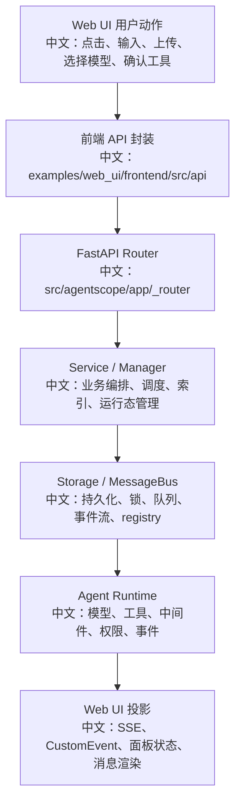

# AgentScope 全量接口地图

> 用途：这是全量 API 学习导航页。它不替代每个接口的深度文档，而是帮助你快速判断“这个接口属于哪个产品模块、该读哪个文档、面试时能讲什么”。

---

## 1. 总体分层



中文说明：接口不是孤立的 HTTP CRUD。面试时要讲清楚：前端为何触发、后端如何装配、状态存在哪里、事件如何回到 UI。

---

## 2. 核心接口总览

| 模块 | 接口 | 文档 | 面试关键词 |
|---|---|---|---|
| Chat | `POST /chat/` | [触发聊天运行.md](interfaces/chat/触发聊天运行.md) | fire-and-forget、异步 run、事件流回包 |
| Session | `GET /sessions/` | [会话列表.md](interfaces/session/会话列表.md) | SessionView、is_running、team detail |
| Session | `POST /sessions/` | [创建会话.md](interfaces/session/创建会话.md) | 运行态边界、workspace 绑定、模型配置 |
| Session | `PATCH /sessions/{sid}` | [更新会话.md](interfaces/session/更新会话.md) | PATCH 语义、模型/TTS/RAG/权限配置 |
| Session | `DELETE /sessions/{sid}` | [删除会话.md](interfaces/session/删除会话.md) | 删除前取消、状态清理、级联 |
| Session | `POST /sessions/{sid}/interrupt` | [中断会话.md](interfaces/session/中断会话.md) | 202、协作式取消、幂等、SSE 收尾 |
| Session | `GET /sessions/{sid}/messages` | [会话消息.md](interfaces/session/会话消息.md) | 历史恢复、is_running、分页 |
| Session | `GET /sessions/{sid}/status` | [会话状态.md](interfaces/session/会话状态.md) | RUNNING/HITL/IDLE、状态归一 |
| Session | `GET /sessions/{sid}/stream` | [会话事件流.md](interfaces/session/会话事件流.md) | SSE、replay log、heartbeat、live pub/sub |
| Agent | `GET /agent/schemas` | [智能体结构.md](interfaces/agent/智能体结构.md) | 动态 schema、配置态 |
| Agent | `GET /agent/default` | [智能体旧版结构.md](interfaces/agent/智能体旧版结构.md) | 默认 Agent、兼容入口 |
| Agent | `GET /agent/` | [智能体列表.md](interfaces/agent/智能体列表.md) | 资源列表、editable、共享可见性 |
| Agent | `POST /agent/` | [创建智能体.md](interfaces/agent/创建智能体.md) | Agent 配置态、system prompt、context/react config |
| Agent | `PATCH /agent/{agent_id}` | [更新智能体.md](interfaces/agent/更新智能体.md) | 编辑权限、配置更新 |
| Agent | `DELETE /agent/{agent_id}` | [删除智能体.md](interfaces/agent/删除智能体.md) | 删除资源、会话关系 |
| Credential | `GET /credential/schemas` | [凭证类型结构列表.md](interfaces/credential/凭证类型结构列表.md) | provider schema、writeOnly、动态表单 |
| Credential | `GET /credential/` | [凭证列表.md](interfaces/credential/凭证列表.md) | 密钥脱敏、共享凭证只读 |
| Credential | `POST /credential/` | [创建凭证.md](interfaces/credential/创建凭证.md) | provider 凭证、模型能力入口 |
| Credential | `PATCH /credential/{credential_id}` | [更新凭证.md](interfaces/credential/更新凭证.md) | 编辑权限、脱敏回填 |
| Credential | `DELETE /credential/{credential_id}` | [删除凭证.md](interfaces/credential/删除凭证.md) | 资源依赖、凭证生命周期 |
| Model | `GET /model/` | [聊天模型列表.md](interfaces/model/聊天模型列表.md) | ModelCard、input_types、context_size |
| Model | `GET /tts-model/` | [语音合成模型列表.md](interfaces/model/语音合成模型列表.md) | TTSModelCard、realtime、audio output |
| KnowledgeBase | `GET /knowledge_bases/embedding_models` | [知识库嵌入模型列表.md](interfaces/knowledge_base/知识库嵌入模型列表.md) | embedding 能力发现、凭证绑定 |
| KnowledgeBase | `GET /knowledge_bases/rag_middleware_params` | [知识库中间件参数结构.md](interfaces/knowledge_base/知识库中间件参数结构.md) | RAG 参数 schema、top_k 等 |
| KnowledgeBase | `GET /knowledge_bases/supported_content_types` | [知识库支持的内容类型.md](interfaces/knowledge_base/知识库支持的内容类型.md) | 上传边界、解析器能力 |
| KnowledgeBase | `POST /knowledge_bases/` | [创建知识库.md](interfaces/knowledge_base/创建知识库.md) | KB 配置、embedding model、向量库 |
| KnowledgeBase | `GET /knowledge_bases/` | [知识库列表.md](interfaces/knowledge_base/知识库列表.md) | KB 资源、共享可见性 |
| KnowledgeBase | `PATCH /knowledge_bases/{kb_id}` | [更新知识库.md](interfaces/knowledge_base/更新知识库.md) | 名称/配置更新 |
| KnowledgeBase | `DELETE /knowledge_bases/{kb_id}` | [删除知识库.md](interfaces/knowledge_base/删除知识库.md) | 删除文档、向量集合、blob |
| KnowledgeBase | `GET /knowledge_bases/{kb_id}/documents` | [知识库文档列表.md](interfaces/knowledge_base/知识库文档列表.md) | 文档状态、索引进度 |
| KnowledgeBase | `GET /knowledge_bases/{kb_id}/documents/{doc_id}/status` | [知识库文档状态.md](interfaces/knowledge_base/知识库文档状态.md) | 前端轮询、异步索引状态 |
| KnowledgeBase | `POST /knowledge_bases/{kb_id}/documents` | [上传知识库文档.md](interfaces/knowledge_base/上传知识库文档.md) | 上传、BlobStore、index task |
| KnowledgeBase | `DELETE /knowledge_bases/{kb_id}/documents/{doc_id}` | [删除知识库文档.md](interfaces/knowledge_base/删除知识库文档.md) | 删除文档、清理向量块 |
| KnowledgeBase | `POST /knowledge_bases/{kb_id}/retrieve` | [知识库检索.md](interfaces/knowledge_base/知识库检索.md) | query、embedding、vector search、top_k |
| Schedule | `GET /schedule/` | [定时任务列表.md](interfaces/schedule/定时任务列表.md) | cron、stateful、session 绑定 |
| Schedule | `POST /schedule/` | [创建定时任务.md](interfaces/schedule/创建定时任务.md) | APScheduler、自动运行、权限模式 |
| Schedule | `PATCH /schedule/{schedule_id}` | [更新定时任务.md](interfaces/schedule/更新定时任务.md) | 重新调度、状态更新 |
| Schedule | `DELETE /schedule/{schedule_id}` | [删除定时任务.md](interfaces/schedule/删除定时任务.md) | 删除 job、清理运行记录 |
| Schedule | `GET /schedule/{schedule_id}/sessions` | [定时任务会话列表.md](interfaces/schedule/定时任务会话列表.md) | 自动产生的 session 列表 |
| Workspace | `GET /workspace/mcp` | [工作区模型上下文协议列表.md](interfaces/workspace/工作区模型上下文协议列表.md) | MCP 配置、工具生态 |
| Workspace | `POST /workspace/mcp` | [添加工作区模型上下文协议.md](interfaces/workspace/添加工作区模型上下文协议.md) | MCP server 注入 |
| Workspace | `DELETE /workspace/mcp/{name}` | [删除工作区模型上下文协议.md](interfaces/workspace/删除工作区模型上下文协议.md) | 工具移除、会话配置 |
| Workspace | `GET /workspace/skill` | [工作区技能列表.md](interfaces/workspace/工作区技能列表.md) | Skill 加载、知识入口 |
| Workspace | `POST /workspace/skill` | [添加工作区技能.md](interfaces/workspace/添加工作区技能.md) | Skill 装配 |
| Workspace | `DELETE /workspace/skill/{name}` | [删除工作区技能.md](interfaces/workspace/删除工作区技能.md) | Skill 生命周期 |

---

## 3. 非 HTTP 但必须掌握的工具接口

| 工具组 | 工具 | 文档 | 面试关键词 |
|---|---|---|---|
| Plan | `TaskCreate` | [创建任务.md](tools/plan/创建任务.md) | 复杂任务结构化、任务树 |
| Plan | `TaskGet` | [查看任务.md](tools/plan/查看任务.md) | 状态读取、上下文恢复 |
| Plan | `TaskList` | [任务列表.md](tools/plan/任务列表.md) | 计划面板、任务总览 |
| Plan | `TaskUpdate` | [更新任务.md](tools/plan/更新任务.md) | 状态推进、done/in_progress |
| Team | `TeamCreate` | [创建团队.md](tools/team/创建团队.md) | leader/team record |
| Team | `AgentCreate` | [创建团队成员.md](tools/team/创建团队成员.md) | 生成 worker agent |
| Team | `AgentInvite` | [邀请智能体.md](tools/team/邀请智能体.md) | 借用已有 agent、跨资源关系 |
| Team | `TeamSay` | [团队发言.md](tools/team/团队发言.md) | inbox+wakeup、跨 session 通信 |
| Team | `TeamDelete` | [删除团队.md](tools/team/删除团队.md) | 团队生命周期、清理 |
| Team | `SubagentHitlProjector` | [子智能体人工确认投影器.md](tools/team/子智能体人工确认投影器.md) | worker HITL 投影到 leader UI |

---

## 4. 按面试价值排序

### P0：必须能讲深

```text
POST /chat/
GET /sessions/{sid}/stream
POST /sessions/{sid}/interrupt
Plan tools
Team tools
KnowledgeBase upload / status / retrieve
Permission + HITL
ToolOffload + ToolStop
```

### P1：要能讲清产品流程

```text
Session 创建/更新/消息/状态
Workspace MCP/Skill
Schedule 创建/运行记录
Model/TTS 能力发现
Credential schema 和脱敏
```

### P2：简析即可，但要知道边界

```text
Agent CRUD
Credential CRUD
KnowledgeBase CRUD
Schedule CRUD
Workspace 删除类接口
```

---

## 5. 学习方法

每个接口建议按这个顺序读：

```text
1. 先看 Web UI 谁触发它
2. 再看前端 api 封装
3. 看 Router 的 HTTP 语义
4. 看 Service / Manager 如何编排
5. 看状态写到哪里
6. 看是否有 MessageBus / SSE / wakeup
7. 看 tests 覆盖什么
8. 最后整理面试表达
```

中文说明：不要从函数细节开始读。先知道“用户为什么需要这个能力”，再看源码如何实现，最后提炼成系统设计表达。

---

## 6. 当前覆盖状态

```text
interfaces/ 已覆盖主要 HTTP endpoint。
tools/ 已覆盖 Plan 与 Team 核心工具。
topics/ 已覆盖 Chat、Event、Interrupt、Plan、Team、RAG、Workspace、Schedule、Agent/Credential、Model/TTS。
interview/ 已覆盖 01-17 个高频亮点。
```

后续需要继续增强的不是“有没有文件”，而是：

```text
1. 每个模块补中文知识延伸。
2. 每个核心接口补面试友好版。
3. 把优雅终止、异常处理、前端状态机、简历表达这类横切知识单独成文。
```

