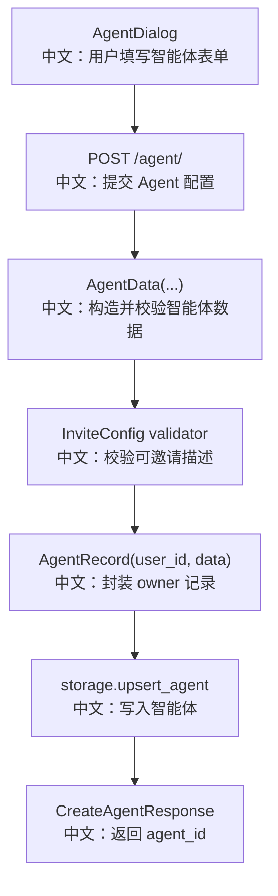

# 创建智能体

## 接口

```http
POST /agent/
```

中文说明：创建一个用户智能体配置，返回 `agent_id`。

## 流程图



## 源码链路

| 层级 | 文件 | 中文说明 |
|---|---|---|
| 路由 | `src/agentscope/app/_router/_agent.py` | `create_agent` |
| DTO | `src/agentscope/app/_router/_schema/_agent.py` | `CreateAgentRequest/Response` |
| 数据模型 | `src/agentscope/app/storage/_model/_agent.py` | `AgentData`、`InviteConfig` |
| 前端弹窗 | `examples/web_ui/frontend/src/components/dialog/AgentDialog.tsx` | 收集四段表单并提交 |

## 关键步骤

```text
name / system_prompt
中文：智能体身份信息。

context_config
中文：上下文窗口和压缩配置。

react_config
中文：ReAct 推理和工具调用配置。

invite_config
中文：是否允许被其他 Agent 通过 AgentInvite 借入团队。

ValidationError -> HTTP 422
中文：配置不满足模型约束时返回参数错误。
```

## 边界与坑

1. `invitable=True` 但 `invite_description` 为空，会返回 `422`。
2. `system_prompt` 有默认值，但前端仍可提交用户自定义值。
3. 创建的是 `source == "user"` 的普通 Agent，不是团队 worker。

## 60 秒讲法

`POST /agent/` 把前端四段表单合成 `AgentData`。后端会通过 Pydantic 校验 `context_config`、`react_config` 和 `invite_config`，尤其是可邀请 Agent 必须有描述。校验通过后封装成 `AgentRecord` 写入当前用户名下，并返回 `agent_id`。
