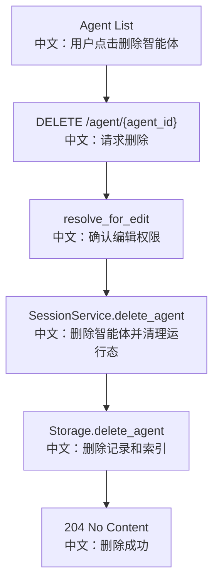

# 删除智能体

## 接口

```http
DELETE /agent/{agent_id}
```

中文说明：删除一个可编辑智能体，并级联清理相关 Session、Team 和运行时状态。

## 流程图



## 源码链路

| 层级 | 文件 | 中文说明 |
|---|---|---|
| 路由 | `src/agentscope/app/_router/_agent.py` | `delete_agent` |
| 服务 | `src/agentscope/app/_service` | `SessionService.delete_agent` |
| 存储 | `src/agentscope/app/storage/_redis_storage.py` | `delete_agent` 级联清理 |
| 前端 Hook | `examples/web_ui/frontend/src/hooks/useAgents.ts` | remove 后刷新列表 |

## 关键步骤

```text
resolve_for_edit
中文：确认当前 viewer 可以删除该 Agent。

session_service.delete_agent(owner_id, agent_id)
中文：不是直接删存储，而是走会话服务处理运行中任务和状态。

storage.delete_agent
中文：清理 session、schedule、team back-reference、agent record 和索引。
```

## 边界与坑

1. 删除 Agent 不是普通 CRUD，它会影响关联 Session。
2. 如果 Agent 是 team leader，删除可能连带 team 关系清理。
3. shared editor 删除时仍然写回 owner 的资源空间。
4. 删除结果为 false 时返回 `404`。

## 60 秒讲法

`DELETE /agent/{agent_id}` 的重点是级联清理。路由先通过 `resolve_for_edit` 判断当前用户是否可编辑，然后调用 `SessionService.delete_agent`，而不是直接删存储。这样可以取消运行中任务，删除关联 session，清理 team 和 message bus 状态，避免留下孤儿运行态。
