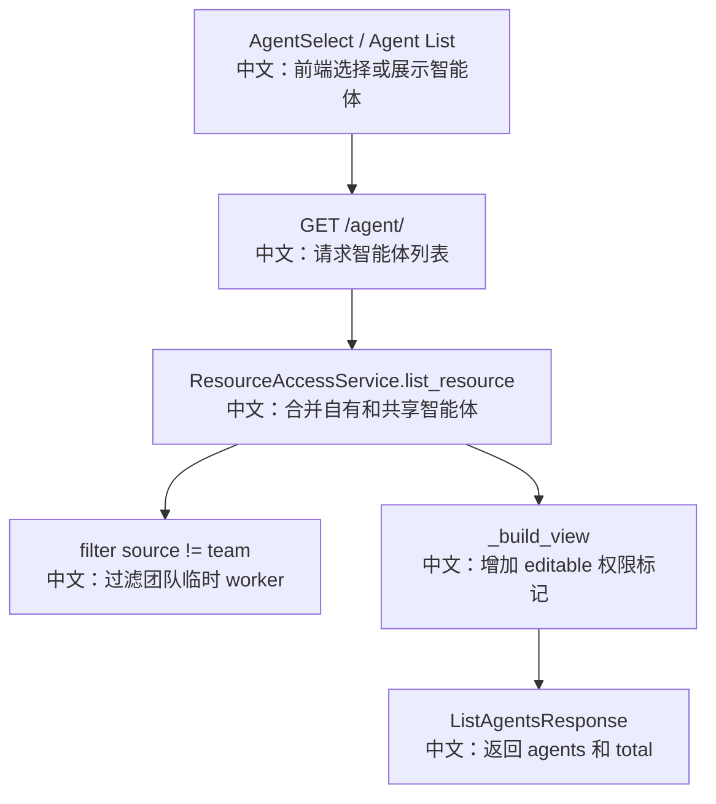

# 智能体列表

## 接口

```http
GET /agent/
```

中文说明：列出当前用户可见的用户智能体，不包含团队临时 worker。

## 流程图



## 源码链路

| 层级 | 文件 | 中文说明 |
|---|---|---|
| 路由 | `src/agentscope/app/_router/_agent.py` | `list_agents` |
| 权限服务 | `src/agentscope/app/_service/_access.py` | `list_resource(ResourceKind.AGENT)` |
| 数据模型 | `src/agentscope/app/storage/_model/_agent.py` | `AgentRecord.source` |
| 前端 Hook | `examples/web_ui/frontend/src/hooks/useAgents.ts` | 维护 Agent 列表 |

## 关键步骤

```text
storage.list_agents(viewer_id)
中文：读取当前用户名下智能体。

if record.source != "team"
中文：普通列表过滤掉团队临时 worker。

policy.list_accessible(viewer_id, AGENT)
中文：读取共享给当前用户的智能体。

AgentView(editable)
中文：返回带可编辑权限的视图。
```

## 面试亮点

1. 用户资产列表和团队运行时 worker 是分开的。
2. `editable` 由后端计算，适配共享只读和共享可编辑。
3. AgentInvite 使用的可邀请池也来自可见 Agent 列表。

## 60 秒讲法

`GET /agent/` 返回当前用户可见的用户智能体。后端通过 `ResourceAccessService` 合并自有和共享 Agent，并过滤 `source == "team"` 的团队临时 worker。返回的 `AgentView` 带 `editable`，前端据此控制编辑和删除能力。
