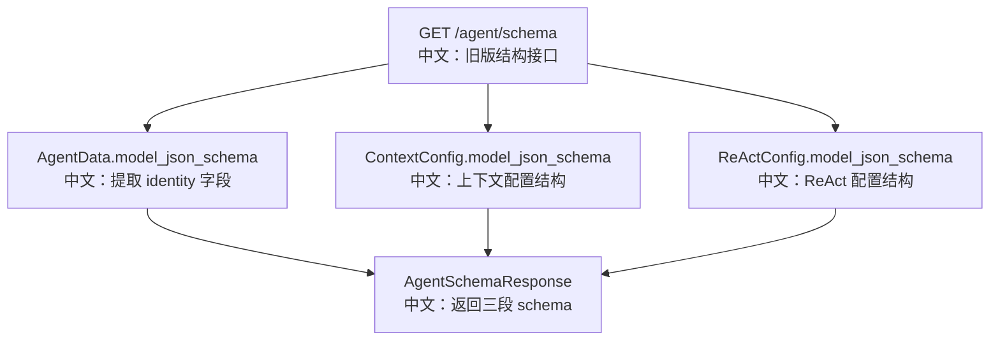

# 智能体旧版结构

## 接口

```http
GET /agent/schema
```

中文说明：返回旧版分段 Agent schema，已废弃，推荐使用 `GET /agent/schema/v2`。

## 为什么还要看

这个接口适合用来理解一次 API 演进：

```text
旧版：identity / context_config / react_config 三段由路由手工拼装。
新版：返回完整 AgentData schema，前端自行分段。
```

## 流程图



## 源码链路

| 层级 | 文件 | 中文说明 |
|---|---|---|
| 路由 | `src/agentscope/app/_router/_agent.py` | `get_agent_schema` |
| DTO | `src/agentscope/app/_router/_schema/_agent.py` | `AgentSchemaResponse` |
| 配置模型 | `src/agentscope/agent` | `ContextConfig`、`ReActConfig` |

## 设计取舍

旧版接口兼容老客户端，但它的问题是新增 Agent 字段需要路由手工维护。例如 `invite_config` 出现后，旧版三段结构不再自然覆盖新增配置。

## 60 秒讲法

`GET /agent/schema` 是旧版 Agent 表单结构接口，它把 Agent 表单拆成 identity、context_config、react_config 三段。这个接口保留是为了兼容，但新的配置字段更适合通过 `/agent/schema/v2` 返回完整 `AgentData` schema，让前端自动分段。
