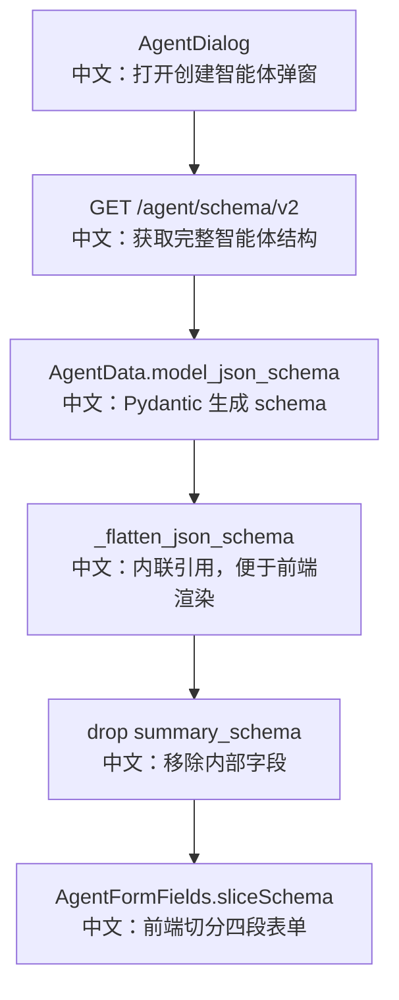

# 智能体结构

## 接口

```http
GET /agent/schema/v2
```

中文说明：返回完整 `AgentData` JSON Schema，用于 Web UI 动态渲染智能体创建和编辑表单。

## 流程图



## 源码链路

| 层级 | 文件 | 中文说明 |
|---|---|---|
| 路由 | `src/agentscope/app/_router/_agent.py` | `get_agent_schema_v2` |
| 数据模型 | `src/agentscope/app/storage/_model/_agent.py` | `AgentData`、`InviteConfig` |
| 工具 | `src/agentscope/_utils/_common.py` | `_flatten_json_schema` |
| 前端 Hook | `examples/web_ui/frontend/src/hooks/useAgentSchema.ts` | schema 会话级缓存 |
| 前端表单 | `examples/web_ui/frontend/src/components/form/AgentFormFields.tsx` | 切成四段并渲染 |

## 关键步骤

```text
AgentData.model_json_schema()
中文：以后端 Pydantic 模型作为表单结构来源。

_flatten_json_schema(...)
中文：把 $ref 展平，前端可以只依赖响应体渲染。

context_config.properties.pop("summary_schema")
中文：移除内部结构化输出字段，不暴露给用户编辑。

sliceSchema
中文：前端拆成 identity、context_config、react_config、invite_config。
```

## 面试亮点

1. v2 避免了路由手写字段分组。
2. `id` 使用 `SkipJsonSchema`，持久化存在但不出现在表单 schema。
3. `invite_config` 作为嵌套对象自动成为独立表单段。

## 60 秒讲法

`GET /agent/schema/v2` 返回完整 `AgentData` schema。后端用 Pydantic 生成结构，再展平 `$ref` 并移除内部字段。前端拿到 schema 后按顶层字段自动切出 identity、context、react 和 invite 四段。这样新增 Agent 配置时，后端模型变化可以自然驱动 UI 表单变化。
