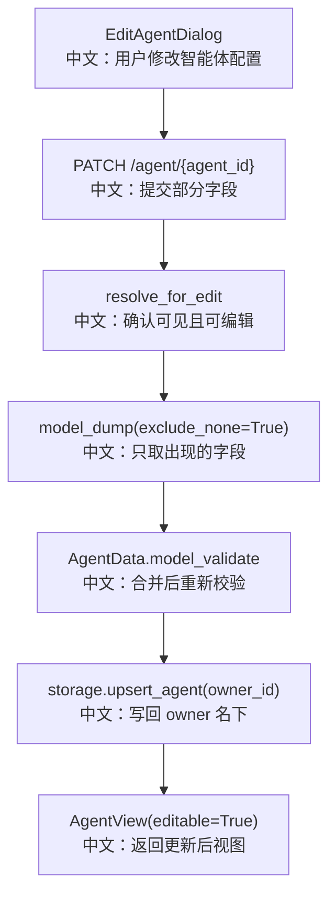

# 更新智能体

## 接口

```http
PATCH /agent/{agent_id}
```

中文说明：部分更新已有智能体配置，返回更新后的 `AgentView`。

## 流程图



## 源码链路

| 层级 | 文件 | 中文说明 |
|---|---|---|
| 路由 | `src/agentscope/app/_router/_agent.py` | `update_agent` |
| 权限服务 | `src/agentscope/app/_service/_access.py` | `resolve_for_edit` |
| 数据模型 | `src/agentscope/app/storage/_model/_agent.py` | `AgentData` validators |
| 前端 Hook | `examples/web_ui/frontend/src/hooks/useAgents.ts` | update 后刷新列表 |

## 关键步骤

```text
body.model_dump(exclude_none=True)
中文：PATCH 语义，只更新提交字段。

{**existing.data.model_dump(), **updates}
中文：把旧配置和新字段合并。

AgentData.model_validate(...)
中文：重新跑完整模型校验，避免跳过 invite_config 约束。

updated_at = datetime.now()
中文：更新记录修改时间。
```

## 面试亮点

这里有一个很好的追问点：为什么不用 `model_copy(update=...)`？

答案：因为 `model_copy(update=...)` 会跳过 validator。这里必须重新 `AgentData.model_validate`，否则可能把 `invitable=True` 但描述为空的非法配置写进存储。

## 60 秒讲法

`PATCH /agent/{agent_id}` 先通过 `resolve_for_edit` 处理自有和共享编辑权限，再把请求中的非空字段与旧 `AgentData` 合并。关键是合并后重新调用 `AgentData.model_validate`，确保跨字段约束仍然生效。最后写回资源 owner 名下并返回 `AgentView`。
