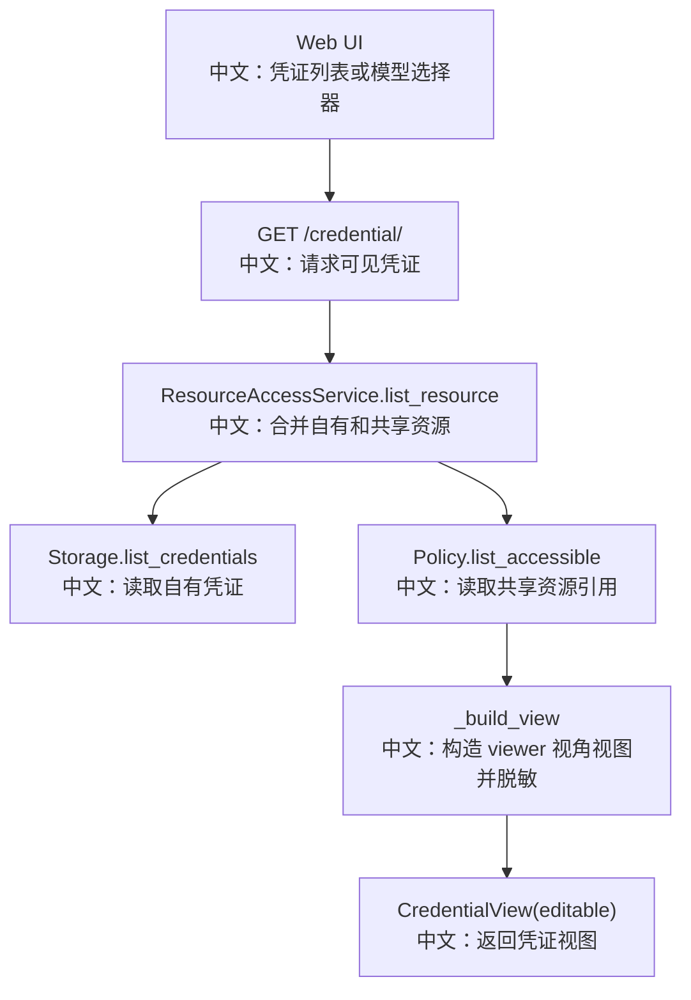

# 凭证列表

## 接口

```http
GET /credential/
```

中文说明：列出当前用户可见的凭证，包括自有凭证和共享给当前用户的凭证。

## 先记住什么

这个接口的重点不是 list，而是：

```text
自有凭证：可编辑，完整展示 data。
共享凭证：根据权限决定 editable，并对 secret 字段脱敏。
```

## 流程图



## 源码链路

| 层级 | 文件 | 中文说明 |
|---|---|---|
| 路由 | `src/agentscope/app/_router/_credential.py` | `list_credentials` |
| 权限服务 | `src/agentscope/app/_service/_access.py` | `list_resource(ResourceKind.CREDENTIAL)` |
| 视图模型 | `src/agentscope/app/_service/_access.py` | `CredentialView` |
| 前端 Hook | `examples/web_ui/frontend/src/hooks/useCredentials.ts` | 凭证 CRUD 状态管理 |
| 模型 Hook | `examples/web_ui/frontend/src/hooks/useAvailableModels.ts` | 基于凭证列表查询模型 |

## 关键步骤

```text
access.list_resource(user_id, ResourceKind.CREDENTIAL)
中文：按当前 viewer 查可见凭证。

own = storage.list_credentials(viewer_id)
中文：自有凭证始终 editable=True。

policy.list_accessible(viewer_id, CREDENTIAL)
中文：读取别人共享给当前用户的凭证引用。

_build_view
中文：如果 viewer 不是 owner，只保留 data.type 和 data.name。
```

## 面试亮点

1. 返回的是 `CredentialView`，不是原始 `CredentialRecord`。
2. `editable` 是后端计算出来的 viewer 相关权限。
3. 共享凭证在展示层脱敏，但运行时仍可通过 `resolve_credential` 被受信任服务解析。

## 边界与坑

1. UI 列表里看到共享凭证，不代表能编辑。
2. 脱敏后的共享凭证仍保留 `type`，所以前端仍能按 provider 查询模型候选。
3. 这个接口不验证密钥是否有效，只负责列出配置资产。

## 60 秒讲法

`GET /credential/` 返回当前用户可见凭证。后端通过 `ResourceAccessService` 合并自有凭证和共享凭证，并返回 viewer 视角的 `CredentialView`。自有凭证可编辑且完整展示，共享凭证会按权限设置 `editable`，并在返回前移除 secret 字段，只保留 `type/name`。这是协作共享和密钥安全之间的平衡。
