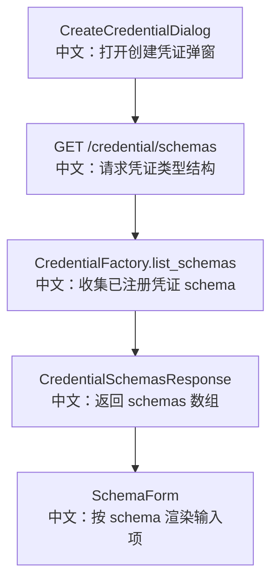

# 凭证类型结构列表

## 接口

```http
GET /credential/schemas
```

中文说明：获取所有已注册 Credential 类型的 JSON Schema，供 Web UI 动态渲染创建凭证表单。

## 先记住什么

这个接口体现的是“后端模型驱动前端表单”：

```text
CredentialFactory.list_schemas()
中文：后端凭证工厂输出所有 provider 的结构。

CreateCredentialDialog
中文：前端根据 schema 渲染不同 provider 的字段。
```

## 流程图



## 源码链路

| 层级 | 文件 | 中文说明 |
|---|---|---|
| 路由 | `src/agentscope/app/_router/_credential.py` | `list_credential_schemas` |
| 工厂 | `src/agentscope/credential` | `CredentialFactory.list_schemas()` |
| DTO | `src/agentscope/app/_router/_schema/_credential.py` | `ListCredentialSchemasResponse` |
| 前端 | `examples/web_ui/frontend/src/components/dialog/CreateCredentialDialog.tsx` | 拉取 schema 并渲染表单 |

## 关键步骤

```text
前端打开弹窗
中文：只有 open 时才加载 schemas。

credentialApi.schemas()
中文：请求 GET /credential/schemas。

schemas[0].properties.type.const
中文：前端默认选中第一个 provider 类型。

SchemaForm
中文：根据选中的 provider schema 渲染密钥、名称等字段。
```

## 面试亮点

1. 新增 provider 时，前端不需要手写新表单。
2. `type` 字段作为 discriminator，后续 `CredentialFactory.from_dict` 会用它还原具体凭证类型。
3. 这个接口只暴露结构，不暴露任何用户密钥。

## 60 秒讲法

`GET /credential/schemas` 是 Credential 配置页的 schema 源头。后端通过 `CredentialFactory.list_schemas()` 输出所有 provider 的 JSON Schema，前端 `CreateCredentialDialog` 拿到后用 `SchemaForm` 动态渲染表单。这样 Credential 类型扩展时，后端模型是单一事实来源，前端只负责渲染。
