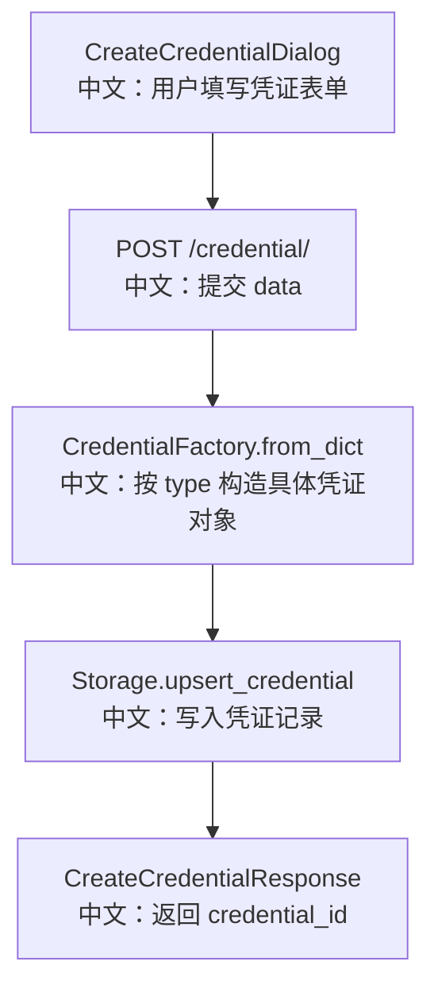

# 创建凭证

## 接口

```http
POST /credential/
```

中文说明：保存一个新的 Credential 配置，返回服务端生成的 `credential_id`。

## 流程图



## 源码链路

| 层级 | 文件 | 中文说明 |
|---|---|---|
| 路由 | `src/agentscope/app/_router/_credential.py` | `create_credential` |
| 工厂 | `src/agentscope/credential` | `CredentialFactory.from_dict` |
| 存储 | `src/agentscope/app/storage/_base.py` | `upsert_credential` 接口定义 |
| 前端 | `examples/web_ui/frontend/src/components/dialog/CreateCredentialDialog.tsx` | 从 schema 收集字段并提交 |

## 关键步骤

```text
data = { type: selectedType, ...values }
中文：前端把 provider 类型和用户输入合并成 data。

CredentialFactory.from_dict(body.data)
中文：后端根据 data.type 选择具体 Credential 类。

storage.upsert_credential(user_id, credential)
中文：以当前用户为 owner 持久化。
```

## 面试亮点

1. `type` 是 Credential 多态建模的关键。
2. 创建接口不直接接收固定字段，而是接收 `data: dict`，让 provider 扩展更灵活。
3. 真实结构校验由具体 Credential 类承担。

## 60 秒讲法

`POST /credential/` 接收 `{ data }`，其中 `data.type` 决定具体 provider。后端用 `CredentialFactory.from_dict` 把字典还原成具体 Credential 对象，再通过 `storage.upsert_credential` 写入当前用户名下。这个接口配合 `/credential/schemas`，构成了后端驱动的动态凭证配置体系。
