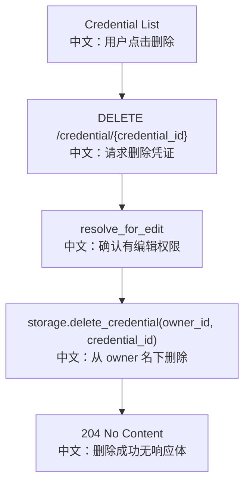

# 删除凭证

## 接口

```http
DELETE /credential/{credential_id}
```

中文说明：删除一个当前用户可编辑的凭证，成功返回 `204 No Content`。

## 流程图



## 源码链路

| 层级 | 文件 | 中文说明 |
|---|---|---|
| 路由 | `src/agentscope/app/_router/_credential.py` | `delete_credential` |
| 权限服务 | `src/agentscope/app/_service/_access.py` | `resolve_for_edit` |
| 存储 | `src/agentscope/app/storage/_base.py` | `delete_credential` |
| 前端 Hook | `examples/web_ui/frontend/src/hooks/useCredentials.ts` | 删除后刷新列表 |

## 关键步骤

```text
resolve_for_edit
中文：避免只读共享用户删除凭证。

delete_credential(owner_id, credential_id)
中文：删除时使用资源 owner，而不是当前 viewer。
```

## 面试亮点

删除接口本身很短，但权限语义很重要：共享编辑者可以删除，仅读共享者不能删除，不可见者拿到 `404`。

## 60 秒讲法

`DELETE /credential/{credential_id}` 通过 `resolve_for_edit` 统一处理自有资源和共享资源。如果当前 viewer 是 owner 或共享编辑者，后端会得到真正的 `owner_id` 并删除该 owner 名下的凭证。成功后返回 `204`。
