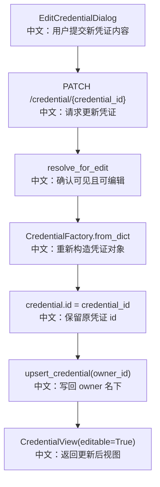

# 更新凭证

## 接口

```http
PATCH /credential/{credential_id}
```

中文说明：替换一个已有凭证的 payload，返回更新后的 `CredentialView`。

## 流程图



## 源码链路

| 层级 | 文件 | 中文说明 |
|---|---|---|
| 路由 | `src/agentscope/app/_router/_credential.py` | `update_credential` |
| 权限服务 | `src/agentscope/app/_service/_access.py` | `resolve_for_edit` |
| 前端 Hook | `examples/web_ui/frontend/src/hooks/useCredentials.ts` | 调用 update 后刷新列表 |

## 关键步骤

```text
owner_id, _ = access.resolve_for_edit(...)
中文：如果是共享编辑者，写回资源真正 owner 的存储空间。

credential = CredentialFactory.from_dict(body.data)
中文：用新 data 构造凭证对象。

credential.id = credential_id
中文：更新不是创建新记录，而是保留原 id。

storage.get_credential(owner_id, credential_id)
中文：写入后再读一次，确保返回最新视图。
```

## 边界与坑

1. 不可见凭证返回 `404`。
2. 可见但只有 READ 权限返回 `403`。
3. 更新后如果立即读不到记录，会抛 `RuntimeError`，避免 `assert` 在优化模式下失效。

## 60 秒讲法

更新凭证先走 `resolve_for_edit`，它不仅检查权限，还返回资源真正的 `owner_id`。这让共享编辑者也能修改被授权的凭证，但写入仍然落在 owner 名下。随后后端根据新 `data` 重建 Credential，并保留原 `credential_id` 写回。
