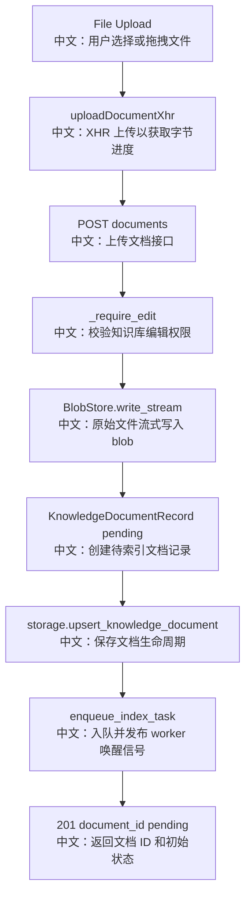

# 接口：上传知识库文档

## 0. 这篇先记住什么

`POST /knowledge_bases/{knowledge_base_id}/documents` 只完成上传登记，不直接完成索引。返回 `document_id` 和 `pending` 后，worker 异步解析、切块、向量化。

---

## 1. 接口卡片

```text
方法：POST
路径：/knowledge_bases/{knowledge_base_id}/documents
请求体：multipart/form-data
字段：file, content_type 可选
成功状态：201 Created
返回：UploadKnowledgeDocumentResponse
前端入口：knowledgeBaseApi.uploadDocument(knowledgeBaseId, file)
后端入口：upload_knowledge_document
```

---

## 2. 主流程图



---

## 3. 源码链路

```text
1. 前端用 XMLHttpRequest 而不是 fetch。
   中文：当前浏览器 fetch 不暴露上传字节进度，XHR 可以驱动进度条。

2. Router 接收 UploadFile 和可选 content_type。
   中文：content_type 可以覆盖文件自带 MIME，用于 parser 路由。

3. service.register_document 先 _require_edit。
   中文：没有 edit 权限不能上传。

4. blob_store.write_stream(key, stream)。
   中文：把文件流写到 BlobStore，LocalBlobStore 以 1 MiB chunk 写入本地文件。

5. 创建 KnowledgeDocumentRecord。
   中文：包含 filename、size、content_type、blob_uri，默认 status=pending。

6. upsert record 后 enqueue_index_task。
   中文：任务进入 durable queue，并 publish signal 唤醒 consumer。
```

---

## 4. 边界与坑

- 上传成功不代表可检索，只代表文件已登记并等待索引。
- 如果 storage 写失败，service 会尝试删除刚写入的 blob，避免孤儿文件。
- 浏览器取消上传只影响 XHR 阶段，server 返回后索引由 worker 接管。
- unsupported file 的最终失败可能发生在 worker parsing 阶段，而不是上传阶段。

---

## 5. 60 秒讲法

```text
POST /knowledge_bases/{id}/documents 是上传登记接口，不是同步索引接口。
前端用 XHR 上传文件，是为了拿到字节级上传进度。
后端先校验 edit 权限，再把 UploadFile.file 流式写入 BlobStore，创建 status=pending 的 KnowledgeDocumentRecord，写入 storage。
随后调用 enqueue_index_task，把 document_id 推到索引任务队列并发布唤醒信号。
接口返回 document_id、filename 和 pending，前端之后通过 status polling 追踪 parsing、chunking、indexing、ready 或 error。
```
