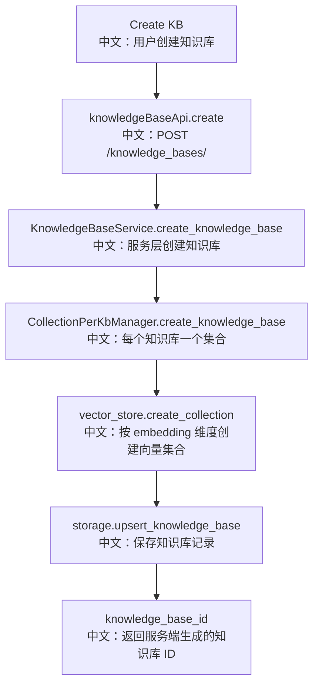

# 接口：创建知识库

## 0. 这篇先记住什么

`POST /knowledge_bases/` 创建知识库时会固定 embedding 模型配置，并创建对应向量集合。embedding 维度一旦确定，后续不能随意改变。

---

## 1. 接口卡片

```text
方法：POST
路径：/knowledge_bases/
请求体：CreateKnowledgeBaseRequest
成功状态：201 Created
返回：CreateKnowledgeBaseResponse
前端入口：knowledgeBaseApi.create(body)
后端入口：create_knowledge_base
```

---

## 2. 主流程图



---

## 3. 源码链路

```text
1. 请求体包含 name、description、embedding_model_config。
   中文：embedding_model_config 包含 credential、model、dimensions。

2. Service 调 manager.create_knowledge_base。
   中文：DimensionPolicyError 会映射成 409 Conflict。

3. CollectionPerKbManager 创建 record 和 collection_name。
   中文：collection_name 形如 kb_<id>。

4. 先创建 vector collection，再写 storage。
   中文：如果 storage 写失败，尝试删除刚创建的 collection 做补偿。
```

---

## 4. 面试亮点

- 创建知识库不是单纯写一条元数据，还要创建向量集合。
- embedding model config 被固定，避免已有向量和查询向量维度不一致。
- 有补偿删除，说明作者考虑了跨系统写入的一致性问题。

---

## 5. 60 秒讲法

```text
POST /knowledge_bases/ 创建一个知识库。
请求里带名称、描述和 embedding_model_config。
后端通过 KnowledgeBaseService 交给 KnowledgeBaseManager，当前 CollectionPerKbManager 会给每个知识库创建一个独立向量集合，维度来自 embedding_model_config.dimensions。
然后写 KnowledgeBaseRecord 到 storage。
如果 storage 写失败，会尝试删除刚创建的 vector collection，避免孤儿集合。
```
