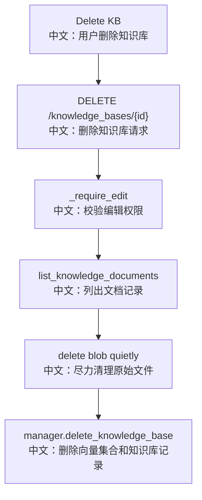

# 接口：删除知识库

## 0. 这篇先记住什么

`DELETE /knowledge_bases/{knowledge_base_id}` 是知识库级删除，会删除向量集合、知识库记录，并 best-effort 清理该知识库下文档的 blob。

---

## 1. 接口卡片

```text
方法：DELETE
路径：/knowledge_bases/{knowledge_base_id}
成功状态：204 No Content
前端入口：knowledgeBaseApi.delete(knowledgeBaseId)
后端入口：delete_knowledge_base
```

---

## 2. 主流程图



---

## 3. 源码链路

```text
1. service.delete_knowledge_base 先 _require_edit。
   中文：删除是强写操作，必须有编辑权限。

2. storage.list_knowledge_documents。
   中文：拿到该 KB 下所有文档，用于清理 blob。

3. _delete_blob_quietly。
   中文：blob 清理失败只记录日志，不阻断主删除。

4. manager.delete_knowledge_base。
   中文：CollectionPerKbManager 会删除向量集合，再删 storage 记录。
```

---

## 4. 面试亮点

- 删除知识库跨 BlobStore、VectorStore、Storage 三个系统。
- blob 删除是 best-effort cleanup，核心一致性以向量集合和知识库记录为主。
- Storage 层可能负责文档记录 cascade，manager 负责向量集合。

---

## 5. 60 秒讲法

```text
DELETE /knowledge_bases/{id} 是知识库级删除。
服务层先确认调用者有 edit 权限，然后列出文档记录并尽力删除每个 blob。
接着交给 manager.delete_knowledge_base，当前 CollectionPerKbManager 会删除对应 vector collection，再删知识库记录。
这里体现了跨存储清理的取舍：blob 清理失败不阻断主流程，可以后续 sweep；向量集合和元数据删除才是主路径。
```
