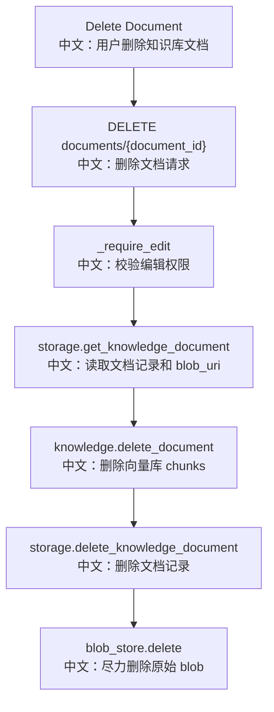

# 接口：删除知识库文档

## 0. 这篇先记住什么

`DELETE /knowledge_bases/{knowledge_base_id}/documents/{document_id}` 删除文档时按“先向量库、再记录、最后 blob”的顺序执行，便于失败后重试。

---

## 1. 接口卡片

```text
方法：DELETE
路径：/knowledge_bases/{knowledge_base_id}/documents/{document_id}
成功状态：204 No Content
前端入口：knowledgeBaseApi.deleteDocument(knowledgeBaseId, documentId)
后端入口：delete_knowledge_document
```

---

## 2. 主流程图



---

## 3. 源码链路

```text
1. service.delete_document 先 _require_edit。
   中文：删除文档必须有编辑权限。

2. 如果 document record 不存在，直接返回。
   中文：知识库存在但文档已删除时，删除操作接近幂等。

3. _resolve_knowledge 获取 KnowledgeBase runtime。
   中文：用于操作对应向量集合。

4. knowledge.delete_document(document_id)。
   中文：先删除向量库中该文档的 chunks。

5. storage.delete_knowledge_document。
   中文：再删除用户可见的文档记录。

6. _delete_blob_quietly(blob_uri)。
   中文：最后清理原始文件，失败只记录日志。
```

---

## 4. 设计权衡

```text
先删 vector store
  中文：如果失败，record 和 blob 还在，用户可以重试。

再删 storage record
  中文：删除记录后，用户列表不再看到该文档。

最后删 blob
  中文：blob 是清理项，失败不会破坏检索正确性，但可能需要后续 sweep。
```

---

## 5. 60 秒讲法

```text
DELETE /knowledge_bases/{kb_id}/documents/{document_id} 做端到端文档删除。
服务层先确认 edit 权限，再读取文档记录。
如果记录不存在就直接返回，这让删除接近幂等。
存在时先调用 knowledge.delete_document 删除向量库 chunks，再删除 storage 里的文档记录，最后 best-effort 删除 blob。
这个顺序的好处是第一步失败时用户还能重试，后面清理失败最多留下孤儿数据，不会继续污染检索结果。
```
