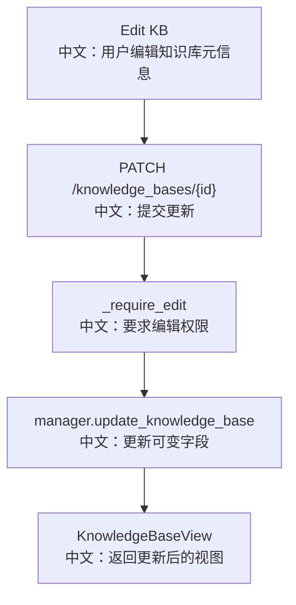

# 接口：更新知识库

## 0. 这篇先记住什么

`PATCH /knowledge_bases/{knowledge_base_id}` 只允许更新 `name` 和 `description`，不能更新 embedding 模型配置。

---

## 1. 接口卡片

```text
方法：PATCH
路径：/knowledge_bases/{knowledge_base_id}
请求体：UpdateKnowledgeBaseRequest
返回：KnowledgeBaseView
前端入口：knowledgeBaseApi.update(knowledgeBaseId, body)
后端入口：update_knowledge_base
```

---

## 2. 主流程图



---

## 3. 源码链路

```text
1. body 只包含 name 和 description。
   中文：embedding_model_config 不在更新请求体里。

2. service.update_knowledge_base 调 _require_edit。
   中文：共享读者不能修改知识库。

3. manager.update_knowledge_base 写 storage。
   中文：只更新可变元数据。

4. 返回 KnowledgeBaseView，editable=true。
   中文：能走到这里说明调用者有 edit 权限。
```

---

## 4. 边界与坑

- 不允许修改 embedding model 和 dimensions，这是为了保护已有向量集合。
- 如果知识库不可见或不存在，service 会映射成 404。
- 如果可见但没有 edit 权限，会由 ResourceAccessService 抛 403。

---

## 5. 60 秒讲法

```text
PATCH /knowledge_bases/{id} 只改知识库展示信息，比如 name 和 description。
后端先通过 _require_edit 校验编辑权限，再调用 manager.update_knowledge_base。
embedding_model_config 创建后不能改，因为改模型或维度会让已有向量失效。
所以这个接口是元信息更新，不是重建索引或迁移向量集合。
```
