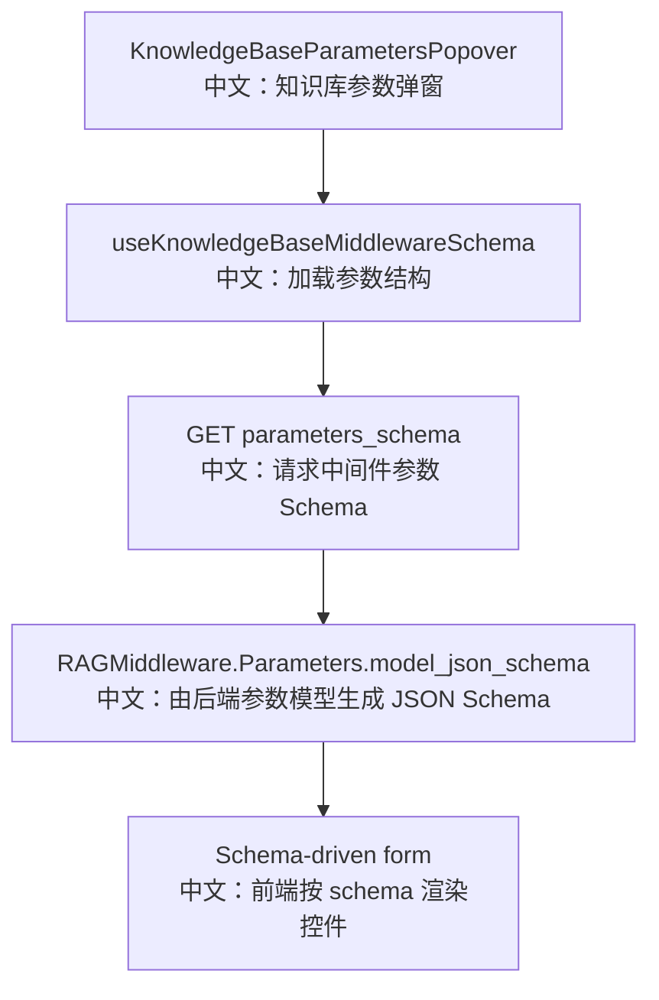

# 接口：知识库中间件参数结构

## 0. 这篇先记住什么

`GET /knowledge_bases/middleware/parameters_schema` 返回 `RAGMiddleware.Parameters` 的 JSON Schema，前端用它渲染知识库挂载后的参数表单。

---

## 1. 接口卡片

```text
方法：GET
路径：/knowledge_bases/middleware/parameters_schema
返回：KbMiddlewareParametersSchemaResponse
前端入口：knowledgeBaseApi.middlewareParametersSchema()
后端入口：get_kb_middleware_parameters_schema
```

---

## 2. 主流程图



---

## 3. 源码链路

```text
1. Router 只校验当前用户已登录。
   中文：这个接口不涉及具体知识库资源。

2. 调 RAGMiddleware.Parameters.model_json_schema()
   中文：直接从 Pydantic 参数模型生成 JSON Schema。

3. 前端 KnowledgeBaseParametersPopover 读取 schema.properties。
   中文：根据 boolean、enum、number、string 渲染不同控件。
```

---

## 4. 参数重点

```text
mode
  中文：agentic 或 static，决定由 Agent 主动检索还是自动注入。

top_k
  中文：最多返回多少个 chunk。

score_threshold
  中文：最低相似度阈值。

emit_hint_event
  中文：static 模式是否把匹配片段作为事件展示给前端。

persist_hint
  中文：static 模式注入的 HintBlock 是否保留在上下文中。
```

---

## 5. 60 秒讲法

```text
这个接口把 RAGMiddleware 的可调参数以 JSON Schema 形式暴露给前端。
后端不手写表单配置，而是直接从 RAGMiddleware.Parameters.model_json_schema 生成。
前端 KnowledgeBaseParametersPopover 根据 schema 渲染控件，用户修改后写回 Session 的 knowledge_config.parameters。
这个设计让后端参数模型成为单一事实来源，减少前后端参数漂移。
```
