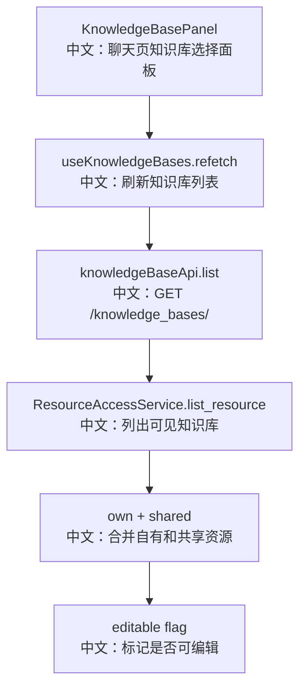

# 接口：知识库列表

## 0. 这篇先记住什么

`GET /knowledge_bases/` 返回当前用户可见的知识库，包括自己拥有的和通过资源访问策略共享给自己的，并带有 `editable` 标记。

---

## 1. 接口卡片

```text
方法：GET
路径：/knowledge_bases/
返回：ListKnowledgeBasesResponse
前端入口：knowledgeBaseApi.list()
后端入口：list_knowledge_bases
```

---

## 2. 主流程图



---

## 3. 源码链路

```text
1. Router 注入 ResourceAccessService。
   中文：列表接口不只看 owner storage，也要看共享资源。

2. access.list_resource(user_id, ResourceKind.KNOWLEDGE_BASE)。
   中文：返回 KnowledgeBaseView 列表。

3. 每个 view 带 editable。
   中文：read 权限可搜索和挂载，edit 权限还能上传、删除、更新。
```

---

## 4. 面试亮点

- 知识库是可共享资源，列表不是简单 `storage.list_knowledge_bases(user_id)`。
- `editable` 让前端不用猜权限，可以决定是否展示编辑和上传入口。
- ChatViewport 的 KnowledgeBasePanel 使用这个列表做 Session 级挂载。

---

## 5. 60 秒讲法

```text
GET /knowledge_bases/ 是知识库面板的数据源。
它通过 ResourceAccessService 列出当前用户可见的知识库，包含自己拥有和别人共享给自己的。
返回的每个 KnowledgeBaseView 带 editable，表示用户是否有编辑权限。
这个接口支撑两类场景：聊天页勾选知识库做 RAG 挂载，以及知识库管理页展示可管理资源。
```
