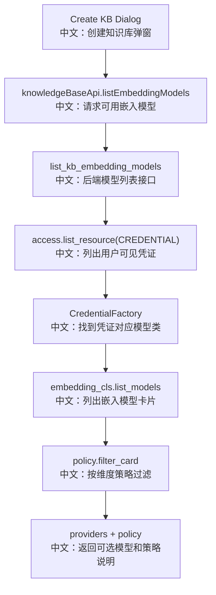

# 接口：知识库嵌入模型列表

## 0. 这篇先记住什么

`GET /knowledge_bases/embedding_models` 给前端返回“当前用户可用于创建知识库的 embedding 模型”。它会遍历用户可见的 credential，并按 KnowledgeBaseManager 的 dimension policy 过滤模型卡片。

---

## 1. 接口卡片

```text
方法：GET
路径：/knowledge_bases/embedding_models
返回：ListKbEmbeddingModelsResponse
前端入口：knowledgeBaseApi.listEmbeddingModels()
后端入口：list_kb_embedding_models
```

---

## 2. 主流程图



---

## 3. 源码链路

```text
1. manager.get_dimension_policy()
   中文：读取知识库管理器当前的向量维度策略。

2. access.list_resource(user_id, ResourceKind.CREDENTIAL)
   中文：获取当前用户自己拥有或被共享的凭证。

3. CredentialFactory.get_credential_class(credential_type)
   中文：找到凭证对应的模型能力声明。

4. credential_cls.get_embedding_model_class()
   中文：只保留能提供 embedding 模型的凭证。

5. policy.filter_card(card)
   中文：过滤掉维度不兼容的模型卡片。
```

---

## 4. 面试亮点

- 知识库创建时必须先确定 embedding 模型和维度，因为已有向量不能随意换维度。
- 返回 `policy` 给前端，能解释为什么某些模型不可选。
- 使用 ResourceAccessService，说明共享 credential 也能参与知识库创建。

---

## 5. 60 秒讲法

```text
这个接口服务于创建知识库时的模型选择。
后端先拿 KnowledgeBaseManager 的 dimension policy，再枚举用户可见的 credential。
每个 credential 通过 CredentialFactory 找到 embedding model class，然后列出模型卡片，并用 policy.filter_card 过滤维度不兼容的模型。
最后按 credential 分组返回 providers，同时把 policy 返回给前端用于展示说明。
```
