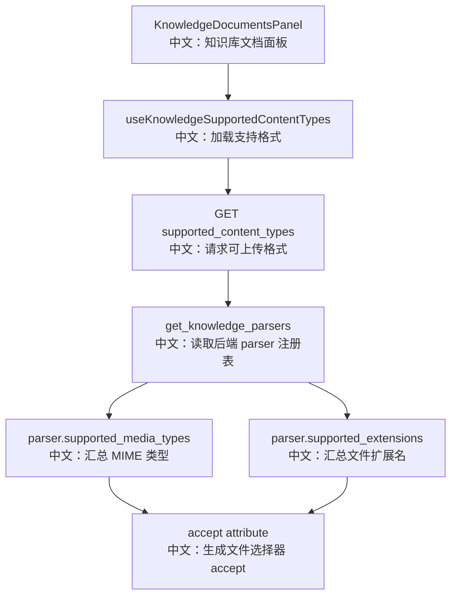

# 接口：知识库支持的内容类型

## 0. 这篇先记住什么

`GET /knowledge_bases/supported_content_types` 告诉前端当前 parser registry 支持哪些 MIME type 和文件扩展名，用于上传前过滤。

---

## 1. 接口卡片

```text
方法：GET
路径：/knowledge_bases/supported_content_types
返回：ListSupportedContentTypesResponse
前端入口：knowledgeBaseApi.supportedContentTypes()
后端入口：list_supported_content_types
```

---

## 2. 主流程图



---

## 3. 源码链路

```text
1. 从 app.state.knowledge_parsers 注入 parsers。
   中文：这是 worker 解析文档时使用的同一套 parser registry。

2. 遍历每个 parser。
   中文：收集 supported_media_types 和 supported_extensions。

3. 去重、排序后返回。
   中文：前端用 extensions 和 media_types 生成 input accept。
```

---

## 4. 边界与坑

- 前端过滤只是体验优化，不是安全边界。
- 上传时真正的 parser 路由仍发生在 worker，根据 content_type 或 filename 推断 media type。
- 浏览器的 `file.type` 不完全可靠，所以前端也会按扩展名过滤。

---

## 5. 60 秒讲法

```text
这个接口把后端当前注册的 parser 能力暴露给前端。
后端汇总每个 parser 的 supported_media_types 和 supported_extensions，返回给 KnowledgeDocumentsPanel。
前端用这些值设置文件选择器 accept，并在拖拽上传时按扩展名先做一层过滤。
但它只是能力提示，最终能不能解析仍由后端 worker 的 parser 路由决定。
```
