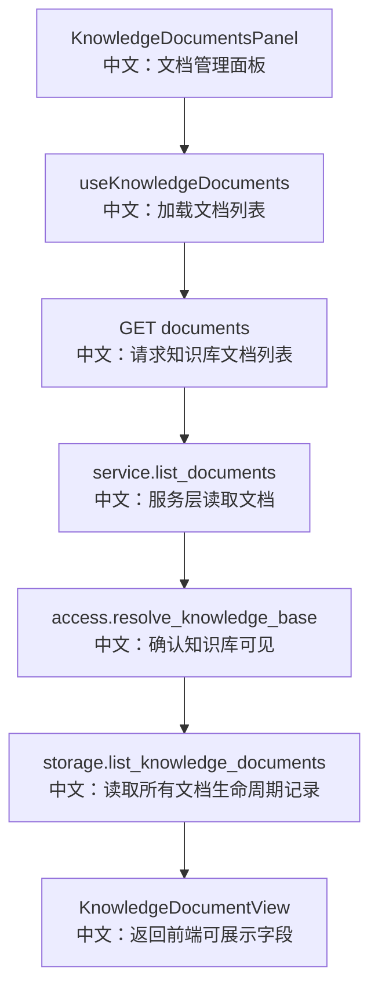

# 接口：知识库文档列表

## 0. 这篇先记住什么

`GET /knowledge_bases/{knowledge_base_id}/documents` 从 Storage 返回文档记录列表，而不是从 VectorStore 返回。因为 pending、parsing、error 等状态只有 Storage 能表达。

---

## 1. 接口卡片

```text
方法：GET
路径：/knowledge_bases/{knowledge_base_id}/documents
返回：ListKnowledgeDocumentsResponse
前端入口：knowledgeBaseApi.listDocuments(knowledgeBaseId)
后端入口：list_knowledge_documents
```

---

## 2. 主流程图



---

## 3. 源码链路

```text
1. Router 调 service.list_documents。
   中文：文档列表走服务层，不直接访问 storage。

2. service 先 resolve_knowledge_base。
   中文：读者只要有 read 权限就能看到文档列表。

3. storage.list_knowledge_documents(owner_id, knowledge_base_id)。
   中文：通过 owner_id 读取真实记录，兼容共享知识库。

4. KnowledgeDocumentView.from_record。
   中文：隐藏 blob_uri、processing_node、lease 等内部字段。
```

---

## 4. 边界与坑

- 列表会返回所有生命周期状态，不只返回 `ready`。
- 客户端看不到 blob_uri 和 lease 信息，这是后端内部实现细节。
- 如果页面刷新时文档仍在 indexing，列表能恢复非终态行，随后轮询继续接管。

---

## 5. 60 秒讲法

```text
GET /knowledge_bases/{id}/documents 是文档面板的基础数据源。
它先校验用户是否能看到该知识库，然后从 storage 读取 KnowledgeDocumentRecord。
返回给前端的是 KnowledgeDocumentView，只包含 filename、size、status、error、chunk_count、created_at、updated_at 等展示字段。
它不从 vector store 查，因为 vector store 只能表达已经索引的 chunks，表达不了 pending、parsing、error 这些生命周期状态。
```
