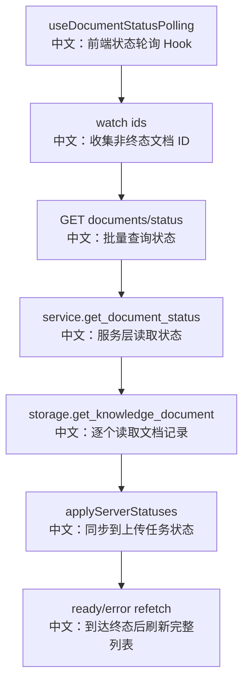

# 接口：知识库文档状态

## 0. 这篇先记住什么

`GET /knowledge_bases/{knowledge_base_id}/documents/status` 是前端索引进度轮询接口，支持一次查询多个 document id，缺失的 id 会被静默省略。

---

## 1. 接口卡片

```text
方法：GET
路径：/knowledge_bases/{knowledge_base_id}/documents/status
查询参数：ids=doc1,doc2
返回：ListKnowledgeDocumentStatusResponse
前端入口：knowledgeBaseApi.getDocumentStatus(knowledgeBaseId, ids)
后端入口：list_knowledge_document_status
```

---

## 2. 主流程图



---

## 3. 源码链路

```text
1. 前端把非终态 server documents 和 UploadProvider 中的 pollable ids 合并。
   中文：刷新页面后仍能继续轮询，刚上传的文档也能立即轮询。

2. 每 1500ms 调 getDocumentStatus。
   中文：没有 ids 时前端直接本地返回 items: []，避免空请求。

3. 后端 ids 按逗号拆分。
   中文：空 token 会被过滤。

4. service.get_document_status 逐个查 storage。
   中文：不存在的 document 被省略，不当成错误。

5. 前端收到 items 后更新 statuses，并调用 applyServerStatuses。
   中文：上传卡片可以从 pending 继续显示 parsing、chunking、indexing。
```

---

## 4. 状态机

```text
pending
  中文：等待 worker 拾取。

parsing
  中文：正在解析原始文件。

chunking
  中文：正在切块。

indexing
  中文：正在 embedding 并写入向量库。

ready
  中文：索引完成，可以检索。

error
  中文：索引失败，可展示 error 字段。
```

---

## 5. 60 秒讲法

```text
这个接口是 RAG 前端进度体验的核心。
上传接口返回 document_id 后，文档还只是 pending，真正索引在 worker 里异步进行。
前端 useDocumentStatusPolling 会收集所有非终态文档 ID，每 1.5 秒批量请求 /documents/status。
后端逐个读取 storage 里的 KnowledgeDocumentRecord，返回存在的文档视图。
前端把结果同步到 UploadProvider 和文档列表，看到 ready 或 error 后再 refetch 完整列表，拿到最终 chunk_count。
```
