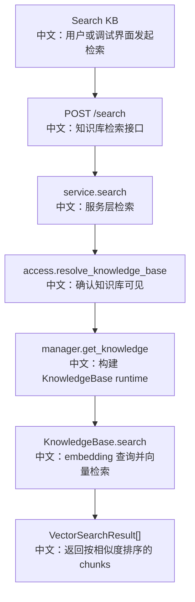

# 接口：知识库检索

## 0. 这篇先记住什么

`POST /knowledge_bases/{knowledge_base_id}/search` 是直接检索某个知识库的 API。它和聊天里的 RAGMiddleware 共用 `KnowledgeBase.search` 能力，但不是聊天运行时自动调用的唯一入口。

---

## 1. 接口卡片

```text
方法：POST
路径：/knowledge_bases/{knowledge_base_id}/search
请求体：SearchKnowledgeBaseRequest
返回：SearchKnowledgeBaseResponse
前端入口：knowledgeBaseApi.search(knowledgeBaseId, body)
后端入口：search_knowledge_base
```

---

## 2. 主流程图



---

## 3. 源码链路

```text
1. 请求体包含 query 和 top_k。
   中文：top_k 默认 5，范围 1 到 50。

2. service.search 调 _resolve_knowledge。
   中文：共享读者也能检索，只要知识库对其可见。

3. manager.get_knowledge(owner_id, kb_id)。
   中文：构建带 embedding model、vector store、collection 的 KnowledgeBase。

4. knowledge.search(queries=[query], top_k=top_k)。
   中文：把 query 向量化，然后在对应 collection 里查相似 chunks。
```

---

## 4. 和 RAGMiddleware 的关系

```text
直接 search API
  中文：外部或前端直接测试某个知识库的检索效果。

RAGMiddleware agentic
  中文：Chat run 中暴露 search_knowledge 工具，由 Agent 自己决定何时检索。

RAGMiddleware static
  中文：Chat run 中自动用用户输入检索，并把结果注入 HintBlock。
```

也就是说，`POST /search` 是 HTTP 检索能力，`RAGMiddleware` 是 Agent Runtime 集成能力。

---

## 5. 边界与坑

- 检索结果只来自已经 `ready` 并写入 VectorStore 的 chunks，pending 文档不会出现。
- 如果知识库的 credential 被删除，`manager.get_knowledge` 可能失败。
- 多知识库合并检索不通过这个单 KB API 完成，而是在 RAGMiddleware 里 fan-out。

---

## 6. 60 秒讲法

```text
POST /knowledge_bases/{id}/search 是单知识库检索接口。
请求传 query 和 top_k，后端先校验用户能看到这个知识库，再用 KnowledgeBaseManager 构建 KnowledgeBase runtime。
KnowledgeBase.search 会用知识库创建时固定的 embedding model 对 query 向量化，然后在该知识库的 vector collection 中做相似度检索。
这个接口适合直接测试或管理端检索；聊天里的 RAG 是通过 ChatService 挂 RAGMiddleware，agentic 模式暴露 search_knowledge 工具，static 模式自动注入 HintBlock。
```
