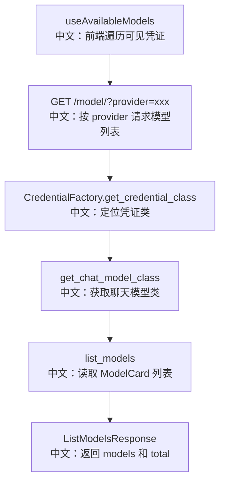

# 聊天模型列表

## 接口

```http
GET /model/?provider={provider}
```

中文说明：根据 Credential provider 类型返回候选聊天模型能力卡片。

## 流程图



## 源码链路

| 层级 | 文件 | 中文说明 |
|---|---|---|
| 路由 | `src/agentscope/app/_router/_model.py` | `list_models` |
| DTO | `src/agentscope/app/_router/_schema/_model.py` | `ListModelsRequest/Response` |
| 前端 API | `examples/web_ui/frontend/src/api/model.ts` | `modelApi.list(provider)` |
| 前端 Hook | `examples/web_ui/frontend/src/hooks/useAvailableModels.ts` | 按凭证分组查询模型 |
| 运行时 | `src/agentscope/app/_service/_model.py` | `get_model` 构造真实模型 |

## 关键步骤

```text
provider = credential.data.type
中文：前端从凭证视图读取 provider 类型。

CredentialFactory.get_credential_class(provider)
中文：后端找到对应凭证类。

credential_cls.get_chat_model_class().list_models()
中文：模型类返回候选 ModelCard。
```

## 边界与坑

1. provider 不存在时返回 `404`。
2. 这个接口不需要 `credential_id`，因为它做的是 provider 能力发现。
3. 返回候选列表不代表某个 API key 一定有调用权限。

## 60 秒讲法

`GET /model/` 根据 provider 类型返回聊天模型候选。前端先通过凭证列表拿到 `credential.data.type`，再按 provider 调这个接口。后端通过 `CredentialFactory` 找到凭证类，再从关联的 chat model class 读取 `ModelCard`。真正运行时才通过 `credential_id` 构造模型实例。
