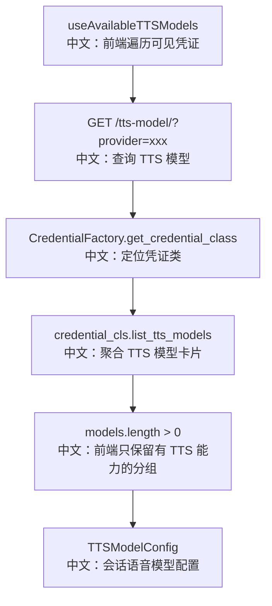

# 语音合成模型列表

## 接口

```http
GET /tts-model/?provider={provider}
```

中文说明：根据 Credential provider 类型返回候选 TTS 模型能力卡片。

## 流程图



## 源码链路

| 层级 | 文件 | 中文说明 |
|---|---|---|
| 路由 | `src/agentscope/app/_router/_tts_model.py` | `list_tts_models` |
| DTO | `src/agentscope/app/_router/_schema/_tts_model.py` | `ListTTSModelsRequest/Response` |
| 前端 API | `examples/web_ui/frontend/src/api/model.ts` | `ttsModelApi.list(provider)` |
| 前端 Hook | `examples/web_ui/frontend/src/hooks/useAvailableTTSModels.ts` | 只展示支持 TTS 的 provider |
| 运行时 | `src/agentscope/app/_service/_tts_model.py` | `get_tts_model` 构造真实 TTS 模型 |

## 关键步骤

```text
credential_cls.list_tts_models()
中文：后端获取 provider 支持的 TTS 模型卡片。

if models.length > 0
中文：前端只保留有语音能力的凭证分组。

get_tts_model
中文：运行时用 credential_id、model、parameters 构造 TTSModelBase。
```

## 边界与坑

1. provider 不存在时返回 `404`。
2. provider 没有 TTS 能力时，前端会跳过该分组。
3. 运行时如果 provider 不支持 TTS，会返回 `400`。
4. `_resolve_tts_class` 会尝试按模型名匹配具体 TTS class。

## 60 秒讲法

`GET /tts-model/` 是 TTS 能力发现接口。它和聊天模型列表类似，也是按 provider 查询，但返回的是 `TTSModelCard`。前端 `useAvailableTTSModels` 会跳过没有 TTS 模型的 provider，只在有能力时展示语音配置。运行时再通过 `get_tts_model` 用原始凭证和模型配置构造真实 `TTSModelBase`。
