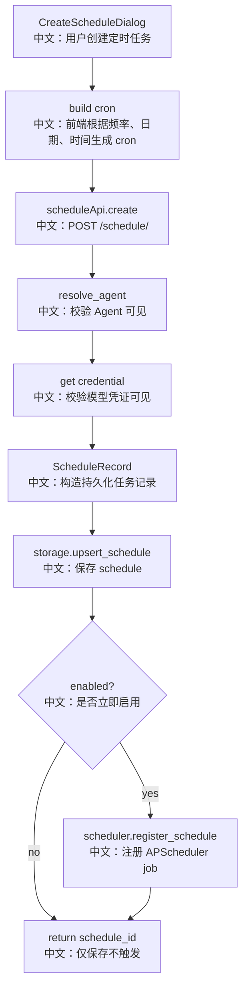

# 接口：创建定时任务

## 0. 这篇先记住什么

`POST /schedule/` 创建 ScheduleRecord，并在 enabled 时注册 APScheduler job。它会提前校验 Agent 和模型 credential 是否对当前用户可见。

---

## 1. 接口卡片

```text
方法：POST
路径：/schedule/
请求体：CreateScheduleRequest
成功状态：201 Created
返回：CreateScheduleResponse
前端入口：scheduleApi.create(body)
后端入口：create_schedule
```

---

## 2. 主流程图



---

## 3. 源码链路

```text
1. 前端表单选择 Agent、模型、时区、频率、权限模式、stateful。
   中文：CreateScheduleDialog 负责把 UI 频率转换为 5 段 cron。

2. 后端校验 agent_id。
   中文：支持自己拥有或共享可见的 Agent。

3. 后端校验 chat_model_config.credential_id。
   中文：提前暴露凭证不可见问题，避免首次定时触发才失败。

4. 构造 ScheduleData。
   中文：保存 cron_expression、timezone、enabled、stateful、permission_mode、chat_model_config。

5. enabled=true 时注册 APScheduler job。
   中文：持久化记录和内存 job 同时建立。
```

---

## 4. 边界与坑

- HTTP 创建 schema 当前没有 `started_at` / `ended_at` 字段，而 Agent 工具 `ScheduleCreate` 有。
- 前端 once 模式构造的是 cron，不是真正 one-shot trigger；如果没有 end date，可能下一年同日再次触发。
- 如果 `scheduler.register_schedule` 因 cron 非法失败，接口会失败；此时 storage 是否已写入要看失败发生位置，当前代码是先 upsert 再 register。

---

## 5. 60 秒讲法

```text
POST /schedule/ 创建一个定时任务。
前端把用户选择的频率、日期、时间转成 5 段 cron，并提交 Agent、模型配置、权限模式和 stateful。
后端先校验 Agent 和模型 credential 可见，然后创建 ScheduleRecord 写入 storage。
如果 enabled 为 true，就调用 scheduler.register_schedule，把它注册到 APScheduler。
这里的关键是：storage 是持久事实，APScheduler job 是运行态；服务重启后会从 storage restore。
```
