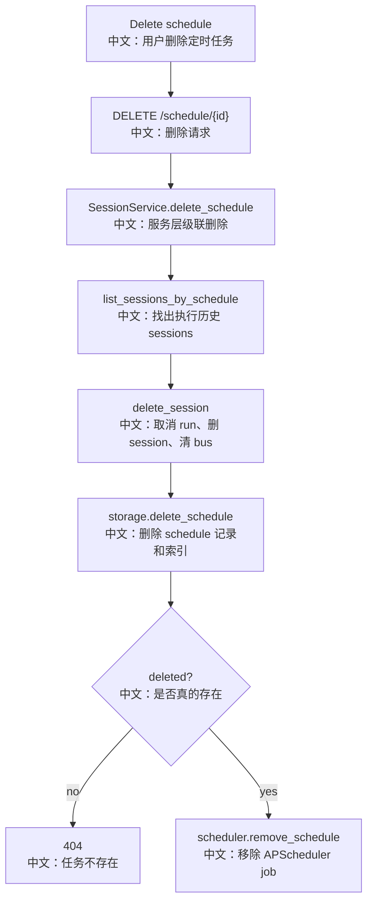

# 接口：删除定时任务

## 0. 这篇先记住什么

`DELETE /schedule/{schedule_id}` 不只是删除 schedule record，还会删除这个 schedule 生成过的 sessions，并清理这些 session 的 bus 状态，最后移除 APScheduler job。

---

## 1. 接口卡片

```text
方法：DELETE
路径：/schedule/{schedule_id}
成功状态：204 No Content
前端入口：scheduleApi.delete(scheduleId)
后端入口：delete_schedule
```

---

## 2. 主流程图



---

## 3. 源码链路

```text
1. Router 调 session_service.delete_schedule。
   中文：删除 schedule 的级联逻辑放在 SessionService，而不是 router。

2. SessionService.list_sessions_by_schedule。
   中文：找出所有由这个 schedule 触发创建的 sessions。

3. 对每个 session 调 delete_session。
   中文：取消 in-flight run，删除 session 记录，清理 events log、inbox、bg_tasks registry。

4. storage.delete_schedule。
   中文：删除 schedule 记录和相关索引。

5. scheduler.remove_schedule。
   中文：移除当前进程内 APScheduler job，找不到时只 warning。
```

---

## 4. 设计亮点

- 删除资源时把 storage 和 bus 清理集中在 SessionService，避免 storage 层知道 message bus。
- 删除 schedule 会清掉执行历史 sessions，避免 schedule 已不存在但历史 session 仍挂在 schedule index。
- `scheduler.remove_schedule` 是 best-effort，job 不存在不影响已删除的持久化事实。

---

## 5. 60 秒讲法

```text
DELETE /schedule/{id} 是级联删除，不是普通删一条配置。
Router 先调用 SessionService.delete_schedule。
SessionService 会列出这个 schedule 创建过的 sessions，对每个 session 走 delete_session：先广播取消运行，再删除 storage 记录，最后清理 bus 里的 events log、inbox、bg_tasks registry。
然后 storage.delete_schedule 删除 schedule 记录本身。
最后 router 调 scheduler.remove_schedule，把内存 APScheduler job 移除。
```
