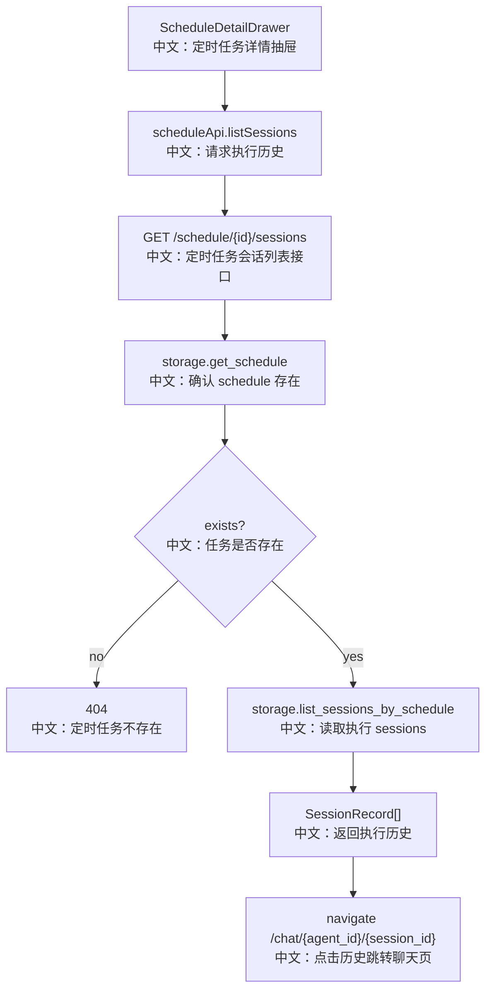

# 接口：定时任务会话列表

## 0. 这篇先记住什么

`GET /schedule/{schedule_id}/sessions` 返回某个 schedule 触发生成过的 sessions，用于 Web UI 展示执行历史并跳转到对应聊天页面。

---

## 1. 接口卡片

```text
方法：GET
路径：/schedule/{schedule_id}/sessions
返回：ScheduleSessionsResponse
前端入口：scheduleApi.listSessions(scheduleId)
后端入口：list_schedule_sessions
```

---

## 2. 主流程图



---

## 3. 源码链路

```text
1. 前端打开 ScheduleDetailDrawer。
   中文：当 schedule 存在且 drawer open 时加载执行历史。

2. Router 先 storage.get_schedule。
   中文：schedule 不存在返回 404，而不是直接返回空列表。

3. storage.list_sessions_by_schedule(user_id, schedule_id)。
   中文：查询 source_schedule_id 指向该 schedule 的 sessions。

4. 前端渲染 sessions。
   中文：每条历史可以跳转到 /chat/{agent_id}/{session.id} 查看执行上下文。
```

---

## 4. 边界与坑

- stateful schedule 多次触发可能复用同一个 session，因此历史数量不一定等于触发次数。
- non-stateful schedule 每次触发创建新 session，更适合执行历史审计。
- 当前 UI 里历史状态显示较粗，主要展示 session 时间并跳转查看详情。

---

## 5. 60 秒讲法

```text
GET /schedule/{id}/sessions 用来展示定时任务执行历史。
后端先确认 schedule 记录存在，不存在返回 404。
然后从 storage.list_sessions_by_schedule 读取 source_schedule_id 等于该 schedule id 的 sessions。
前端 ScheduleDetailDrawer 展示这些 session，用户点击后跳转到对应聊天页。
需要注意 stateful schedule 会复用同一个 session，所以执行历史不一定一触发一条；non-stateful 才是每次触发一个新 session。
```
