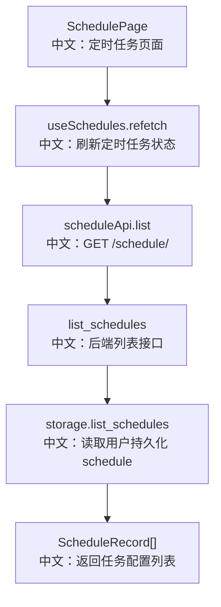

# 接口：定时任务列表

## 0. 这篇先记住什么

`GET /schedule/` 返回当前用户拥有的 ScheduleRecord 列表。它读的是持久化 storage，不直接读取 APScheduler 当前 job 列表。

---

## 1. 接口卡片

```text
方法：GET
路径：/schedule/
返回：ListSchedulesResponse
前端入口：scheduleApi.list()
后端入口：list_schedules
```

---

## 2. 主流程图



---

## 3. 源码链路

```text
1. 前端 useSchedules 在 mount 后自动 refetch。
   中文：Schedule 页面打开后加载用户 schedule。

2. Router 注入 user_id 和 storage。
   中文：列表按当前用户隔离。

3. storage.list_schedules(user_id)。
   中文：返回持久化记录，而不是只看内存 job。

4. 返回 schedules 和 total。
   中文：前端 calendar/list 两种视图复用同一份数据。
```

---

## 4. 边界与坑

- 这个接口不返回 `next_run_time`，前端自己用 `cron-parser` 展开日历事件。
- disabled schedule 也会返回，因为它仍是用户保存的配置。
- 如果内存 APScheduler job 注册失败，storage 里仍可能有 record；列表接口本身看不出 job 是否真的已注册。

---

## 5. 60 秒讲法

```text
GET /schedule/ 是 Schedule 页面基础数据源。
它从 storage.list_schedules 读取当前用户持久化的 ScheduleRecord，并返回 schedules 和 total。
这说明 ScheduleRecord 是系统事实来源，APScheduler job 只是当前进程运行态。
前端拿到后可以用 cron-parser 在日历里展开未来触发事件，也可以在列表视图展示任务配置。
```
