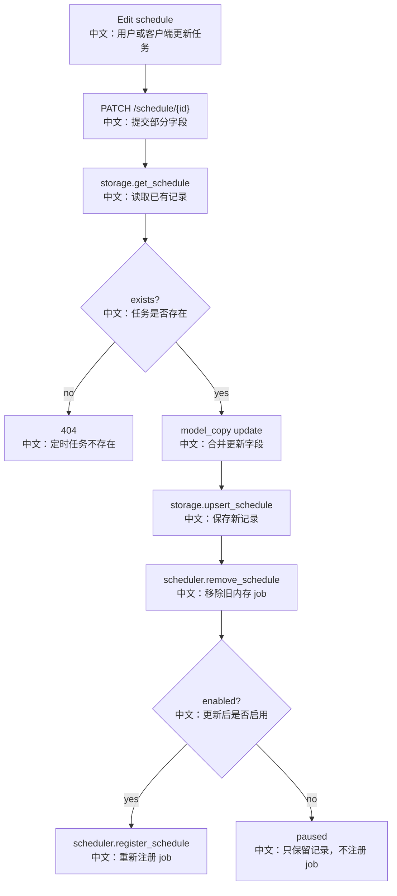

# 接口：更新定时任务

## 0. 这篇先记住什么

`PATCH /schedule/{schedule_id}` 先更新持久化记录，再移除旧 job，最后在 enabled 时重新注册 job。它适合修改 cron、timezone、enabled、stateful、permission_mode 等配置。

---

## 1. 接口卡片

```text
方法：PATCH
路径：/schedule/{schedule_id}
请求体：UpdateScheduleRequest
返回：ScheduleRecord
前端入口：scheduleApi.update(scheduleId, body)
后端入口：update_schedule
```

---

## 2. 主流程图



---

## 3. 源码链路

```text
1. storage.get_schedule(user_id, schedule_id)。
   中文：不存在返回 404。

2. body.model_dump(exclude_none=True)。
   中文：只更新请求里出现的字段，省略字段保持原值。

3. existing.data.model_copy(update=updates)。
   中文：合并 ScheduleData。

4. storage.upsert_schedule(user_id, updated_record)。
   中文：先写持久化记录。

5. scheduler.remove_schedule(schedule_id)。
   中文：无论改没改 cron，都先移除旧 job。

6. enabled=true 时 register_schedule。
   中文：重新用新配置注册 APScheduler job。
```

---

## 4. 边界与坑

- `enabled=false` 表示暂停，record 还在 storage，但 APScheduler job 被移除。
- 当前顺序是先写 storage，再重建 job；如果 register 失败，可能出现 record 已更新但 job 未注册。
- update schema 不允许修改 agent_id 或 chat_model_config，模型配置只在创建时确定。

---

## 5. 60 秒讲法

```text
PATCH /schedule/{id} 是部分更新定时任务。
后端先取出已有 ScheduleRecord，不存在就 404。
然后只合并请求里非 null 的字段，写回 storage。
为了保证 cron、timezone、enabled 等变化立即生效，它总是先从 APScheduler 移除旧 job；如果更新后 enabled 仍然为 true，就重新 register。
enabled=false 相当于暂停任务：记录保留，但内存 job 不存在。
```
