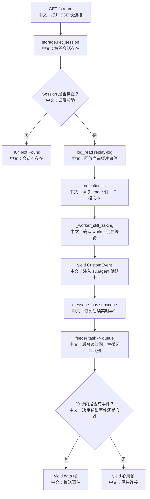

# GET /sessions/{session_id}/stream：SSE 实时事件流

> 这篇是 `topics/02_事件流与事件系统_面试友好版.md` 的接口卡片版。重点是：这个接口不是历史消息接口，而是 AgentEvent / CustomEvent 的实时回流通道。

---

## 0. 这篇先记住什么

1. **返回 `text/event-stream`，连接会长期保持。**  
   前端用 fetch-based SSE 读取 `data: {...}` 帧。

2. **启动时先 replay，再注入 projection，最后 subscribe live。**  
   三段分别解决：当前 run 事件补读、多 Agent HITL 卡恢复、后续实时增量。

3. **当前实现存在 read -> subscribe 竞态窗口。**  
   这是一个值得主动讲的改进点：可用 last entry id 二次补读修复。

---

## 1. 产品场景

用户打开聊天窗口后，消息不是从 `POST /chat/` 返回的，而是从这个 SSE 接口持续流入。

前端流程：

```text
useMessages 初始化
  → 先 GET /messages
     中文说明：恢复已经落盘的历史消息
  → 再 GET /stream
     中文说明：订阅后续 Agent 事件
  → processEvent
     中文说明：按事件类型更新聊天消息、Plan 面板、Team HITL 卡
```

---

## 2. 接口卡片

- **方法**：`GET`
- **路径**：`/sessions/{session_id}/stream`
- **查询参数**：`agent_id`
- **成功状态码**：`200 OK`
- **响应类型**：`text/event-stream`
- **主要失败**：`404`，当 session 不存在

SSE 帧：

```text
data: {"type": "...", "...": "..."}

中文说明：普通事件帧，前端 JSON.parse 后交给 processEvent。
```

心跳帧：

```text
:

中文说明：SSE comment frame，前端跳过，用来防止代理静默断连。
```

---

## 3. 主流程图



---

## 4. 源码链路

后端入口：

```text
src/agentscope/app/_router/_session.py
stream_session_events
```

关键步骤中文解释：

```text
1. existing = await storage.get_session(user_id, agent_id, session_id)
   中文：SSE 也要先做 session 归属校验。

2. message_bus.log_read(MessageBusKeys.session_events(session_id))
   中文：回放当前 session event log 中已有事件。

3. SessionProjection(message_bus).list(session_id, SubagentHitlProjector.KIND)
   中文：读取 leader session 上投影出来的 worker HITL 卡。

4. _worker_still_asking(...)
   中文：回 worker session 的真实 state.context 检查是否仍在 ASKING/SUBMITTED。

5. message_bus.subscribe(MessageBusKeys.session_events(session_id))
   中文：订阅后续 live Pub/Sub 事件。

6. asyncio.wait_for(queue.get(), timeout=30)
   中文：30 秒没事件就发心跳。
```

前端入口：

```text
examples/web_ui/frontend/src/api/session.ts
sessionApi.streamEvents
```

中文说明：

```text
使用 client.stream 打开 fetch 请求；
读取 ReadableStream；
按行解析 data: 开头的 SSE 帧；
跳过 ":" 开头的 comment heartbeat；
yield AgentEvent 给 useMessages.processEvent。
```

---

## 5. 设计亮点

### 5.1 为什么不用原生 EventSource

源码注释说明前端使用 fetch-based SSE，是为了带自定义请求头，例如 `X-User-ID`。原生 EventSource 对自定义 header 支持不友好。

### 5.2 为什么要注入 projection

多 Agent HITL 卡的权威状态在 worker session，但用户看的可能是 leader 页面。SSE 端点必须在 leader stream 中主动注入 `subagent_require_user_confirm`，否则刷新 leader 页面会丢卡。

### 5.3 feeder queue 的价值

`subscribe` 是 async generator。SSE 主循环还要发 heartbeat。如果直接 cancel `__anext__()`，可能导致 generator 关闭困难。feeder task + queue 把订阅读取和 SSE 输出节奏解耦。

---

## 6. 边界与坑

| 场景 | 实际行为 | 面试提醒 |
|---|---|---|
| session 不存在 | 404 | stream 前也校验归属 |
| 刷新时已有 run 事件 | 先 `log_read` 回放 | replay-log 不是长期历史 |
| worker HITL parked | projection 注入确认卡 | 卡不在 leader 消息历史里 |
| 30 秒无事件 | 输出心跳 `:\n\n` | 防代理断连 |
| read 后 subscribe 前有新事件 | 当前实现可能漏窗口事件 | 可用二次补读修复 |

竞态窗口改进：

```text
方案一：log_read 后记录 last_entry_id，subscribe ready 后再 log_read(since=last_entry_id) 补读。
方案二：先 subscribe，并确认 ready，再读取 replay，最后用 _entry_id 去重。
方案三：支持 Last-Event-ID / cursor，让客户端和服务端共同维护游标。
```

---

## 7. 面试问答

**Q：这个接口和 `GET /messages` 有什么区别？**  
`messages` 查持久历史；`stream` 推实时事件。前端先 messages 后 stream，组合出完整聊天体验。

**Q：为什么 HITL 卡不直接放 replay-log？**  
replay-log 会被 trim，而且 worker 的确认卡不是 leader 自己的消息历史。projection 更适合保存这种跨 session UI 镜像。

**Q：这个实现可靠性完美吗？**  
方向是对的，但 `log_read` 到 `subscribe` 中间有竞态窗口。可以通过二次补读或 cursor 协议加强。

---

## 8. 60 秒讲法

```text
GET /sessions/{id}/stream 是 AgentScope 的实时事件通道。
它返回 text/event-stream，前端用 fetch-based SSE 读取 data 帧。

后端生成器分三段：
先 log_read 回放当前缓冲事件，
再从 projection registry 注入多 Agent 的 HITL 确认卡，
最后 subscribe live 事件，并用 30 秒 heartbeat 保活。

这个设计把历史恢复、实时推送、跨 session UI 投影拆开处理。
我也会指出一个改进点：
当前 replay-read 到 live-subscribe 之间有竞态窗口，可以用 last_entry_id 二次补读修掉。
```
