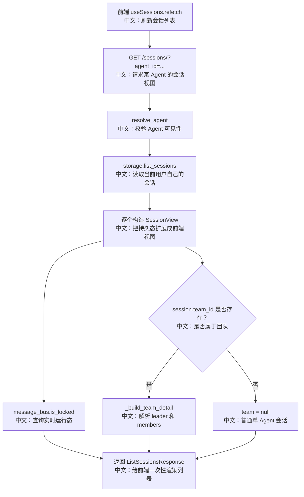

# GET /sessions/：获取 Session 列表与运行态视图

> 这篇讲的是 Web UI 左侧会话列表为什么不是简单 records 列表，而是 `SessionView`：它把持久 Session、实时运行态、Team 详情一次性打包给前端。

---

## 0. 这篇先记住什么

1. **返回的是 SessionView，不只是 SessionRecord。**  
   每项包含 `session`、`is_running`、可选 `team`。

2. **`is_running` 来自 MessageBus 锁，不来自数据库字段。**  
   运行态是实时状态，靠 `session_lock(session.id)` 判断。

3. **Team 信息在列表接口里被解析好。**  
   leader、members、worker session_id 都随 SessionView 返回，前端不需要再瀑布式请求。

---

## 1. 产品场景

用户打开 Chat 页面或切换 Agent 时，前端要立刻知道：

- 这个 Agent 有哪些会话；
- 哪些会话正在运行，要显示 loading / streaming 状态；
- 哪个会话是 team leader，成员有哪些；
- 如果点击 team member，应该跳到哪个 worker session。

因此列表接口返回的是增强视图：

```text
SessionView
  session: 持久会话记录
  is_running: 当前是否有运行锁
  team: team leader 和 members 的解析结果
```

前端对应 `examples/web_ui/frontend/src/hooks/useSessions.ts`：`refetch` 调 `sessionApi.list(agentId)`，把返回的 `sessions` 放进 React state。

---

## 2. 接口卡片

- **方法**：`GET`
- **路径**：`/sessions/`
- **查询参数**：`agent_id`
- **成功状态码**：`200 OK`
- **响应体**：`ListSessionsResponse { sessions, total }`
- **主要失败**：`404`，当目标 agent 对当前用户不可见

响应体关键结构：

| 字段 | 中文说明 |
|---|---|
| `sessions` | `SessionView[]`，每个会话的增强视图 |
| `total` | 当前返回的 session 数量 |
| `SessionView.session` | 持久化的 `SessionRecord` |
| `SessionView.is_running` | 是否有 worker 持有该 session 的运行锁 |
| `SessionView.team` | 当前 session 参与 team 时的 team 详情 |

---

## 3. 主流程图



---

## 4. 源码链路

后端入口：

```text
src/agentscope/app/_router/_session.py
list_sessions
```

关键步骤中文解释：

```text
1. await access.resolve_agent(user_id, agent_id)
   中文：确认当前用户能访问这个 Agent；共享 Agent 也可能可见。

2. sessions = await storage.list_sessions(user_id, agent_id)
   中文：列出当前用户在该 Agent 下的会话；即使 Agent 是共享的，会话也是 viewer 自己的。

3. is_running = await message_bus.is_locked(MessageBusKeys.session_lock(session.id))
   中文：用分布式锁判断是否有 worker 正在运行该会话。

4. 如果 session.team_id 存在，调用 _build_team_detail
   中文：把 team leader、worker agent、worker session_id 解析好。
```

`_build_team_detail` 的重点：

```text
leader_session = storage.get_session(user_id, "", team.session_id)
中文：根据 team 的 leader session id 反查 leader agent。

members = _ensure_team_members(...)
中文：规范化 team 成员列表，尤其兼容 invited member。

TeamMemberView(agent, session_id)
中文：每个成员都带自己的 worker session_id，前端点击成员时可以直接切换。
```

---

## 5. 设计亮点

### 5.1 为什么 `is_running` 不存在数据库

运行中是实时状态，不适合落数据库字段。进程崩溃时 DB 字段可能永远停在 running；而 MessageBus 锁有 TTL 和续租机制，worker 死掉后锁会过期。

面试表达：

> 持久状态放 storage，实时运行态放 bus lock。SessionView 把两者组合给前端，但不混淆来源。

### 5.2 为什么列表接口要带 team detail

TeamSidebar 需要知道 leader 和 members，还要知道每个 member 对应哪个 session。如果前端每个 session 再查 team、每个 member 再查 agent/session，会形成瀑布请求。

所以后端提前做聚合：

```text
SessionRecord + is_running + TeamDetailResponse
中文：一个接口满足列表、运行态、团队导航三个 UI 需求。
```

---

## 6. 边界与坑

| 场景 | 实际行为 | 面试提醒 |
|---|---|---|
| Agent 是共享给当前用户的 | `resolve_agent` 可以通过 | 返回的 session 仍是当前用户自己的运行记录 |
| Session 属于 team | 返回 `team` 详情 | UI 可以渲染 TeamSidebar |
| invited agent 有多个 session | 使用 `member.session_id` | 不能用 `list_sessions(agent_id)[0]` 猜 worker session |
| worker 正在运行 | `is_running=true` | 来源是 MessageBus 锁 |

---

## 7. 面试问答

**Q：为什么不直接返回 SessionRecord 列表？**  
因为前端需要的不是纯持久记录，还需要实时运行态和团队导航信息。`SessionView` 是面向 UI 的聚合视图。

**Q：`is_running` 为什么查锁？**  
运行态是瞬时的，锁比 DB 字段更适合表达“当前是否有 worker 持有运行权”。崩溃后锁会过期，DB 字段不会自动恢复。

**Q：TeamMemberView 为什么要带 session_id？**  
多 Agent 架构里每个成员是独立 session。特别是 AgentInvite 借来的 Agent 可能有多个 session，必须使用 team roster 里的精确 `member.session_id`。

---

## 8. 60 秒讲法

```text
GET /sessions/ 返回的不是普通会话列表，而是 SessionView。
它把持久 SessionRecord、实时 is_running、可选 TeamDetail 聚合在一起。

is_running 从 MessageBus 的 session lock 来，因为运行态不能靠 DB 字段；
team detail 在后端解析好，是为了让前端 TeamSidebar 不需要瀑布式请求。

这个接口体现了 AgentScope 的一个边界：
storage 管持久态，message bus 管实时态，router 负责组合成 UI 需要的视图。
```
