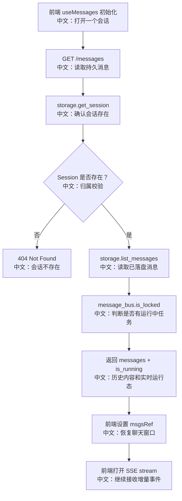

# GET /sessions/{session_id}/messages：恢复历史消息与初始运行态

> 这篇讲的是前端打开会话时的第一步：先拿持久消息和 `is_running`，再打开 SSE。历史恢复和实时增量是两条通道。

---

## 0. 这篇先记住什么

1. **messages 接口读取的是持久消息，不是实时事件。**  
   它从 storage 读取已经落盘的 `Msg` 列表。

2. **响应里带 `is_running`。**  
   前端用它决定初始 phase 是否进入 `streaming`。

3. **前端先 `messages`，再 `streamEvents`。**  
   历史靠 `GET /messages`，实时增量靠 `GET /stream`。

---

## 1. 产品场景

用户刷新页面或切换到某个 session 时，前端要先恢复已经存在的聊天内容，然后继续接收新事件。

前端 `useMessages` 的启动流程：

```text
组件挂载或 sessionId 变化
  → sessionApi.messages(sessionId, agentId)
     中文说明：读取持久消息和当前运行态
  → msgsRef.current = messages
     中文说明：先把历史消息放回聊天窗口
  → 如果 is_running 或尾部有 pending tool_call，phase=streaming
     中文说明：让 Stop 按钮可用，避免 HITL 停住时无法中断
  → sessionApi.streamEvents(...)
     中文说明：打开 SSE，继续接收实时增量
```

---

## 2. 接口卡片

- **方法**：`GET`
- **路径**：`/sessions/{session_id}/messages`
- **查询参数**：`agent_id`、`offset`、`limit`
- **成功状态码**：`200 OK`
- **响应体**：`ListMessagesResponse { messages, is_running }`
- **主要失败**：`404`，当 session 不存在

参数说明：

| 参数 | 中文说明 |
|---|---|
| `agent_id` | 会话所属 Agent，用于归属校验 |
| `offset` | 分页偏移，默认 0 |
| `limit` | 返回数量，默认 50，最大 200 |

---

## 3. 主流程图



---

## 4. 源码链路

后端入口：

```text
src/agentscope/app/_router/_session.py
list_messages
```

关键步骤中文解释：

```text
1. existing = await storage.get_session(user_id, agent_id, session_id)
   中文：确认 session 存在，且属于当前用户和 Agent。

2. messages = await storage.list_messages(user_id, session_id, offset=offset, limit=limit)
   中文：按分页读取持久消息。

3. is_running = await message_bus.is_locked(MessageBusKeys.session_lock(session_id))
   中文：从分布式锁读取实时运行状态。

4. return ListMessagesResponse(messages=messages, is_running=is_running)
   中文：把历史内容和运行态一起给前端。
```

前端入口：

```text
examples/web_ui/frontend/src/hooks/useMessages.ts
```

关键逻辑中文解释：

```text
1. 先 await sessionApi.messages(sessionId, agentId)
   中文：恢复历史消息。

2. 如果 is_running 为 true，设置 phase='streaming'
   中文：说明后端仍有 run 正在执行。

3. 如果最后一条消息有 pending tool_call，也设置 phase='streaming'
   中文：说明会话停在 HITL / 外部执行等待态，Stop 按钮仍要可用。

4. 再 for await sessionApi.streamEvents(...)
   中文：接入 SSE 实时事件流。
```

---

## 5. 设计亮点

### 5.1 历史恢复和实时增量分离

`GET /messages` 不承担实时流职责。它只负责“打开页面时恢复已有内容”；新的 token、工具事件、Plan 更新都走 SSE。

面试表达：

> 历史消息是 storage 查询，实时事件是 message bus stream。两者合起来构成前端看到的连续聊天体验。

### 5.2 为什么响应带 `is_running`

如果前端只拿 messages，它不知道后端是否仍在生成。`is_running` 让前端刷新后能立即显示 streaming 状态，不必等第一条 SSE 事件。

### 5.3 为什么还检查尾部 pending tool_call

HITL parked 时可能没有 worker 持有运行锁，所以 `is_running=false`。但用户仍需要看到 Stop / interrupt 能力。前端检查尾部 tool call 是否 `ASKING/SUBMITTED`，并进入 `streaming`。

---

## 6. 边界与坑

| 场景 | 实际行为 | 面试提醒 |
|---|---|---|
| session 不存在 | 404 | 先校验归属 |
| run 正在执行 | `is_running=true` | 来源是 MessageBus 锁 |
| parked on HITL | `is_running` 可能 false，但尾部 tool_call pending | 前端仍设置 streaming |
| SSE 还没连上 | messages 已先恢复 | 用户不会看到空白聊天 |
| replay-log 已 trim | 不影响历史消息 | 历史靠 storage，不靠 replay-log |

---

## 7. 面试问答

**Q：为什么不直接从 SSE 恢复历史？**  
SSE replay-log 是当前运行事件缓冲，不是长期消息历史。历史消息应从 storage 分页读取。

**Q：为什么 messages 响应还要带 is_running？**  
刷新页面时前端需要立即知道是否正在生成，否则 Stop 按钮和 loading 状态会不准。

**Q：HITL 等待时为什么前端也算 streaming？**  
因为用户仍处在“一个回复未完成”的状态，可以确认、拒绝或中断。即使没有运行锁，也不是普通 idle。

---

## 8. 60 秒讲法

```text
GET /sessions/{id}/messages 是打开会话时的历史恢复接口。
它从 storage 读取已落盘消息，同时从 MessageBus 锁读取 is_running。

前端 useMessages 会先调 messages 恢复聊天窗口，
再根据 is_running 或尾部 pending tool_call 设置 phase，
最后打开 SSE 接实时事件。

所以 AgentScope 的恢复模型是：
长期历史靠 storage，当前增量靠 stream，运行态靠 bus lock。
```
