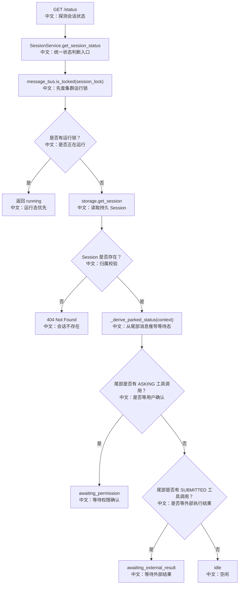

# GET /sessions/{session_id}/status：统一会话状态探测

> 这篇讲一个很适合面试的设计：如何把“集群运行中”和“持久化等待态”折叠成一个前端好用的四值状态。

---

## 0. 这篇先记住什么

1. **状态不是单一来源。**  
   `running` 来自 MessageBus 分布式锁；`awaiting_*` 和 `idle` 来自持久化 `AgentState.context`。

2. **RUNNING 优先级最高。**  
   只要有 worker 持有 session run lock，就直接返回 `running`，不再看持久 context。

3. **parked 状态只看尾部 assistant 消息。**  
   如果尾部 tool call 有 `ASKING`，返回 `awaiting_permission`；有 `SUBMITTED`，返回 `awaiting_external_result`。

---

## 1. 产品场景

有些 UI 或轮询逻辑不需要拉完整 messages，也不想打开 SSE，只想知道 session 当前处于什么状态：

```text
前端或外部调用方探测会话
  → GET /sessions/{sid}/status
     中文说明：请求高层状态
  → 后端先查运行锁
     中文说明：判断是否有 worker 正在运行
  → 如果没有运行锁，再读取持久 context 尾部
     中文说明：判断是否停在用户确认或外部执行等待
  → 返回 running / idle / awaiting_permission / awaiting_external_result
     中文说明：前端拿一个枚举就能渲染状态
```

---

## 2. 接口卡片

- **方法**：`GET`
- **路径**：`/sessions/{session_id}/status`
- **查询参数**：`agent_id`
- **成功状态码**：`200 OK`
- **响应体**：`SessionStatusResponse { session_id, status }`
- **主要失败**：`404`，当 session 不存在或不属于当前用户

状态枚举：

| status | 中文说明 |
|---|---|
| `running` | 有 worker 持有 run lock，正在运行 |
| `idle` | 没有 worker 运行，也没有 pending tool call |
| `awaiting_permission` | 停在用户权限确认 |
| `awaiting_external_result` | 停在外部执行结果等待 |

---

## 3. 主流程图



---

## 4. 源码链路

后端入口：

```text
src/agentscope/app/_router/_session.py
get_session_status
```

核心服务：

```text
src/agentscope/app/_service/_session.py
SessionService.get_session_status
SessionService._derive_parked_status
```

关键步骤中文解释：

```text
1. if await self._bus.is_locked(MessageBusKeys.session_lock(session_id)):
       return SessionStatus.RUNNING
   中文：运行锁是实时真相。只要有 worker 正在跑，持久 context 可能是旧快照。

2. session = await self._storage.get_session(user_id, agent_id, session_id)
   中文：没有运行锁时，再读持久 session。

3. return self._derive_parked_status(session.state.context)
   中文：从 AgentState.context 的尾部消息推导 parked 状态。

4. 如果尾部 assistant 消息有 ASKING tool_call，返回 awaiting_permission。
   中文：用户确认是最高优先级的等待原因。

5. 如果尾部 assistant 消息有 SUBMITTED tool_call，返回 awaiting_external_result。
   中文：表示已经提交给外部 executor，等结果回来。
```

---

## 5. 设计亮点

### 5.1 为什么 RUNNING 先于 storage

运行时 worker 内存里的状态比 storage 新。ChatRun 可能还在生成，最终 state 要到 `finally` 持久化后才落盘。因此只要锁还在，就不应该用旧 context 推导状态。

面试表达：

> 这是一个“实时态优先于持久快照”的状态机设计。锁代表当前 worker 正在推进状态，storage 只在没有 worker 运行时才是判断 parked/idle 的依据。

### 5.2 为什么只看尾部消息

一个未完成回复的 pending tool call 只可能在最后一条 assistant 消息上。历史消息里的 ASKING/SUBMITTED 如果不是尾部，就不应该影响当前状态。

### 5.3 ASKING 为什么优先于 SUBMITTED

如果同一轮有多个工具调用，一个在等待用户确认，一个已经提交外部执行，用户可感知的阻塞原因仍然是确认。因此 `awaiting_permission` 优先。

---

## 6. 边界与坑

| 场景 | 实际行为 | 面试提醒 |
|---|---|---|
| worker 正在运行 | 直接 `running` | 不读取 storage context |
| 无锁且 session 不存在 | 404 | router 把 None 转 404 |
| 尾部不是 assistant | `idle` | parked 只看最后一条 assistant |
| 同时有 ASKING 和 SUBMITTED | `awaiting_permission` | 用户确认优先 |
| worker 崩溃 | 锁 TTL 到期后不再 running | 然后根据持久 context 推导 |

补充风险点：

```text
当前实现先查 lock 再查 storage。
中文说明：这让 running 热路径更快，但也依赖删除流程及时 cancel/purge。
如果出现异常残留锁，status 可能优先返回 running。
```

---

## 7. 面试问答

**Q：为什么不用一个 DB 字段保存 status？**  
因为 status 同时包含实时运行态和持久 parked 态。运行态适合锁，parked 态适合从持久 context 推导；单 DB 字段容易在进程崩溃时失真。

**Q：为什么 running 优先级最高？**  
运行中的 in-memory 状态比落盘 state 新。只要 worker 持有锁，storage 里的 context 可能还没更新完。

**Q：这个状态接口和 messages 里的 is_running 有什么区别？**  
`messages` 只返回历史消息和一个布尔运行态；`status` 返回四值高层状态，可以区分 idle、运行中、等待用户确认、等待外部执行。

---

## 8. 60 秒讲法

```text
GET /sessions/{id}/status 把两类信号合成一个状态：
第一类是 MessageBus 的 session run lock，表示集群里是否有 worker 正在运行；
第二类是持久化 AgentState.context 的尾部 tool call，表示是否 parked。

它的优先级是 running 先判断，因为运行中的内存状态比 storage 快照更新。
没有运行锁时才看尾部 assistant 消息：
ASKING 返回 awaiting_permission，SUBMITTED 返回 awaiting_external_result，
否则就是 idle。

这个接口的本质是把实时态和持久态做成一个前端好用的状态机。
```
