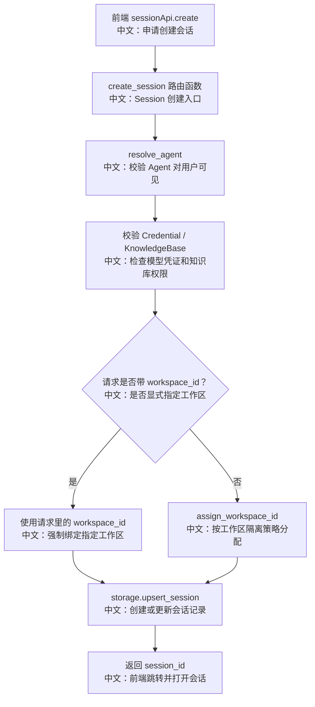

# POST /sessions/：创建或复用 Session

> 这篇讲清楚一个核心点：Session 是 AgentScope 的运行态边界。创建 Session 不只是拿一个 id，而是在绑定 agent、workspace、模型配置、知识库配置和初始 AgentState。

---

## 0. 这篇先记住什么

1. **Session 不是一次请求，而是一段持续对话的运行容器。**  
   它保存 `SessionConfig` 和 `AgentState`，后续 `POST /chat/` 每次运行都会从这里恢复上下文。

2. **创建接口带有 upsert 语义。**  
   源码注释说明同一个 `(user_id, agent_id, workspace_id)` 最多一个 session；重复创建会更新已有 session，而不是制造重复会话。

3. **workspace 绑定是创建时确定的。**  
   请求可以显式传 `workspace_id`；不传时由 `WorkspaceManagerBase.assign_workspace_id` 按隔离策略分配。

---

## 1. 产品场景

用户在 Web UI 里点击“新建会话”时，前端不是直接开始聊天，而是先创建 Session：

```text
用户点击新建会话
  → 前端调用 sessionApi.create
     中文说明：向后端申请一个新的会话容器
  → 后端校验 Agent / Credential / KnowledgeBase 可见性
     中文说明：防止会话引用用户无权访问的资源
  → 后端绑定 workspace 和模型配置
     中文说明：确定这段对话运行在哪个工作区、用什么模型
  → 返回 session_id
     中文说明：前端跳转到 /chat/{agentId}/{sessionId}
```

前端入口在 `examples/web_ui/frontend/src/pages/chat/index.tsx`，`handleCreateSession` 会复用当前会话或第一个会话的模型配置作为 seed，再调用 `createSession`。

---

## 2. 接口卡片

- **方法**：`POST`
- **路径**：`/sessions/`
- **请求体**：`CreateSessionRequest`
- **成功状态码**：`201 Created`
- **响应体**：`CreateSessionResponse { session_id }`
- **主要失败**：`404`，当 agent、credential 或 knowledge base 对当前用户不可见

请求体关键字段：

| 字段 | 中文说明 |
|---|---|
| `agent_id` | 这段 Session 属于哪个 Agent |
| `workspace_id` | 可选；显式指定运行工作区，不传则由 workspace manager 分配 |
| `name` | 可选；会话显示名，不传则默认当前时间 |
| `chat_model_config` | 主聊天模型配置 |
| `fallback_chat_model_config` | 主模型失败时的备用模型配置 |
| `tts_model_config` | 语音合成模型配置 |
| `knowledge_config` | 本会话挂载哪些知识库，以及 RAG 参数 |

---

## 3. 主流程图



---

## 4. 源码链路

后端入口：

```text
src/agentscope/app/_router/_session.py
create_session
```

关键步骤中文解释：

```text
1. access.resolve_agent(user_id, body.agent_id)
   中文：先确认当前用户能看到这个 Agent；共享 Agent 也可以被 resolve。

2. _ensure_credential_exists(...)
   中文：主模型、fallback 模型、TTS 模型引用的 credential 都要可见。

3. _ensure_knowledge_bases_exist(...)
   中文：knowledge_config 里的每个知识库 id 都要可见。

4. resolved_workspace_id = body.workspace_id or workspace_manager.assign_workspace_id(...)
   中文：显式 workspace 优先；否则由 workspace manager 生成/分配。

5. storage.upsert_session(...)
   中文：持久化 SessionConfig，并返回 SessionRecord。
```

数据模型在 `src/agentscope/app/storage/_model/_session.py`：

```text
SessionRecord
  user_id
  agent_id
  source
  source_schedule_id
  team_id
  config: SessionConfig
  state: AgentState
```

中文理解：`config` 是“这段会话怎么运行”，`state` 是“这段会话已经运行到哪里”。

---

## 5. 设计亮点

### 5.1 为什么创建时就绑定 workspace

AgentScope 的工具、文件、MCP、Skill 都和 workspace 有关系。如果 Session 不固定 workspace，每次运行时再临时决定，会导致同一段对话的文件上下文漂移。

面试表达：

> Session 的 workspace 绑定是运行隔离边界。模型上下文、文件操作和工具环境都应该围绕同一个 session workspace 展开，避免一次对话跨工作区污染状态。

### 5.2 为什么是 upsert，而不是纯 create

同一个用户、同一个 Agent、同一个 workspace 下重复创建多个 Session，可能只是前端重复点击或恢复已有入口。upsert 可以避免重复会话。

但要注意：这是“按存储语义复用”，不是 HTTP 幂等协议；请求里配置变了，已有 session 可能被更新。

---

## 6. 边界与坑

| 场景 | 实际行为 | 面试提醒 |
|---|---|---|
| agent 不可见 | `resolve_agent` 抛 404 | Session 不能引用不可见 Agent |
| credential 不可见 | `_ensure_credential_exists` 抛 404 | 模型配置不是纯字符串，也要做权限校验 |
| knowledge base 不可见 | `_ensure_knowledge_bases_exist` 抛 404 | RAG 资源也走可见性校验 |
| 没传 workspace_id | 调 `assign_workspace_id` | 由 workspace manager 的隔离策略决定 |
| 同 triple 重复创建 | `storage.upsert_session` 复用/更新 | 不要简单讲成“每次新建一条记录” |

---

## 7. 面试问答

**Q：Session 和 ChatRun 有什么区别？**  
Session 是持久运行态边界，ChatRun 是一次后台执行。一个 Session 可以经历多次 ChatRun，每次 ChatRun 都从 SessionRecord 的 config/state 恢复。

**Q：为什么创建 Session 要校验 Credential 和 KnowledgeBase？**  
因为这些资源会在后续运行时被加载。如果创建时不校验，运行时才失败，错误会从同步 API 延迟到后台任务，用户体验和排错都会变差。

**Q：workspace_id 为什么允许前端传？**  
主要服务于复用或团队借用等高级场景，可以强制把新 Session 绑定到已有 workspace。不传时走 workspace manager 的默认隔离策略。

---

## 8. 60 秒讲法

```text
POST /sessions/ 是创建会话运行容器的入口。
它先校验 Agent、模型凭证、知识库是否对当前用户可见，
再确定 workspace 绑定，最后 upsert 一个 SessionRecord。

SessionRecord 里最关键的是 config 和 state：
config 决定这段对话用哪个 workspace、哪个模型、挂哪些知识库；
state 保存 AgentState，后续 ChatService.run 会从这里恢复上下文。

所以我不会把 Session 看成普通聊天记录 id，
而会把它看成 Agent Runtime 的持久运行边界。
```
