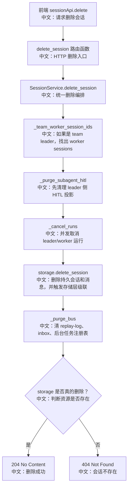

# DELETE /sessions/{session_id}：删除 Session 与清理运行态

> 这篇讲删除为什么不是简单 `storage.delete_session`。Session 删除必须先取消运行、处理 Team 级联、清理 MessageBus 临时状态和 HITL projection。

---

## 0. 这篇先记住什么

1. **删除前先 cancel。**  
   `SessionService.delete_session` 会广播 cancel，等待 run lock 释放或超时。

2. **删除要同时清 storage 和 bus。**  
   storage 删除持久记录和消息；bus 清 replay-log、inbox、background task registry。

3. **Team leader 删除会牵涉 worker session。**  
   如果被删 session 是 team leader，要提前找出 worker session ids，一起 cancel 和 purge。

---

## 1. 产品场景

用户在左侧会话列表删除一个 session 时，前端不能只移除 UI 项。后端必须保证：

- 如果该 session 正在生成，先让 worker 停下来；
- 如果它是 team leader，worker sessions 也要处理；
- 如果 leader 页面有 subagent HITL 卡，projection 要清掉；
- 删除后 replay-log、inbox 等临时状态不能残留。

前端入口在 `examples/web_ui/frontend/src/pages/chat/index.tsx`：

```text
用户确认删除会话
  → removeSession(sessionId)
     中文说明：调用 useSessions.remove
  → sessionApi.delete(sessionId, agentId)
     中文说明：请求后端删除
  → refetch sessions
     中文说明：刷新会话列表
  → 如果 URL 指向被删 session，跳回 /chat/{agentId}
     中文说明：避免页面停在不存在的会话上
```

---

## 2. 接口卡片

- **方法**：`DELETE`
- **路径**：`/sessions/{session_id}`
- **查询参数**：`agent_id`
- **成功状态码**：`204 No Content`
- **响应体**：无
- **主要失败**：`404`，当 session 不存在或不属于当前用户

---

## 3. 主流程图



---

## 4. 源码链路

HTTP 入口：

```text
src/agentscope/app/_router/_session.py
delete_session
```

服务层入口：

```text
src/agentscope/app/_service/_session.py
SessionService.delete_session
```

关键步骤中文解释：

```text
1. worker_sids = await self._team_worker_session_ids(...)
   中文：如果当前 session 是 team leader，提前解析它的 worker session ids。

2. await self._purge_subagent_hitl(...)
   中文：删除前清理 leader 侧 subagent HITL 投影；必须在 storage 级联之前做。

3. await self._cancel_runs(all_sids)
   中文：对 leader 和 worker sessions 并发广播 cancel。

4. deleted = await self._storage.delete_session(...)
   中文：删除持久 session，storage 自己处理消息、team、schedule 相关级联。

5. await self._purge_bus(all_sids)
   中文：删除 replay-log、inbox、background task registry 等临时状态。
```

bus 清理内容：

```text
MessageBusKeys.session_events(session_id)
中文：SSE replay-log。

MessageBusKeys.inbox(session_id)
中文：TeamSay / wakeup 相关 inbox 队列。

MessageBusKeys.bg_tasks(session_id)
中文：该 session 关联的后台任务 registry。
```

---

## 5. 设计亮点

### 5.1 为什么删除逻辑放 SessionService

删除同时触碰 storage 和 message bus。storage 不应该 import bus，bus 也不应该知道 storage。`SessionService` 是唯一同时协调两者的层。

面试表达：

> 删除是跨资源级联，不是单表删除。服务层负责取消运行和清理 bus，存储层负责删除持久记录，各自边界清晰。

### 5.2 为什么先找 worker_sids

storage 删除 team 后，team roster 和 member session 信息可能被清掉。如果等删除后再找 worker session，就来不及清 bus。

### 5.3 为什么 cancel 超时也继续删除

`cancel_session_run` 等待 lock 释放有 timeout。超时后返回 false 并记录 warning，但删除流程继续。否则一个死亡 worker 或异常锁可能让删除接口无限卡住。

---

## 6. 边界与坑

| 场景 | 实际行为 | 面试提醒 |
|---|---|---|
| session 不存在 | 返回 404 | router 根据 service 返回值判断 |
| session 正在运行 | 先广播 cancel | 跨进程由 CancelDispatcher 执行 |
| cancel 超时 | 记录 warning，继续删除 | 删除接口不能无限挂起 |
| session 是 team leader | worker sessions 一起 cancel/purge | 先解析 worker_sids |
| session 是 worker | 清 leader 侧该 worker 的 HITL projection | 不能误删 sibling 卡 |
| bus 有残留 replay/inbox/bg_tasks | `_purge_bus` 清理 | storage 不负责 bus |

---

## 7. 面试问答

**Q：为什么 DELETE 不是直接删数据库？**  
因为 session 可能正在运行，MessageBus 里也有 replay-log、inbox、bg task registry。只删 DB 会留下运行任务和临时状态。

**Q：Team leader 删除为什么复杂？**  
leader session 删除可能解散 team，worker sessions 也要被处理。尤其 AgentInvite 的成员可能是借来的，只能删 borrowed session，不能删原 Agent。

**Q：删除时 cancel 失败怎么办？**  
实现会等待锁释放到超时，超时后继续删除并 warning。这样避免删除接口被异常 worker 永久阻塞。

---

## 8. 60 秒讲法

```text
DELETE /sessions/{id} 是一个跨资源删除流程。
它不是直接调 storage.delete_session，而是交给 SessionService。

服务层先找出可能受影响的 worker sessions，
再清理 subagent HITL projection，
然后并发 cancel 这些 session 的运行，
接着删除持久 session，
最后清理 MessageBus 上的 replay-log、inbox 和后台任务 registry。

这个设计的关键是：
storage 管持久级联，message bus 管运行态和临时态，
SessionService 是唯一同时协调两者的边界层。
```
