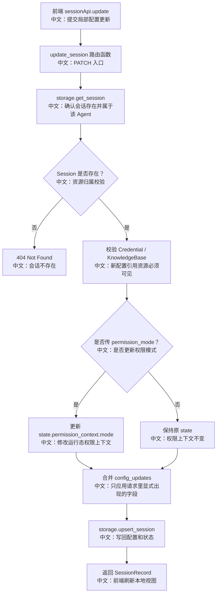

# PATCH /sessions/{session_id}：更新 Session 配置与权限模式

> 这篇重点讲“配置什么时候生效”：PATCH 更新的是持久 SessionRecord，当前正在运行的 ChatRun 已经加载了自己的运行配置，通常要到下一轮运行才会使用新配置。

---

## 0. 这篇先记住什么

1. **PATCH 是局部更新，不传字段就保持不变。**  
   后端使用 `exclude_unset=True` 区分“省略不改”和“传 null 清空”。

2. **模型、TTS、知识库配置都要重新校验可见性。**  
   更新 session 不能绕过资源权限。

3. **`permission_mode` 更新的是 AgentState，不是 SessionConfig。**  
   它被写入 `state.permission_context.mode`，属于运行态权限上下文。

---

## 1. 产品场景

用户在 ChatViewport 里切换模型、fallback 模型、TTS、知识库或权限模式时，前端会调用 `sessionApi.update`。

典型流程：

```text
用户在右侧面板切换模型
  → ChatViewport.handleLlmChange
     中文说明：更新本地选中的模型
  → sessionApi.update(sessionId, agentId, { chat_model_config })
     中文说明：把新模型配置写回 Session
  → refetchSessions()
     中文说明：重新拉取 SessionView，保证 UI 和后端持久态一致
```

对应前端文件：`examples/web_ui/frontend/src/pages/chat/ChatViewport.tsx`。

---

## 2. 接口卡片

- **方法**：`PATCH`
- **路径**：`/sessions/{session_id}`
- **查询参数**：`agent_id`
- **请求体**：`UpdateSessionRequest`
- **成功状态码**：`200 OK`
- **响应体**：更新后的 `SessionRecord`
- **主要失败**：`404`，当 session 不存在或引用资源不可见

可更新字段：

| 字段 | 中文说明 |
|---|---|
| `name` | 会话显示名 |
| `chat_model_config` | 主聊天模型配置 |
| `fallback_chat_model_config` | fallback 模型配置；传 `null` 可清空 |
| `tts_model_config` | TTS 配置；传 `null` 可关闭 |
| `knowledge_config` | 会话挂载的知识库和 RAG 参数 |
| `permission_mode` | 权限模式，写入 `state.permission_context.mode` |

---

## 3. 主流程图



---

## 4. 源码链路

后端入口：

```text
src/agentscope/app/_router/_session.py
update_session
```

关键步骤中文解释：

```text
1. existing = await storage.get_session(user_id, agent_id, session_id)
   中文：先确认 session 存在，且属于 query 里的 agent。

2. _ensure_credential_exists(...)
   中文：新模型配置里的 credential 必须可见。

3. _ensure_knowledge_bases_exist(...)
   中文：新 knowledge_config 里的知识库必须可见。

4. 如果 body.permission_mode is not None：
   updated_ctx = existing.state.permission_context.model_copy(update={"mode": body.permission_mode})
   中文：权限模式属于 AgentState 的 permission_context。

5. config_updates = body.model_dump(exclude_unset=True, exclude={"permission_mode"})
   中文：只拿请求里明确出现的字段；permission_mode 不属于 config。

6. storage.upsert_session(..., config=merged_config, state=updated_state, session_id=session_id)
   中文：把合并后的 config 和 state 写回同一条 session。
```

---

## 5. 设计亮点

### 5.1 `exclude_unset=True` 的意义

PATCH 最大的坑是区分：

```text
字段没传：保持原值
字段传 null：清空原值
```

例如 fallback 模型：

```json
{
  "fallback_chat_model_config": null
}
```

中文说明：这表示“关闭 fallback”，不是“保持不变”。

### 5.2 配置更新不等于当前 run 立即换配置

`ChatService.run` 在运行开始时读取 `session_record.config`，组装 workspace、toolkit、model、RAG middleware。PATCH 更新的是 storage 中的配置；如果此时已有 run 正在进行，它一般不会重新读取配置。

面试表达：

> PATCH 改的是下一次运行的持久配置，不是当前 in-memory run 的热更新协议。

### 5.3 permission_mode 为什么放 state

模型配置、知识库配置属于“会话怎么运行”，放 `SessionConfig`。权限模式属于“当前会话权限上下文”，会和工具确认、permission rules 一起变化，所以放 `AgentState.permission_context`。

---

## 6. 边界与坑

| 场景 | 实际行为 | 面试提醒 |
|---|---|---|
| session 不存在 | 404 | 先 `get_session` |
| 新 credential 不可见 | 404 | PATCH 不能绕过资源权限 |
| 新 knowledge base 不可见 | 404 | RAG 也要资源校验 |
| 字段省略 | 不更新 | `exclude_unset=True` |
| 字段传 null | 清空配置 | 适合 fallback/TTS/knowledge |
| 当前 run 正在执行 | 不保证立即生效 | 新配置通常下一轮 run 使用 |

---

## 7. 面试问答

**Q：PATCH 为什么不用简单 dict update？**  
因为要区分 omit 和 null。简单 dict update 容易把“没传字段”误当成清空，或者无法表达“主动清空 fallback”。

**Q：切模型后当前正在生成的回复会换模型吗？**  
不会把它当成实时热更新。当前 run 已经创建了模型实例；PATCH 改的是持久配置，下一轮 `ChatService.run` 会重新读取。

**Q：permission_mode 为什么不和 model config 放一起？**  
它不是静态模型配置，而是权限上下文的一部分。HITL 确认、权限规则和工具调用都围绕 `permission_context` 工作。

---

## 8. 60 秒讲法

```text
PATCH /sessions/{id} 是会话配置更新接口。
它先确认 session 存在，再校验新 credential 和 knowledge base 的可见性。

核心细节是 PATCH 语义：
后端用 exclude_unset=True 区分字段省略和显式传 null，
所以可以做到“不改”和“清空配置”两种语义。

另外 permission_mode 不写进 SessionConfig，
而是更新 AgentState.permission_context.mode。
配置变化通常影响下一轮 ChatService.run，不是当前 run 的热更新。
```
