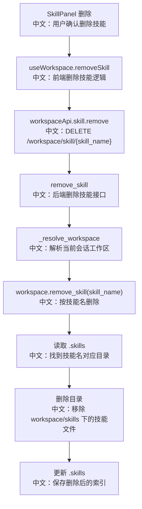

# 接口：删除工作区技能

## 0. 这篇先记住什么

`DELETE /workspace/skill/{skill_name}` 按 Agent 可见的技能名删除当前 Workspace 的 Skill。LocalWorkspace 通过 `.skills` 索引找到真实目录，删除目录后再更新索引。

---

## 1. 接口卡片

```text
方法：DELETE
路径：/workspace/skill/{skill_name}
查询参数：agent_id, session_id
成功状态：204 No Content
前端入口：workspaceApi.skill.remove(skillName, agentId, sessionId)
后端入口：remove_skill
```

---

## 2. 主流程图



---

## 3. 源码链路

关键步骤：

```text
1. 前端调用 workspaceApi.skill.remove(skillName, agentId, sessionId)。
   中文：skillName 是 UI 展示的 Agent 可见名称。

2. 后端 remove_skill 解析当前 Workspace。
   中文：仍然先确认 Session 存在。

3. LocalWorkspace.remove_skill 读取 workspace/skills/.skills。
   中文：索引里保存目录名到 skill_name 的映射。

4. 遍历索引找到 entry["skill_name"] == name 的目录。
   中文：删除不是直接按目录名删，而是按 Agent 可见名查真实目录。

5. 删除技能目录，并从 .skills 移除该 entry。
   中文：同时更新文件和索引。
```

---

## 4. 设计亮点

- 用 `.skills` 做间接映射，可以支持技能显示名和目录名不同。
- 删除后更新索引，避免 UI 列表继续看到已经不存在的技能。
- LocalWorkspace 找不到技能时只记录 warning 并返回，用户体验上更接近幂等删除。

---

## 5. 边界与坑

- 删除用的是 agent-facing name。如果用户看到的名字带 `(1)` 后缀，删除时也要传这个完整名字。
- 已经装配到某次 run 的 Skill 不一定因为删除立刻失效。
- LocalWorkspace 的 no-op 删除不一定代表所有 Workspace 后端都这样处理。

---

## 6. 面试问答

**Q：为什么删除 Skill 不直接按目录名删？**  
A：因为 Agent 看到的技能名可能和目录名不同。导入时会处理名称冲突和目录安全，`.skills` 负责保存映射，所以删除也应该按 agent-facing name 查索引再删真实目录。

**Q：删除后为什么要更新 `.skills`？**  
A：`.skills` 是列表和运行时加载的重要索引。如果只删目录不改索引，后续列表可能出现失效 entry，或者每次都需要 reconcile。

**Q：找不到技能时应该返回 404 还是 204？**  
A：LocalWorkspace 当前更偏 204/no-op，便于幂等删除。但 API 设计上也可以选择 404，让客户端知道目标不存在。这里是体验稳定性和错误显式性的取舍。

---

## 7. 60 秒讲法

```text
DELETE /workspace/skill/{skill_name} 删除当前 Workspace 的技能。
前端 SkillPanel 触发 useWorkspace.removeSkill，调用 workspaceApi.skill.remove，成功后刷新技能列表。
后端通过 Session 解析 Workspace，再调用 workspace.remove_skill。
LocalWorkspace 会读取 .skills 索引，用 agent-facing skill_name 找到真实目录名，然后删除 workspace/skills 下的目录，并更新 .skills。
这个设计的重点是显示名和目录名解耦，所以删除必须走索引。
当前 LocalWorkspace 找不到技能时只 warning，不抛错，体验上接近幂等删除。
```
