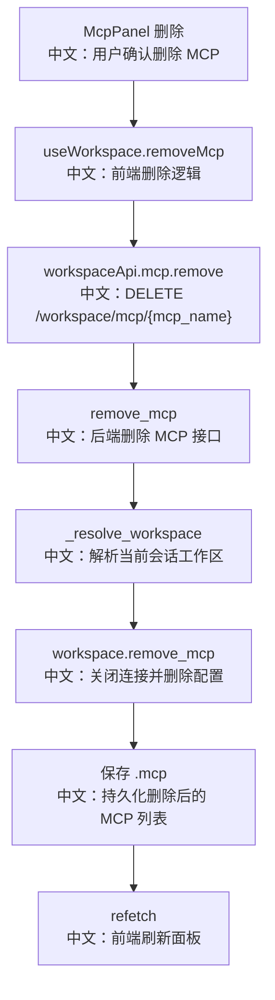

# 接口：删除工作区模型上下文协议

## 0. 这篇先记住什么

`DELETE /workspace/mcp/{mcp_name}` 用 MCP 名称删除当前 Session Workspace 里的 MCP。LocalWorkspace 找不到目标时只记录 warning 并返回，因此体验上接近幂等删除。

---

## 1. 接口卡片

```text
方法：DELETE
路径：/workspace/mcp/{mcp_name}
查询参数：agent_id, session_id
成功状态：204 No Content
前端入口：workspaceApi.mcp.remove(mcpName, agentId, sessionId)
后端入口：remove_mcp
```

---

## 2. 主流程图



---

## 3. 源码链路

关键步骤：

```text
1. 前端调用 workspaceApi.mcp.remove(mcpName, agentId, sessionId)。
   中文：MCP 名称在路径里，agent_id 和 session_id 在 query 里。

2. 后端 remove_mcp 调 _resolve_workspace。
   中文：仍然先按 Session 找到 Workspace。

3. LocalWorkspace.remove_mcp 遍历 self._mcps。
   中文：按 MCP 的 name 字段找目标。

4. 如果找到且是 stateful connected，先 close。
   中文：避免删除配置后留下长连接资源。

5. 从列表删除并保存 .mcp。
   中文：保证 Workspace 重启后不会再恢复这个 MCP。
```

---

## 4. 设计亮点

- 删除前会关闭 stateful MCP，资源生命周期处理比较完整。
- 删除后写 `.mcp`，保证内存状态和持久化状态一致。
- LocalWorkspace 找不到目标时不报错，便于前端重复点击或并发刷新后的删除请求保持稳定。

---

## 5. 边界与坑

- 删除接口以 `mcp_name` 为标识，如果后端允许重名，删除语义会变得不清晰。当前 LocalWorkspace 是遍历到第一个同名就删除。
- 已经装配到当前 run 的 MCP 不一定会因为删除接口立刻从运行中的 Toolkit 消失。
- 不同 Workspace 实现对“找不到 MCP”的处理可能不同，不能把 LocalWorkspace 的 no-op 行为泛化到所有实现。

---

## 6. 面试问答

**Q：删除 MCP 为什么要 close？**  
A：stateful MCP 可能持有进程、HTTP session 或长连接。删除配置前关闭连接，可以避免资源泄漏。

**Q：这个删除接口幂等吗？**  
A：在 LocalWorkspace 下接近幂等，找不到目标时只记录 warning 并返回，接口仍然可以表现为 204。但严格说这是具体实现行为，不一定适用于所有 Workspace 后端。

**Q：如果有两个同名 MCP 会怎样？**  
A：LocalWorkspace 当前按名称遍历，找到第一个就删除。所以更好的生产设计是在新增时就强制 name 唯一。

---

## 7. 60 秒讲法

```text
DELETE /workspace/mcp/{mcp_name} 删除当前 Session Workspace 下的 MCP。
前端从 McpPanel 触发，useWorkspace.removeMcp 调 workspaceApi，然后删除成功后 refetch。
后端仍然先通过 agent_id 和 session_id 解析 Workspace，再调用 workspace.remove_mcp。
LocalWorkspace 会按 name 找 MCP，如果是 stateful 且已连接就先 close，再从 _mcps 删除并保存 .mcp。
这个实现找不到目标时只打 warning，所以体验上接近幂等。
但如果系统允许 MCP 重名，按 name 删除会有歧义，因此生产级最好在 add_mcp 做唯一约束。
```
