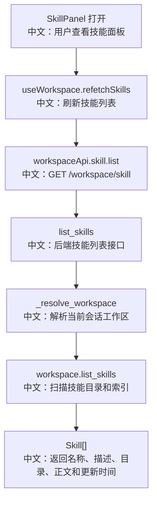

# 接口：工作区技能列表

## 0. 这篇先记住什么

`GET /workspace/skill` 返回当前 Session Workspace 中可用的 Skill。LocalWorkspace 会读取 `workspace/skills` 和 `.skills` 索引，把技能以 Agent 可见的名称返回给前端。

---

## 1. 接口卡片

```text
方法：GET
路径：/workspace/skill
查询参数：agent_id, session_id
返回：list[Skill]
前端入口：workspaceApi.skill.list(agentId, sessionId)
后端入口：list_skills
```

---

## 2. 主流程图



---

## 3. 源码链路

关键步骤：

```text
1. 前端 refetchSkills 检查 agentId 和 sessionId。
   中文：没有选中会话时直接清空 skills。

2. 调 workspaceApi.skill.list。
   中文：请求 /workspace/skill，并带 agent_id、session_id。

3. 后端 list_skills 解析 Workspace。
   中文：同样通过 SessionRecord.config.workspace_id 定位。

4. LocalWorkspace.list_skills 读取 skills 目录。
   中文：技能都放在 workspace/skills 下。

5. 如果目录 mtime 变化，调用 reconcile。
   中文：支持手动增删技能目录后的索引修复。

6. 使用 .skills 中的 agent-facing name 加载 Skill。
   中文：返回给 Agent 和 UI 的名字可能带有冲突后缀。
```

---

## 4. 设计亮点

- `.skills` 索引把“目录名”和“Agent 看到的技能名”解耦。
- `list_skills()` 会根据目录 mtime 做 reconcile，兼容手动改动。
- Skill 返回的不只是 name/description，也包含 markdown 内容和更新时间，运行时可以直接加载。

---

## 5. 边界与坑

- Skill 必须有合法 `SKILL.md`，并且 frontmatter 里要有 `description`；否则会被跳过。
- agent-facing name 可能不是原始 `SKILL.md` 的 name，因为冲突时会加后缀。
- 如果远程 Workspace 不是本地文件系统，`list_skills` 的具体行为要看对应实现。

---

## 6. 面试问答

**Q：为什么需要 `.skills` 索引？**  
A：因为磁盘目录名不一定等于 Agent 应该看到的技能名。导入时可能需要重命名、去重、冲突处理，`.skills` 用来记录目录和 agent-facing name 的映射。

**Q：为什么 `list_skills()` 要 reconcile？**  
A：用户或系统可能绕过 API 直接改动 `skills` 目录。通过 mtime 检测变化并修复索引，可以让列表结果和磁盘状态重新对齐。

**Q：Skill 列表和 MCP 列表最大的区别是什么？**  
A：MCP 列表会主动探测外部工具健康状态；Skill 列表主要是本地技能文件扫描和索引加载。

---

## 7. 60 秒讲法

```text
GET /workspace/skill 是 SkillPanel 的数据源。
前端 useWorkspace.refetchSkills 调 workspaceApi.skill.list，后端通过 agent_id 和 session_id 找到当前 Workspace。
LocalWorkspace 会读取 workspace/skills 目录和 .skills 索引；如果目录 mtime 变化，会先 reconcile，处理手动新增或删除的技能目录。
最终返回 Skill 列表，里面有 agent-facing name、description、dir、markdown、updated_at。
这里的关键点是目录名和 Agent 看到的技能名被 .skills 解耦，所以名字冲突时可以安全加后缀。
```
