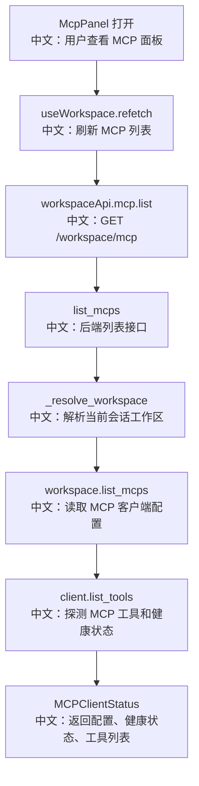

# 接口：工作区模型上下文协议列表

## 0. 这篇先记住什么

`GET /workspace/mcp` 不是简单列配置，它会解析当前 Session 的 Workspace，并对每个 MCP 调 `list_tools()`，把健康状态和工具列表一起返回给 Web UI。

---

## 1. 接口卡片

```text
方法：GET
路径：/workspace/mcp
查询参数：agent_id, session_id
返回：list[MCPClientStatus]
前端入口：workspaceApi.mcp.list(agentId, sessionId)
后端入口：list_mcps
```

返回对象比普通 `MCPClient` 多两类信息：

```text
is_healthy
  中文：当前 MCP 是否能成功列出工具。

tools
  中文：MCP 暴露给 Agent 的工具名称和描述。
```

---

## 2. 主流程图



---

## 3. 源码链路

关键步骤：

```text
1. 前端调用 workspaceApi.mcp.list(agentId, sessionId)。
   中文：请求带 agent_id 和 session_id 查询参数。

2. 后端 list_mcps 调 _resolve_workspace。
   中文：先确认 Session 存在，再拿到 session_record.config.workspace_id。

3. workspace.list_mcps() 返回 MCPClient 列表。
   中文：这是工作区里已经登记的 MCP 配置。

4. 对每个 client 调 await client.list_tools()。
   中文：如果成功，说明 MCP 当前可用，并能返回 tools。

5. 如果 list_tools 抛异常，只把该 MCP 标记为 is_healthy=false。
   中文：单个 MCP 故障不会导致整个列表接口失败。
```

---

## 4. 设计亮点

- 列表接口承担了“配置展示 + 健康探测”两个职责，UI 可以直接展示绿点/红点和工具数量。
- 每个 MCP 独立 try/except，避免一个坏 MCP 拖垮整个面板。
- 前端只使用 `agent_id + session_id`，Workspace 归属由后端 SessionRecord 决定。

---

## 5. 边界与坑

- `client.list_tools()` 可能触发网络请求、子进程通信或远端 MCP 调用，因此列表接口可能变慢。
- 当前接口没有在 router 层显式设置每个 MCP 的健康检查超时。
- 如果 MCP 数量很多，逐个探测会放大延迟，可以考虑缓存或异步刷新健康状态。

---

## 6. 面试问答

**Q：为什么 MCP 列表接口要返回 `is_healthy`？**  
A：因为 MCP 是外部能力接入，配置存在不代表当前可用。列表时调用 `list_tools()`，可以让 UI 展示健康状态和工具清单，用户能立刻知道哪个 MCP 连接失败。

**Q：单个 MCP 挂了会怎样？**  
A：后端捕获该 MCP 的异常，只返回 `is_healthy=false`，不会让整个 `/workspace/mcp` 请求失败。这是局部失败隔离。

**Q：这个接口有什么可优化点？**  
A：可以给 `list_tools()` 增加超时、缓存最近一次结果，或者把健康检查改成后台刷新，避免列表接口被慢 MCP 阻塞。

---

## 7. 60 秒讲法

```text
GET /workspace/mcp 是 Web UI MCP 面板的数据源。
前端通过 useWorkspace.refetch 调 workspaceApi.mcp.list，带上 agent_id 和 session_id。
后端先解析当前 Session 对应的 Workspace，然后读取 workspace.list_mcps。
它不是直接返回配置，而是对每个 MCP 调 client.list_tools，如果成功就返回 tools 和 is_healthy=true；失败就只把这个 MCP 标成 unhealthy。
这个设计让 UI 可以展示工具数量和健康状态，也避免一个 MCP 故障影响整个列表。
需要注意的是 list_tools 可能较慢，生产环境可以补超时、缓存或异步健康检查。
```
