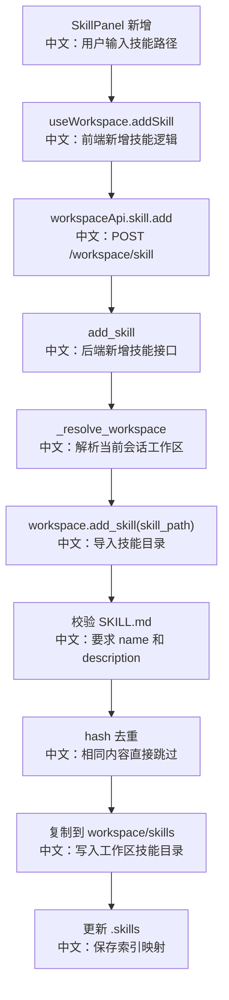

# 接口：添加工作区技能

## 0. 这篇先记住什么

`POST /workspace/skill` 从一个服务端可访问的目录导入 Skill。LocalWorkspace 要求目录里有合法 `SKILL.md`，并用内容 hash 去重、用名称后缀解决冲突。

---

## 1. 接口卡片

```text
方法：POST
路径：/workspace/skill
查询参数：agent_id, session_id
请求体：{"skill_path": "..."}
成功状态：201 Created
前端入口：workspaceApi.skill.add(agentId, sessionId, { skill_path })
后端入口：add_skill
```

---

## 2. 主流程图



---

## 3. 源码链路

关键步骤：

```text
1. 前端调用 addSkill(skillPath)。
   中文：skillPath 是后端服务能访问到的路径。

2. 后端 add_skill 接收 AddSkillRequest。
   中文：请求体只有一个字段 skill_path。

3. _resolve_workspace 定位当前 Session Workspace。
   中文：不让客户端直接操作 workspace_id。

4. LocalWorkspace.add_skill 校验 skill_path/SKILL.md。
   中文：SKILL.md 必须存在，并且 frontmatter 包含 name 和 description。

5. 计算 SKILL.md 的 SHA-256 hash。
   中文：用内容判断是否已经导入过。

6. 解决名称和目录冲突。
   中文：agent-facing name 可以加 (1)，目录名可以加 _1。

7. copytree 到 workspace/skills，并更新 .skills。
   中文：导入后技能成为这个 Workspace 的一部分。
```

---

## 4. 设计亮点

- 内容 hash 去重比单纯按名字去重更稳，避免同一个 Skill 换目录重复导入。
- agent-facing name 和目录名分别处理冲突，兼顾 Agent 体验和文件系统安全。
- `_sanitize_dir_name` 会把不适合作为目录名的字符替换掉，并做路径越界检查。

---

## 5. 边界与坑

- `skill_path` 是服务端路径，不是浏览器本地随便一个路径。远程部署时需要额外设计上传或仓库安装机制。
- 相同 hash 的 Skill 会静默跳过，不会创建第二份。
- 如果 `SKILL.md` 缺少 `name` 或 `description`，LocalWorkspace 会抛 `ValueError`；router 层没有细分业务错误码。
- 新增 Skill 后，通常影响后续 run 的 Toolkit 装配，不保证已经运行中的 Agent 立即看到。

---

## 6. 面试问答

**Q：为什么 Skill 要用 `SKILL.md`？**  
A：`SKILL.md` 是 Skill 的元数据和正文载体。frontmatter 提供 name、description，正文提供可复用的能力说明。这样 Skill 可以像一个可复制、可索引、可加载的小模块。

**Q：为什么按 hash 去重？**  
A：同一个 Skill 可能来自不同目录或被重复导入，按 `SKILL.md` 内容 hash 去重能识别“内容相同”的重复，比只看目录名或 name 更可靠。

**Q：远程服务里这个接口有什么问题？**  
A：`skill_path` 必须是后端能访问的路径。浏览器端路径在远程部署里通常不可用，所以需要改成上传、从 Git 安装、或从服务端受控目录选择。

---

## 7. 60 秒讲法

```text
POST /workspace/skill 用来把一个技能目录导入当前 Session Workspace。
前端 SkillPanel 收到用户输入的路径后，通过 useWorkspace.addSkill 调 workspaceApi.skill.add。
后端解析 Workspace，然后调用 workspace.add_skill。
LocalWorkspace 会检查 skill_path 下有没有 SKILL.md，并要求 frontmatter 里有 name 和 description。
接着它计算 SKILL.md hash，避免重复导入；如果名字冲突，就给 Agent 看到的名称加 (1) 这类后缀，同时处理目录名冲突。
最后把技能复制到 workspace/skills，并更新 .skills 索引。
这个接口的关键边界是：skill_path 是服务端路径，远程部署时要设计上传或仓库安装。
```
