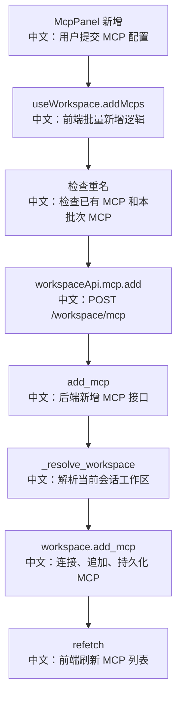

# 接口：添加工作区模型上下文协议

## 0. 这篇先记住什么

`POST /workspace/mcp` 的作用是把一个 MCP client 配置加入当前 Session 的 Workspace。它是“登记能力”的接口，真正被 Agent 使用发生在后续 `get_toolkit` 装配阶段。

---

## 1. 接口卡片

```text
方法：POST
路径：/workspace/mcp
查询参数：agent_id, session_id
请求体：MCPClient
成功状态：201 Created
前端入口：workspaceApi.mcp.add(agentId, sessionId, mcp)
后端入口：add_mcp
```

---

## 2. 主流程图



---

## 3. 源码链路

关键步骤：

```text
1. useWorkspace.addMcps(clients) 先检查已有名称。
   中文：如果当前 mcps 里已有同名 MCP，前端直接报错。

2. addMcps 再检查本次批量配置内部是否重名。
   中文：避免一次粘贴多个 MCP 配置时自相冲突。

3. 对每个 MCP 调 workspaceApi.mcp.add。
   中文：当前实现是逐个 POST，最后统一 refetch。

4. 后端 add_mcp 调 _resolve_workspace。
   中文：确认 Session 存在，并用 Session 的 workspace_id 定位 Workspace。

5. workspace.add_mcp(mcp)。
   中文：LocalWorkspace 会在需要时连接 stateful MCP，然后追加到内存列表并保存 .mcp。
```

---

## 4. 设计亮点

- 前端支持批量新增，并在提交前做重复名称校验。
- LocalWorkspace 对 stateful MCP 会先 `connect()`，避免保存一个完全不可用的长连接客户端。
- MCP 配置会写入 `.mcp`，Workspace 重启后可以恢复。

---

## 5. 边界与坑

- 前端重名检查不是后端强约束。如果绕过 UI 直接调 API，后端是否拒绝重名取决于 Workspace 实现。
- stateful MCP 的 `connect()` 失败会让新增失败；router 层没有把它包装成更细的业务错误。
- 新增 MCP 后，不一定影响已经开始运行的 Chat run；更稳妥地说，它影响后续 Toolkit 装配。

---

## 6. 面试问答

**Q：添加 MCP 后 Agent 为什么能用到它？**  
A：添加接口把 MCP 放进当前 Session 的 Workspace。下一次 Chat run 组装 `Toolkit` 时，`get_toolkit` 会调用 `workspace.list_mcps()`，把 MCP client 传给 `Toolkit`，Agent 才能看到 MCP 暴露的工具。

**Q：为什么前端要做重名检查？**  
A：MCP name 通常会参与工具命名和 UI 展示，重复名称会造成歧义。前端先检查已有列表和本批次配置，可以提供更早、更友好的错误反馈。

**Q：这个接口生产化还可以补什么？**  
A：后端可以补 name 唯一约束、连接超时、错误码映射，以及新增成功后的健康检查结果返回。

---

## 7. 60 秒讲法

```text
POST /workspace/mcp 是把 MCP server 配进当前会话工作区的接口。
前端 useWorkspace.addMcps 会先检查 MCP 名称是否和当前列表或本批次重复，然后逐个调用 workspaceApi.mcp.add。
后端通过 agent_id 和 session_id 解析 Workspace，再调用 workspace.add_mcp。
LocalWorkspace 会在 MCP 是 stateful 且未连接时先 connect，然后追加到 _mcps 并保存 .mcp。
需要注意，UI 的重名检查不等于后端强约束；绕过 UI 时还要看 Workspace 实现。
新增 MCP 是登记能力，真正进入 Agent 工具箱是在后续 get_toolkit 调 workspace.list_mcps 的时候。
```
