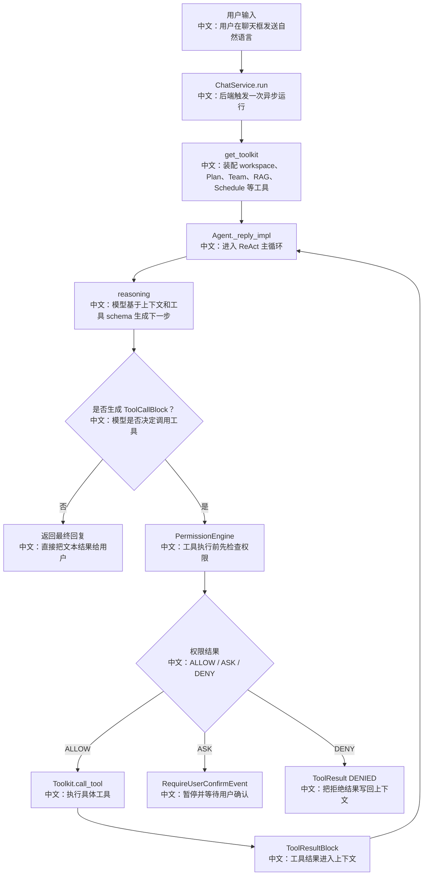

# 聊天意图识别与工具选择

> 结论：AgentScope 源码里没有看到独立的“意图识别分类器”。它更像是通过 ReAct 循环、工具 schema/description、`tool_choice`、Toolkit 可见工具集合、middleware 共同驱动模型决定是否调用工具。面试时这个点很重要：不要把它讲成传统 NLU intent classifier。

---

## 1. 先讲清楚：这里的“意图识别”是什么

在很多传统对话系统里，流程是：

```text
用户输入
  ↓
Intent Classifier
中文：意图分类器，例如判断是“查天气 / 下订单 / 取消任务”
  ↓
Slot Filling
中文：槽位抽取，例如城市、时间、商品
  ↓
固定业务流程
```

AgentScope 的源码更接近：

```text
用户输入 + 历史上下文 + 工具 schema
  ↓
LLM reasoning
中文：模型根据上下文和工具描述自己判断下一步
  ↓
ToolCallBlock 或最终文本
中文：要么生成工具调用，要么直接回答
  ↓
Permission / Acting / ToolResult
中文：工具调用先过权限，再执行，再把结果交回模型
```

也就是说，这里的“意图识别”不是一个单独模块，而是 Agent Runtime 的工具选择能力。

---

## 2. 源码证据

关键源码：

```text
src/agentscope/agent/_agent.py
中文：Agent ReAct 主循环，负责 reasoning、acting、HITL、状态更新。

src/agentscope/app/_service/_toolkit.py
中文：根据 session / workspace / middleware 装配工具集合，决定模型能看到哪些工具。

src/agentscope/tool/_toolkit.py
中文：真正执行工具，包含工具查找、参数解析、状态注入、异常和取消处理。

src/agentscope/middleware/_budget.py
中文：预算中间件能在预算耗尽时把 tool_choice 改成 none，禁止继续调用工具。
```

关键链路：

```text
Agent._reply_impl
中文：一次回复的核心入口
  ↓
Agent._reasoning
中文：调用模型，模型看到上下文和工具 schema
  ↓
_check_next_action
中文：判断下一步是继续 reasoning、执行 tool、等待 HITL，还是结束
  ↓
Agent._execute_tool_call
中文：工具调用进入参数解析和权限检查
  ↓
Toolkit.call_tool
中文：找到具体工具并执行
```

---

## 3. 流程图



---

## 4. 工具选择受哪些因素影响

### 4.1 工具是否被装配

`get_toolkit` 决定模型“看得到什么工具”。

```text
workspace.list_tools()
中文：工作区内置工具，例如文件、命令、搜索。

TaskCreate / TaskList / TaskGet / TaskUpdate
中文：计划工具始终装配。

Schedule tools
中文：只有 session 有模型配置时才装配。

Team tools
中文：根据当前 session 是 leader 还是 worker 装配不同工具。

middleware.list_tools()
中文：例如 RAGMiddleware 在 agentic 模式下暴露 search_knowledge。
```

面试亮点：

```text
工具选择不是只靠模型聪明，也靠“可见工具集合”控制行为边界。
worker 看不到创建团队工具，leader 才能看到完整 team 工具。
这是一种产品权限和 Agent 能力共同收敛的设计。
```

### 4.2 工具描述如何影响模型

Plan、Team、RAG 的触发条件主要写在工具 description 里。

例如：

```text
TaskCreate 的 description
中文：告诉模型遇到复杂、多步骤、需要跟踪的任务时应该创建计划。

TeamCreate / AgentCreate 的 description
中文：告诉模型在任务需要多个成员、专业分工、并行处理时创建团队和成员。

search_knowledge 的 description
中文：告诉模型当问题可能由知识库内容回答时检索。
```

这也是面试里可以讲的一个工程点：

```text
Agent 产品的“意图路由”一部分从代码 if-else 转移到了工具 schema 和描述里。
好处是扩展工具成本低；
风险是行为更依赖模型，需要通过工具描述、权限、测试和 UI 反馈来约束。
```

### 4.3 `tool_choice` 和 middleware

`tool_choice` 可以限制模型是否允许调用工具。预算中间件是一个典型例子：

```text
ReplyBudgetControlMiddleware
中文：统计一次回复中的 token 使用量。

预算超过上限
中文：向上下文注入提示，并把 input_kwargs["tool_choice"] 设置为 none。

结果
中文：模型后续只能收束回答，不能继续开新工具调用。
```

面试亮点：

```text
这说明 Agent 的行为控制不是只有 prompt。
middleware 可以在运行时改写模型调用参数，从系统层面限制工具使用。
```

---

## 5. 和传统意图识别的对比

| 维度 | 传统 Intent Classifier | AgentScope 工具选择 |
|---|---|---|
| 决策方式 | 分类模型或规则 | LLM reasoning + tool schema |
| 扩展新能力 | 增加 intent、训练/规则配置 | 增加工具和描述 |
| 可解释性 | 分类标签明确 | 需要看模型输出、ToolCall、事件流 |
| 稳定性 | 对固定业务强 | 对开放任务强，但需要约束 |
| 安全控制 | 业务流程内控制 | PermissionEngine + tool visibility + HITL |
| 适合场景 | 窄域流程 | 开放式 Agent 任务 |

---

## 6. 面试沉淀

### 一句话回答

AgentScope 没有把“意图识别”做成单独分类器，而是让模型在 ReAct 循环里基于工具 schema、上下文和 middleware 决定是否调用 Plan、Team、RAG 等工具。

### 3 分钟讲解版

```text
一次聊天运行时，后端会先根据 Session 配置装配 Toolkit。
Toolkit 里有什么工具，取决于 workspace、Plan、Team、Schedule、RAG middleware 和当前 session 的角色。
之后 Agent 进入 ReAct 循环，模型在 reasoning 阶段看到上下文和工具 schema。
如果模型认为需要工具，就生成 ToolCallBlock；如果不需要，就直接生成最终回复。
工具调用不会立刻执行，而是先经过 PermissionEngine，可能被允许、拒绝，或进入 HITL 等待用户确认。
工具结果再作为 ToolResultBlock 写回上下文，驱动下一轮 reasoning。
```

### 高频追问

| 问题 | 回答方向 |
|---|---|
| 有没有 intent classifier？ | 源码里未看到独立 classifier，是 ReAct + 工具 schema 的 agentic routing。 |
| 怎么避免模型乱调用工具？ | 控制可见工具集合、工具描述、权限引擎、HITL、预算中间件。 |
| Plan 和 Team 怎么被触发？ | 它们是工具，模型根据描述决定调用，而不是前端按钮直接开启。 |
| RAG 什么时候检索？ | agentic 模式下是 search_knowledge 工具；static 模式下 middleware 首轮 reasoning 自动注入。 |
| 如果 token 预算不够怎么办？ | budget middleware 可以强制 tool_choice=none，让模型停止开新工具。 |

### 项目表达

```text
我会把它表达成“工具驱动的意图路由”：
不是写死一堆 if intent == xxx，而是把能力抽象成工具，通过 schema/description 给模型决策空间，再用工具可见性、权限和 HITL 收敛风险。
这比传统 intent classifier 更适合开放式 Agent，但也要求更强的事件可观测性和权限控制。
```

