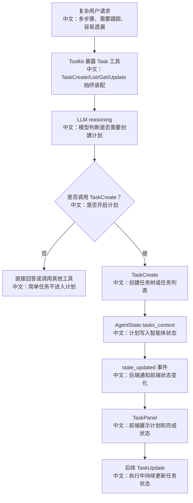

# 什么时候开启计划模式

> 结论：AgentScope 的 Plan 不是一个单独 HTTP API，也不是前端点了某个“计划模式”按钮才开启。Plan 能力以 `TaskCreate`、`TaskList`、`TaskGet`、`TaskUpdate` 工具的形式始终装配进 Toolkit，模型在复杂任务中根据工具描述主动创建和维护任务。

---

## 1. 先给结论

Plan 的触发不是硬编码规则：

```text
if 用户说“帮我做一个复杂任务”:
    开启 Plan
```

更准确的源码表达是：

```text
get_toolkit 始终装配 Task 工具
  ↓
模型在 reasoning 时看到 Task 工具 schema 和 description
  ↓
当任务多步骤、非平凡、需要跟踪时，模型生成 TaskCreate / TaskUpdate 工具调用
  ↓
TaskContext 写入 AgentState
  ↓
前端 TaskPanel 从 session state 中渲染计划
```

---

## 2. 源码证据

关键源码：

```text
src/agentscope/app/_service/_toolkit.py
中文：get_toolkit 中始终追加 TaskCreate、TaskList、TaskGet、TaskUpdate。

src/agentscope/tool/_task_create_task.py
中文：TaskCreate 工具，负责创建任务。

src/agentscope/tool/_task_update_task.py
中文：TaskUpdate 工具，负责更新任务状态、内容和依赖。

src/agentscope/app/_types.py
中文：AgentState 里包含 tasks_context。

examples/web_ui/frontend/src/components/panel/TaskPanel.tsx
中文：前端任务面板，显示 AgentState 中的任务上下文。

examples/web_ui/frontend/src/hooks/useMessages.ts
中文：接收 state_updated 事件后刷新任务和权限状态。
```

工具装配链路：

```text
get_toolkit
中文：每次 run 前装配工具
  ↓
tools += [TaskCreate(), TaskList(), TaskGet(), TaskUpdate()]
中文：Plan 工具始终可见
  ↓
Toolkit
中文：把工具 schema 暴露给模型
```

---

## 3. 什么时候模型应该调用 Plan

从产品和工具描述角度，可以总结为这些情况：

| 场景 | 是否适合 Plan | 原因 |
|---|---|---|
| 用户只问一个事实问题 | 不适合 | 直接回答即可，Plan 会增加成本 |
| 用户要求修改多处代码 | 适合 | 需要拆步骤、跟踪完成状态 |
| 用户要求分析一批接口/文档 | 适合 | 多文件、多阶段，容易遗漏 |
| 用户中途追加新要求 | 适合更新 Plan | 需要把新要求合并进任务上下文 |
| 用户让 AI “先规划再执行” | 适合 | 明确要求计划 |
| 工具调用失败需要改路线 | 适合更新 Plan | 记录阻塞、替代路径 |

面试里可以把它讲成：

```text
Plan 的触发不是 UI 开关，而是 Agent 自主使用任务工具。
工具描述定义“什么时候该计划”，AgentState 保存计划，前端只负责投影和展示。
```

---

## 4. 流程图



---

## 5. Plan 的系统设计价值

### 5.1 从 prompt 记忆变成状态记忆

不用 Plan 时，任务进展只在聊天上下文里：

```text
历史消息很长
  ↓
模型自己从文本里找“做到哪了”
  ↓
容易遗漏、重复做、上下文压缩后丢细节
```

使用 Plan 后：

```text
TaskContext
中文：结构化保存任务列表、状态、依赖和描述
  ↓
TaskPanel
中文：用户能看到进度
  ↓
TaskUpdate
中文：模型能显式标记完成、阻塞、继续
```

### 5.2 Plan 是 AgentState 的一部分

Plan 没有设计成一个完全独立的业务系统，而是放在 AgentState 里。

面试可讲的 trade-off：

| 设计 | 优点 | 代价 |
|---|---|---|
| Plan 放 AgentState | 和一次 Agent 运行上下文强绑定，工具调用自然更新 | 不适合做跨 Agent 的全局项目管理 |
| 独立 Task API | 可做复杂项目管理、跨 session 共享 | 会把 Agent Runtime 和业务任务系统强耦合 |

AgentScope 当前选择更适合：

```text
让 Plan 服务于 Agent 执行，而不是做一个通用任务管理系统。
```

---

## 6. 和 Web UI 的关系

前端不是“决定是否开启 Plan”的地方。

前端主要做三件事：

```text
1. 在侧边 PanelDock 中提供 Plan 面板入口。
2. 监听 state_updated，把后端 AgentState 中的 tasks_context 同步到 UI。
3. 在 TaskPanel 里渲染任务、状态和层级。
```

中文解释：

```text
Plan 的决策权在 Agent Runtime，展示权在 Web UI。
这让用户可以观察计划，但不会把复杂决策逻辑写死在前端按钮里。
```

---

## 7. 面试沉淀

### 一句话回答

Plan 模式不是前端开关，而是 Task 工具始终进入 Toolkit，模型在复杂任务中主动调用 `TaskCreate` 和 `TaskUpdate`，把执行计划结构化写进 AgentState 并投影到前端。

### 3 分钟讲解版

```text
AgentScope 每次装配 Toolkit 时都会把 TaskCreate、TaskList、TaskGet、TaskUpdate 加进去。
模型在 reasoning 阶段看到这些工具的 schema 和 description。
如果用户请求是多步骤、非平凡、需要持续跟踪的任务，模型会调用 TaskCreate 创建计划。
计划不是存在 prompt 文本里，而是写入 AgentState.tasks_context。
之后每完成一步，模型可以调用 TaskUpdate 更新状态，前端通过 state_updated 事件刷新 TaskPanel。
这个设计把复杂任务的进度从自然语言上下文里抽出来，变成结构化状态，适合长任务和面试里说的 Agent 工程化。
```

### 高频追问

| 问题 | 回答方向 |
|---|---|
| Plan 是谁触发的？ | LLM 基于工具描述触发，不是独立 classifier，也不是固定 UI 开关。 |
| 为什么 Plan 放在 AgentState？ | 它服务于当前 Agent 执行上下文，状态恢复和 UI 投影更自然。 |
| 简单问题会不会浪费调用 Plan？ | 取决于模型是否调用 Task 工具；工具描述应鼓励只在复杂任务中使用。 |
| 计划更新怎么通知前端？ | 工具修改 AgentState 后产生状态变化，前端监听 `state_updated` 刷新。 |
| Plan 和多智能体是什么关系？ | Plan 负责拆任务和跟踪，多智能体负责把部分任务分派给成员执行。 |

### 项目表达

```text
我会把 Plan 讲成 Agent 的“结构化工作记忆”：
模型不再只靠长上下文记住做了什么，而是通过 Task 工具把任务拆分、状态和阻塞点写入 AgentState。
这样前端能展示，后端能恢复，面试官问长任务可靠性时也有很好的系统设计点。
```

