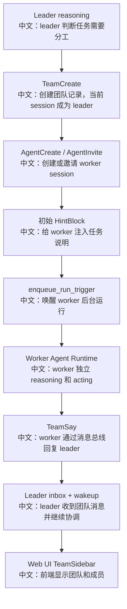

# 什么时候开启多智能体协作

> 结论：AgentScope 的多智能体不是“在一个函数里直接 new 几个 Agent 并行跑”。它是 TeamRecord + SessionRecord + leader/worker 工具权限 + MessageBus 通信 + wakeup 触发 + 前端团队投影的一整套产品流程。

---

## 1. 多智能体什么时候该开启

适合开启 Team / 多 Agent 的场景：

| 场景 | 原因 |
|---|---|
| 任务可以拆成多个专业角色 | 例如代码审查、测试、文档、RAG 分析分别交给不同 agent |
| 任务需要并行探索 | leader 负责协调，worker 独立运行 |
| 任务上下文很大 | 每个 worker 有自己的 session 和上下文，避免一个上下文塞爆 |
| 需要复用已有智能体能力 | 用 `AgentInvite` 借用已有 agent |
| 需要临时创建专家角色 | 用 `AgentCreate` 按模板创建 team agent |

不适合开启多智能体的场景：

```text
1. 单轮事实问答。
2. 明确只需要一个工具调用。
3. 任务拆分成本高于收益。
4. 需要严格顺序执行、没有并行空间。
```

---

## 2. 源码证据

关键源码：

```text
src/agentscope/app/_service/_toolkit.py
中文：根据 session 的 team 角色装配 Team 工具。

src/agentscope/app/_tool/_team_create.py
中文：创建团队，当前 session 成为 leader。

src/agentscope/app/_tool/_agent_create.py
中文：基于模板创建新的团队成员 agent 和 worker session。

src/agentscope/app/_tool/_agent_invite.py
中文：把已有可邀请 agent 借入当前 team，生成 team-scoped session。

src/agentscope/app/_tool/_team_say.py
中文：团队成员之间通过消息总线发消息和唤醒。

src/agentscope/app/_service/_projectors/_subagent_hitl.py
中文：把 worker 的人工确认请求投影到 leader 的 UI。

examples/web_ui/frontend/src/components/team/TeamSidebar.tsx
中文：前端团队侧栏。

examples/web_ui/frontend/src/components/chat/SubagentHitlCard.tsx
中文：leader 视角下的子智能体确认卡片。
```

---

## 3. 工具可见性：leader 和 worker 不一样

`get_toolkit` 里有一个很重要的设计：

```text
如果当前 session 是 worker：
  只装配 TeamSay

如果当前 session 不是 team 成员，或是 team leader：
  装配 TeamCreate / AgentCreate / TeamSay / TeamDelete
  如果存在可邀请 agent，再装配 AgentInvite
```

中文解释：

```text
这不是只靠工具内部权限判断，而是在 Toolkit 装配阶段就收敛模型可见能力。
worker 看不到创建成员、删除团队等 leader 工具。
leader 才能创建、邀请、解散和协调团队。
```

面试亮点：

```text
多智能体的权限边界是 session-level 的，不是简单看 AgentRecord.source。
因为被邀请进来的 agent 仍然可能是 user-owned agent，但它在当前 team session 中应该表现为 worker。
```

---

## 4. AgentCreate 和 AgentInvite 的区别

| 维度 | AgentCreate | AgentInvite |
|---|---|---|
| 来源 | 从 `SubAgentTemplate` 创建新的 team agent | 借用已有 user-owned agent |
| AgentRecord | 新建，通常 `source="team"` | 复用已有 AgentRecord |
| SessionRecord | 新建 worker session | 新建 team-scoped session |
| 配置定制 | 可按团队任务定制 prompt、权限、模型等 | 复用已有 agent 配置，邀请进 team |
| 生命周期 | Team 删除时可清理团队创建的 agent/session | Team 删除时只清理借用 session，不删除原 agent |
| 适合场景 | 临时专家角色 | 复用已有专业 agent |

面试表达：

```text
AgentCreate 是“生成一个团队成员”；
AgentInvite 是“借用一个已有智能体到当前团队”。
这两个设计区分了临时角色和可复用资产，生命周期完全不同。
```

---

## 5. 多智能体通信流程



关键点：

```text
TeamSay 不是进程内直接调用另一个 Agent 的函数。
它会写入对方 session 的 inbox，并通过 wakeup 机制触发运行。
这让多进程、刷新恢复、后台运行都更自然。
```

---

## 6. 子智能体 HITL 投影

worker 执行工具时也可能需要用户确认。如果确认卡只出现在 worker session，leader 很难发现。

AgentScope 用 `SubagentHitlProjector` 做投影：

```text
Worker RequireUserConfirmEvent
中文：worker 需要人工确认
  ↓
SubagentHitlProjector
中文：把 worker 的确认请求投影到 leader session 的 projection feed
  ↓
CustomEvent / SSE
中文：leader 前端收到子智能体确认事件
  ↓
SubagentHitlCard
中文：leader 在当前聊天界面确认或拒绝
  ↓
POST /chat/
中文：带 UserConfirmResultEvent 恢复 worker session
```

面试亮点：

```text
这是多智能体产品体验里非常高级的一点：
worker 可以独立运行，但它的 HITL 不会丢在后台；
leader 作为团队协调者，能在自己的 UI 里处理成员的确认请求。
```

---

## 7. 设计权衡

| 设计选择 | 好处 | 代价 |
|---|---|---|
| 多智能体基于 session | 每个成员可恢复、可独立运行、可事件投影 | 状态模型更复杂 |
| TeamSay 走 MessageBus | 支持跨进程、异步唤醒、后台运行 | 比直接函数调用链路长 |
| leader/worker 工具可见性分离 | 模型能力边界清楚 | Toolkit 装配逻辑更复杂 |
| AgentCreate/AgentInvite 分离 | 区分临时角色和已有资产 | 用户理解成本更高 |
| HITL 投影到 leader | 产品体验完整 | 需要额外 projection 机制 |

---

## 8. 面试沉淀

### 一句话回答

多智能体协作在 AgentScope 里是基于 TeamRecord 和独立 Session 的异步协作系统，leader 通过 Team 工具创建/邀请 worker，成员通过 MessageBus 和 TeamSay 通信，HITL 请求还能投影回 leader UI。

### 3 分钟讲解版

```text
当任务复杂到需要角色分工或并行探索时，leader agent 可以调用 TeamCreate 创建团队。
之后它可以用 AgentCreate 创建临时 worker，也可以用 AgentInvite 借用已有可邀请 agent。
每个成员都有独立 SessionRecord，所以不是同一个上下文里硬塞多个角色。
成员之间通过 TeamSay 通信，TeamSay 会写入目标 session 的 inbox 并触发 wakeup。
这样即使跨进程或者前端刷新，团队通信也能恢复。
同时 worker 如果执行工具需要人工确认，SubagentHitlProjector 会把确认请求投影到 leader UI，leader 可以在当前聊天里确认并恢复 worker。
```

### 高频追问

| 问题 | 回答方向 |
|---|---|
| 多 Agent 是直接函数调用吗？ | 不是，核心是 session + MessageBus + wakeup。 |
| leader 和 worker 怎么区分能力？ | get_toolkit 根据 session 的 team role 装配不同工具。 |
| AgentCreate 和 AgentInvite 有什么区别？ | 一个创建临时 team agent，一个借用已有 user agent。 |
| worker 需要用户确认怎么办？ | SubagentHitlProjector 投影到 leader UI。 |
| TeamSay 为什么不直接调用对方 Agent？ | 消息总线更适合跨进程、异步、恢复和事件投影。 |

### 项目表达

```text
我会把多智能体讲成“基于 Session 的协作编排”：
leader 不直接拿函数句柄调用 worker，而是通过持久化 team/session 和 MessageBus 建立协作关系。
这样多智能体不仅能跑起来，还能被 UI 观察、能处理 HITL、能恢复、能跨进程部署。
```

